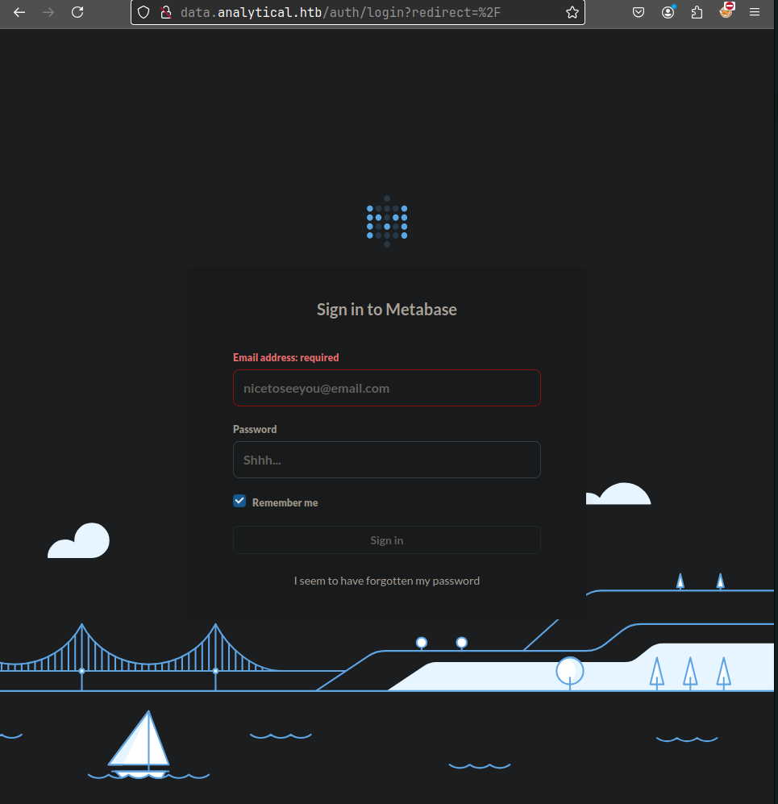

**ip of the machine :- 10.129.4.229**

machine is on!!!

Got two open ports!!!

got versions of http and ssh using aggressive scan of nmap.

add ip with domain name in /etc/hosts file and let's do manual enumeration......

Found these menus in the side bar.....

So after clicking on "login", found this login page...

So didn't find any default creds. to the metabase login page and searched for any possible exploits and found this, we don't know the version so let's to hit and trial and use this as it came first and is one the most recent one of metabase.

So in the exploit enter url, setup-token (can be found at /api/session/properties) and command which in this case added reverse shell payload.

Got reverse shell.

Got a user but no user.txt in the home directory of the user.

Was unable to find anythin even after using "find" command with user.txt as the parameter and then checked environment variables and found this user and pass. Let's try to login as this user with id and pass.

got it!!!

got our first flag...

Didn't find anything worthwhile in user's home directory and as well as user metalytics cannot run anything as root user and as well as no other user...

No unusual cron jobs are running.

No other user confirmed.

No SUID and GUID files present that can help in privilege escalation...

Kernel exploit can work but will look at it afterwards...

in /opt found a directory which cannot be accessed...

So after searching a lot and not finding anything found a way for local privilege escalation using kernel exploit.

So got the exploit in compromised machine and ran it and thus escalated privileges vertically.

Got last/root flag...