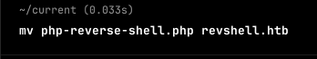

**ip of the machine :- 10.129.29.200**

machine is on!!!

added ip with domain in /etc/hosts file...

Only three ports are open, 53 is for DNS, and 22 for ssh and 80 for Http, because 53 for DNS is open that's why added domain with ip in /etc/hosts file, else site won't open...

If we write ip in the browser this will show up...

If we type bank.htb it will show us bank.htb website and to be specific login.php, let's do some directory fuzzing now...

First did a common php file names one and found that after visiting any oh the above it is redirecting to login.php. Did a php files scan because it redirected to a php file.

So after using lot's of password lists, for directory fuzzing, directory-list-lowercase-2.3-medium.txt from seclists gave the directory which looks interesting...

Went to the directory and got some .acc files, not WTF is acc huh???

used in accounting which means details of users...

Downloaded any one and saw what is in it and got an email and password. So basically tried everything and found nothing and it says it is encrypted and saw one more thing that there are many .acc files so let's see what other files have...

Found a file with size 257 which looked unusual so downloaded it and open it!!!

got some creds...

Entered some creds. and now authenticated.

So now went to support.php and saw that we can upload something...

Found this in src. code which means if i upload a .htb file it will get executed as a .php file.

added the ip in pentestmonkey rev shell and renamed it with a new extension.

So chose the file and submitted it...

it is submitted now and then clicked on attachment and got rev shell...

Let's see what we can find...

Found a user in /home directory and can view the user flag...

Found SUID files and first one seems strange, /var/htb/bin/emergency.

So just ran it and got root...

Got root flag...