**ip of the machine :- 10.129.229.183**

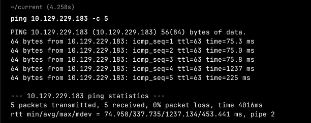
machine is on!!!

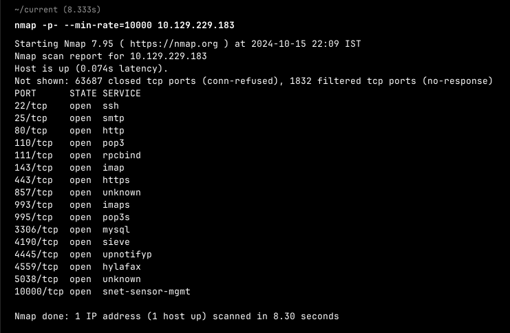
Got a lot of open ports....

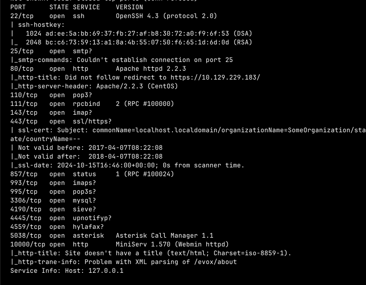
So only port 22,80 and 443 are only of some use... Rest don't know but will be looking for http and https for now.

So website was not loading so went to official HTB writeup of Beep machine and fixed it.

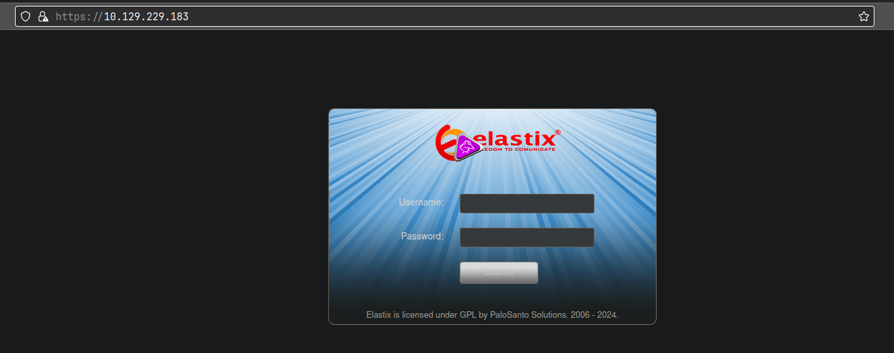
Now can see the website and something called Elastix but what is it...

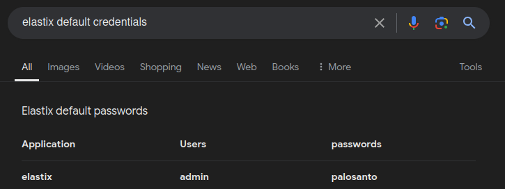
So found defult creds. first so let's try them... and it didn't work..

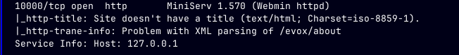
Then observed my nmap scan again and found another http server running at port 10000. Let's visit it...

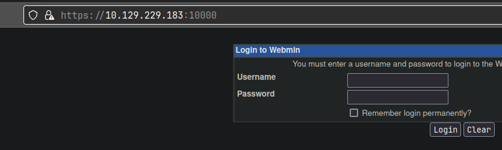
It is running webmin....

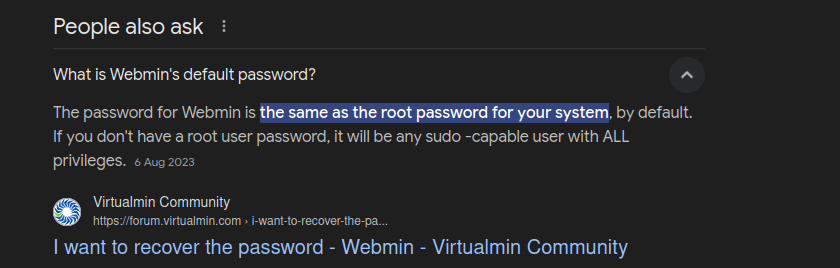
Webmin default username is root and password is system's root password... So it is of no interest right now.. Let's look for any exploit of elastix.

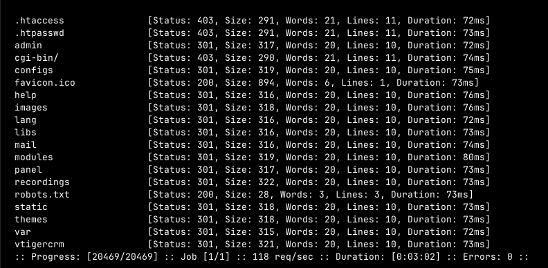
So did directory fuzzing and found a lot of directories..

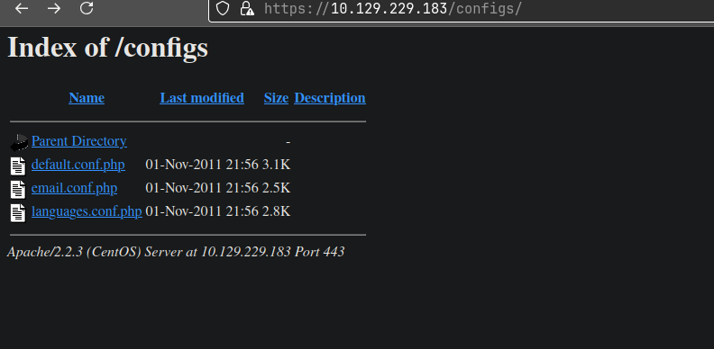
Can see configs directory but cannot view the files... Same with lang, libs and mail directory, found nothing promising.

So after going through all the directories, found one that was interesting...
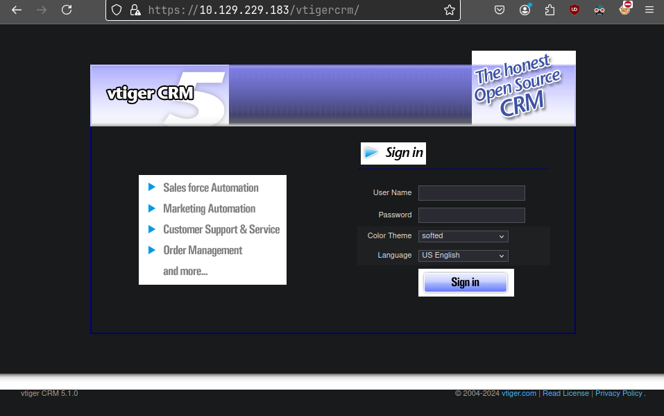
Found a crm and also it's version which is 5.1.0, let's find a exploit for vtiger CRM version 5.1.0.

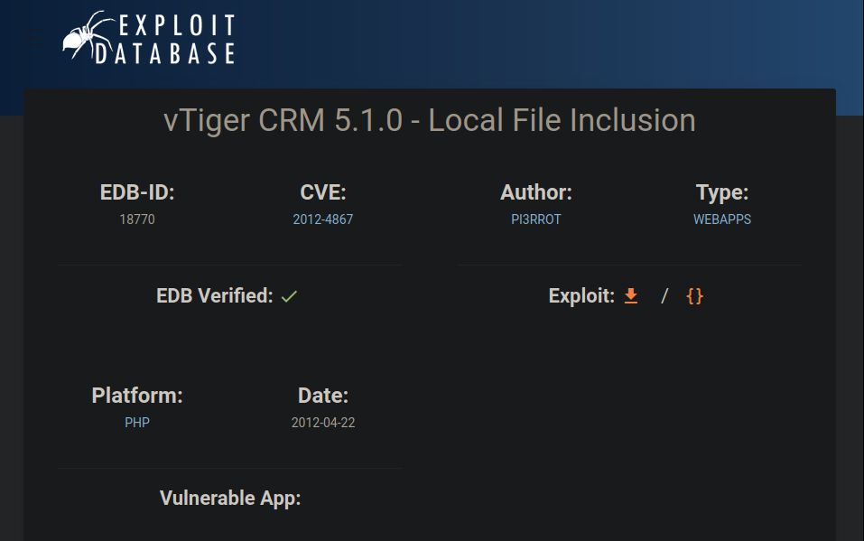
Found an exploit which says that vtiger crm v 5.1.0 is vulnerable to LFI. Let's add then payload provided then.

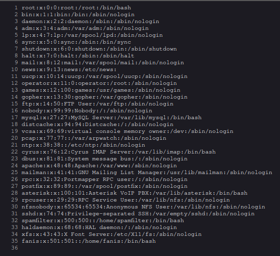
Added the provided payload in the exploit and can see /etc/passwd file.

i was unable to figure out how to do LFI to RCE, so went hunting and found another exploit..
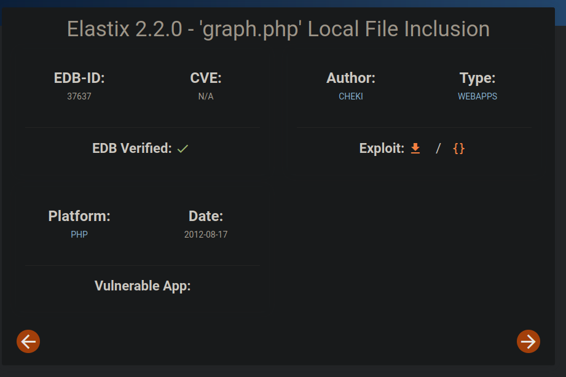
Elastix 2.2.0 but the payload it provided was, 
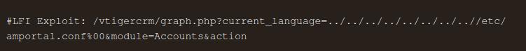
of vtigercrm, so let's try it...

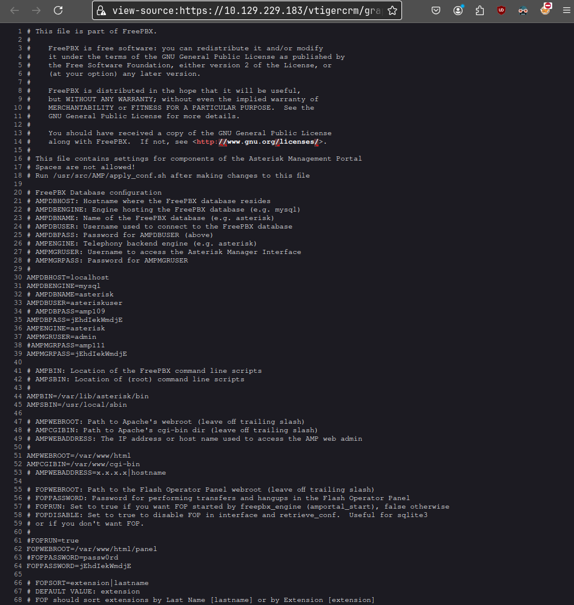
So after adding above payload can see a .conf file which revealed some creds. 
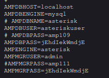
So digged some info. about amportal.conf and found that this file contains some intial configuration about the system and specifically about the Asterisk Management Portal...

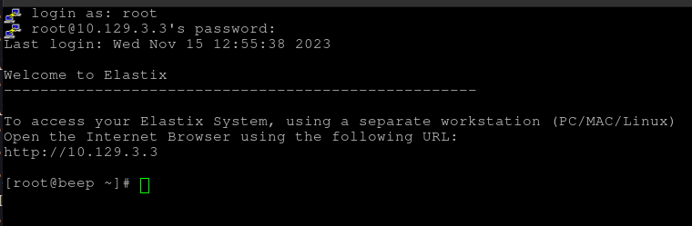
So was able to log in as user root directly by performing password spraying as the password used for database and ssh login through root user was same.

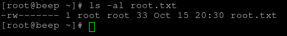
got root flag first.

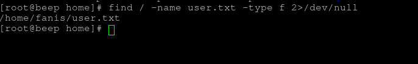
Also found user.txt file.