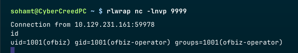

**ip of the machine :- 10.129.231.161**

machine is on!!!

got some open ports!!! Let's do an aggressive scan to find out the version of the services running on the respective open ports.

Got the version of the services running on the ports...

Let's ip and domain in /etc/hosts file.

Now let's open the website again...

http and https both are running this same website and found nothing worthwhile on this website, so let's do directory fuzzing using ffuf.

It literally showed that all directories are present that are in the wordlist which is not possible so maybe there aren't any web directories. Let's try subdomain enumeration using gobuster.

No subdomains as well, now that's strange...

So when both of the fuzzing scans didn't work, i searched for common .php file names and found all the files as redirected to somewhere which means they do not exist and didn't find any...

As no scans for subdomain and directory fuzzing were actually working and there is no anchor tag in the website to capture any kind of request to analyse it, went to storage tab and found JSESSIONID and the value has .jvm1 as the extensions which seems good enough to move forward to the next step.

So, when searched on google, one of the results was saying that it can be apache OFBiz...

Then in footer section of the website it said Apache OFBiz thus conforming that web application is running Apache OFBiz.

So, did a directory fuzzing again but the wordlist was "apache.txt" this time and the results were limited. But again every directory and web page was pointing to the default web page.

So found this repo on github with a scanner like tool for rce. Let's try it!!!

Tried to see /etc/passwd and it worked... Now let's try to establish a reverse shell connection now.....

Didn't use any reverse shell payload, simply used netcat in order to execute a bash shell command and get response on my machine...

got it!!!

In user's home directory, got user flag...

There are a lot of files and directories in the directory we reverse shelld....

In framework/security found a file revealing certain properties related security like password is encrypted using SHA, min. password length etc.

So came across repo. of apache OFBiz and saw that derby is an embedded database based on java and is stored in runtime directory...

So to connect to this database we need valid url, appropriate drivers and a command named "ij".

Made a tar file of the derby directory in ofbiz and got it in my system.

Oh man!!! It's not easy to connect to the database straight simply for a file or folder like sqlite3.

I was fed up troubleshooting, but then i noticed while creating a tar, it archived lots of .dat files, let's see if they can give something interesting...

Hmm, this means we can find something interesting in these files...

So used grep command to reveal the password... Here, -arin flag means binary text, recursively, ignore case and printing line number and -E for extended regex.

got this password hash and seems like a custom hash and not sha...

Found a lot of directories in crypto directory in framework/base and much more deep in that...

Looking at the src. code of HashCrypt.java and looking at the compare password class. It looks like it is calling doComparePosix class.

So, here now hash type, salt and something something is getting seperated and then another class is getting called getCrypteBytes.

So, it is encoded into base64 while replacing + with "." and getting the hash type which "sha" to further encode it.

So there was a custom encryption and at last got a hash that is crackable...

Got a hash and also added the salt.

Cracked the password as "monkeybizness".

logged in as root with the password...

Got root flag...