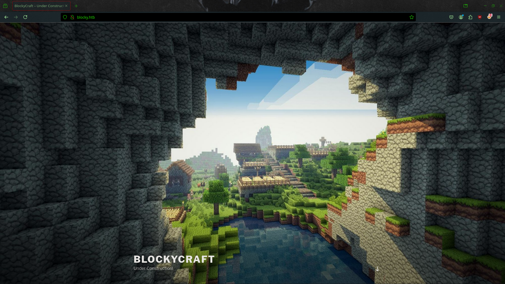

**ip of the machine :- 10.129.6.133**

machine is on!!!

Got some open ports, got a different port this time... Minecraft.

Found versions of the services running on the ports except FTP which i am expecting to be either ProFTPd or vsftpd, it can be only one of them as they are the extremely common FTP services that can be run on port 21.

Add ip with domain name in /etc/hosts file to access the website.

Seems like the developers are working on their own minecraft web server that's why port 25565 port which is the default port for minecraft server.

Found a blog post and seems that website is running on wordpress.

Clicked on blog post and found the author name "notch" which is a possible username.

Found some possible directories. Let's explore them.

found a phpmyadmin login page...

let's try some default credentials.

it didn't work, let's move to next directory.

Found two jar files in /plugins/ directory and downloaded them, let's see what they contain.

downloaded the .jar files and extracted them using "jar xf" command.

in com directory and further sub directory found a .class file.

Viewed it's contents a bit gibberish though but found something under root.....
(8YsqfCTnvxAUeduzjNSXe22)

It's not a hash so possibly a password i guess...

used the password with root and was able to get through phpmyadmin. (root:8YsqfCTnvxAUeduzjNSXe22)

So in wordpress database and further wp-users table, got a password hash for user Notch.

Let's try to crack the hash.

Also found hash type, let's crack it.

Was unable to crack the password through hashcat maybe the password is too strong so hashcat cannot crack it from rockyou. But the only password i have found is of root user of myphpadmin. Let's perform password spraying.

So directly tried to login through ssh and failed now let's try to login through ssh as user "notch".

logged in....

got our first flag....

User "notch" can run all the commands as root user.....

So started a bash shell as root user and got the last flag.....