**ip of the machine :- 10.10.11.11**

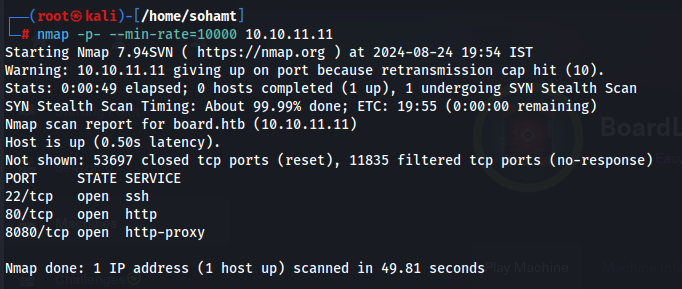
found some open ports.

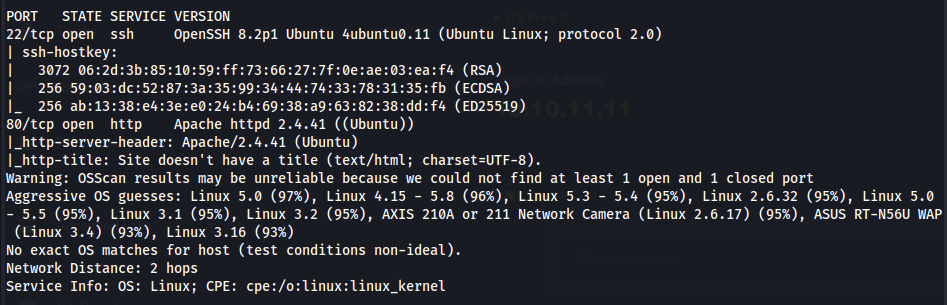
did some versioning!!!

on website found this which means the domain of the website is board.htb which we had to add in our /etc/hosts file.

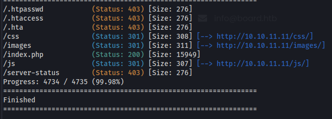
did directory fuzzing using gobuster and found nothing interesting.

On manual inspection of website found nothing. So started a sub domain emuneration scan using gobuster.

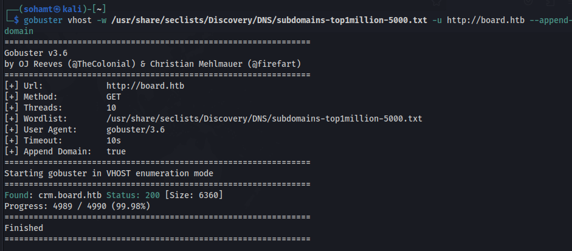
found a sub domain. Let's visit it.

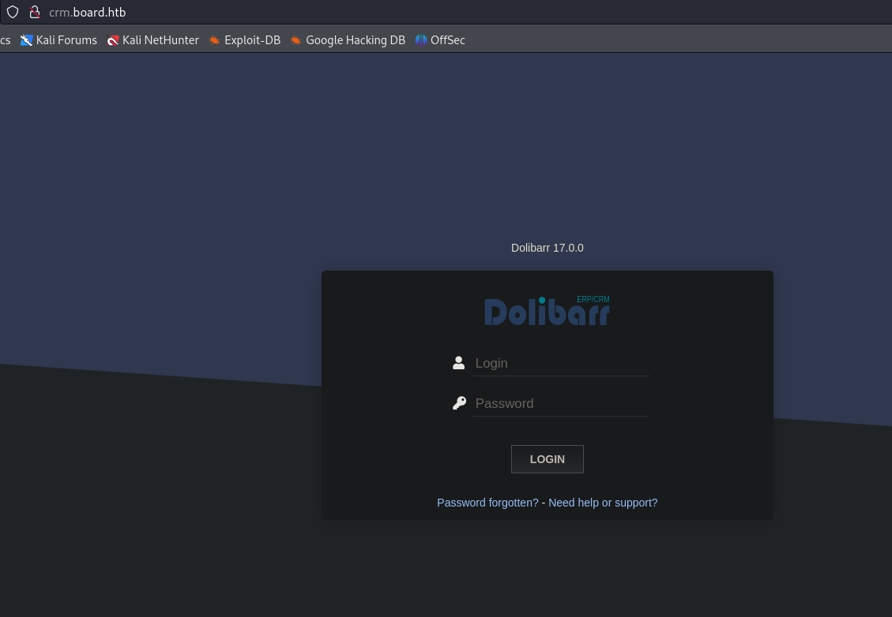
a login page named "dolibarr". So what are the default creds. for dolibar???

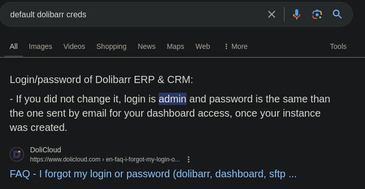
admin:admin ???

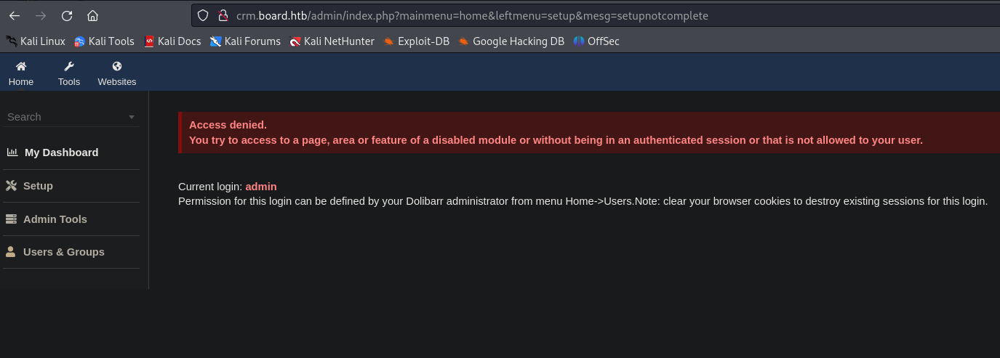
was able to login with admin:admin as administrator.

also found it's version let's see if any exploits are present for this dolibar version for reverse shell.

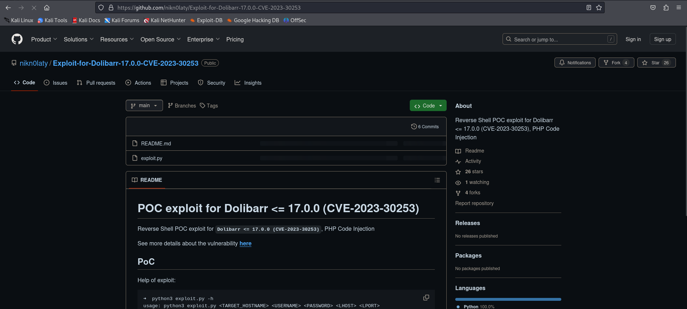
found this. Let's try it!!!

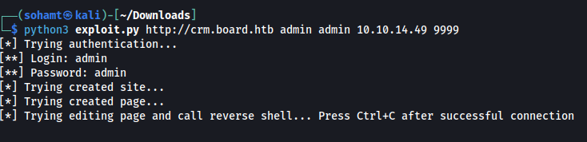
ran the exploit!!!

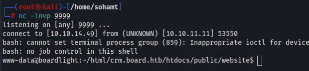
got reverse shell!!!

Went through /opt directory, cron jobs, and many other files got nothing then thought that it reverse shell'd us in /var/www/html/crm.board.htb, so though that can i find something there????

There were like a ton of directories and files and was failing as usual!!!!

So went to conf directory and found creds. in one file.

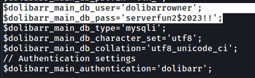
found some database creds.

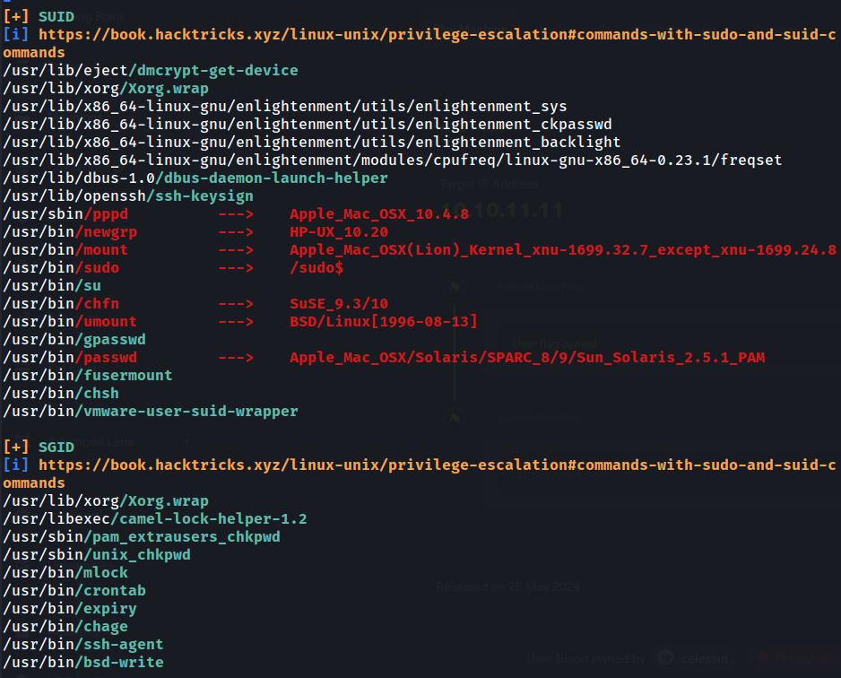
found some SUID and GUID permission files.

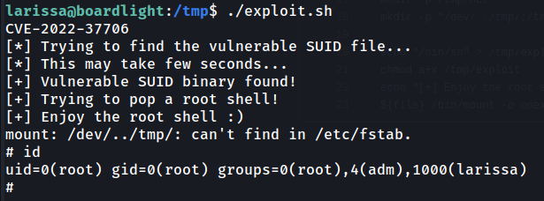
so searched for enlightenment and found an exploit with associated CVE and further got root flag......................................