**ip of the machine :- 10.129.5.139**

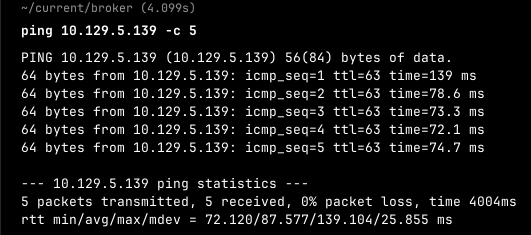
machine is on!!!

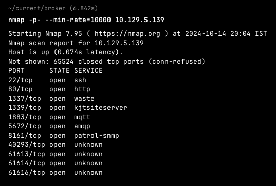
oh! a lot of open ports!!!

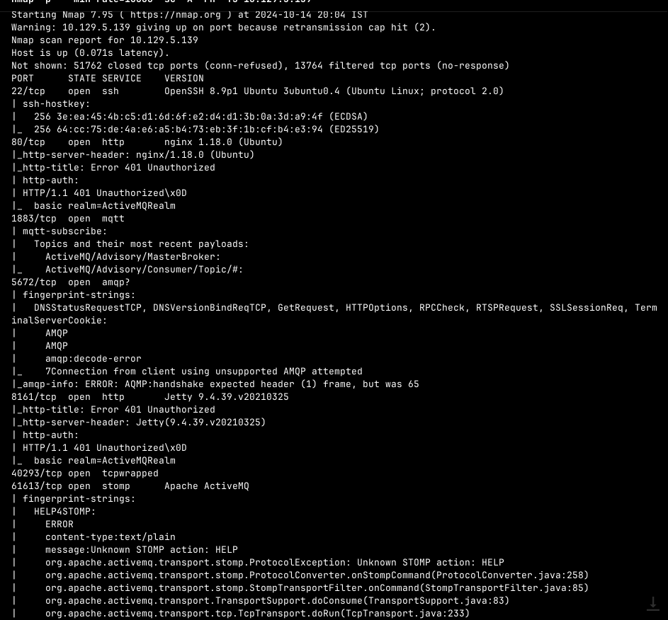
Did an aggressive scan and found that a lot of http servers are running and let's try to open all of them one by one...

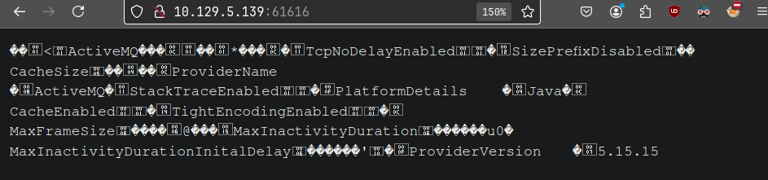
But only one at port got to see something as in rest it was all 401 status codes.

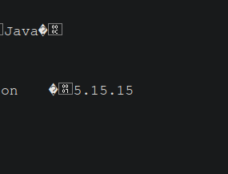
Found here a version...

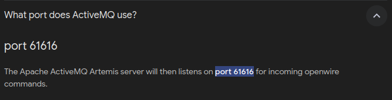
found activeMQ version 5.15.5 on port 61616.

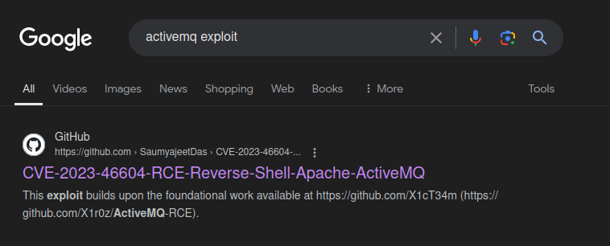
After digging with some keywords found this exploit...

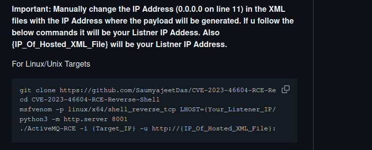
Let's try to run this exploit...

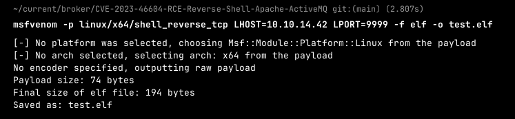
First, will be using msfvenom command to actually generate a reverse shell payload.

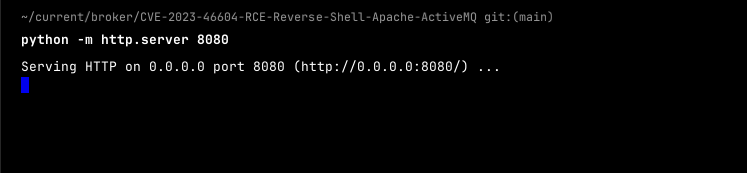
Then starting a python server at port 8080.

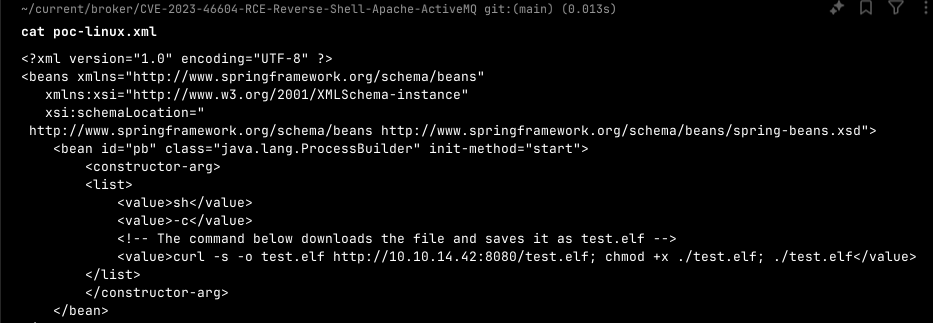
Then changing the poc-linux.xml file (changing ip and port). So this file will download the test.elf file created on the attacking machine and then execute it to give reverse shell and this is the deserialisation vulnerability in apache activeMQ which will gu=ive us RCE.

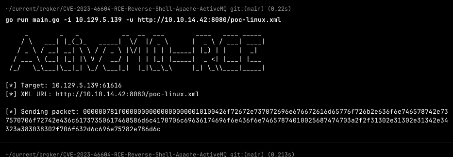
executed the exploit....

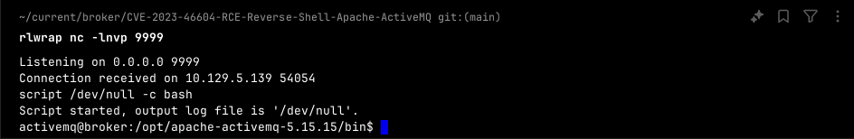
Got reverse shell...

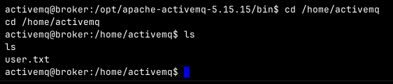
Got user flag....

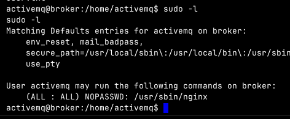
did 'sudo -l' to see what commands current logged in user can this.....

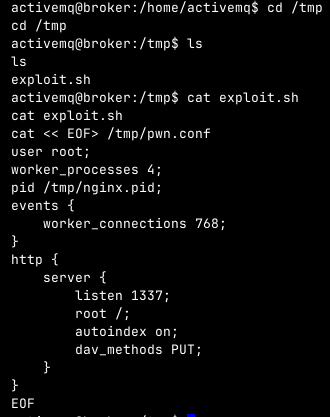
So found an exploit to actually exploit nginx which can be run as user... So basically according to this exploit a pwn.conf file in /tmp directory will be created where i can run a server on root directory as root user in the attacking machine...

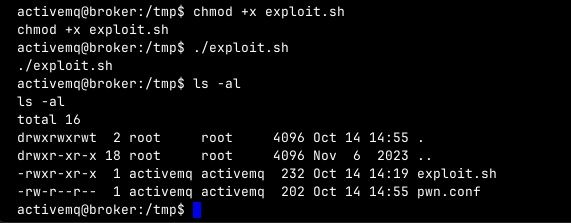
So after running the exploit a pwn.conf file will be created.

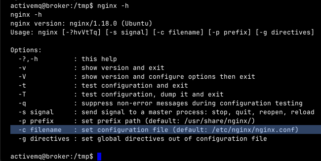
Will be using -c option/flag to set/enable to configuration created.

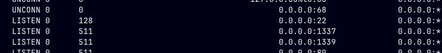
So in sockets found 1337 at localhost of the machine started.

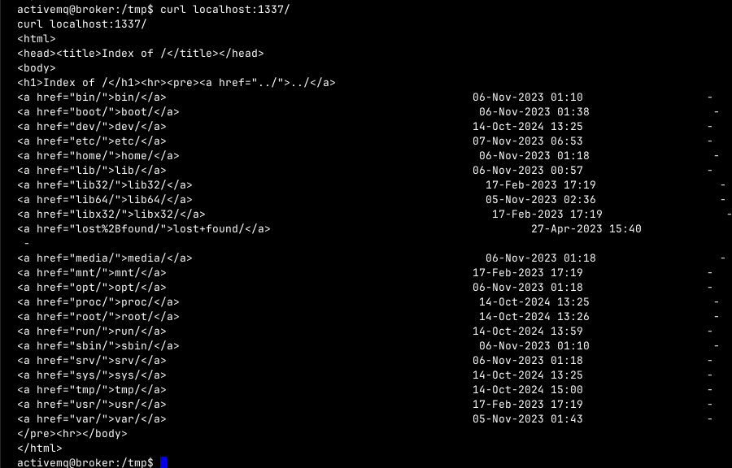
It showed root directory...

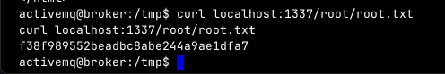
So directory got the root flag...

But still there are some ways to escalate privileges which can be uploading a rev shell and then going on web interface to get the rev shell as root user.
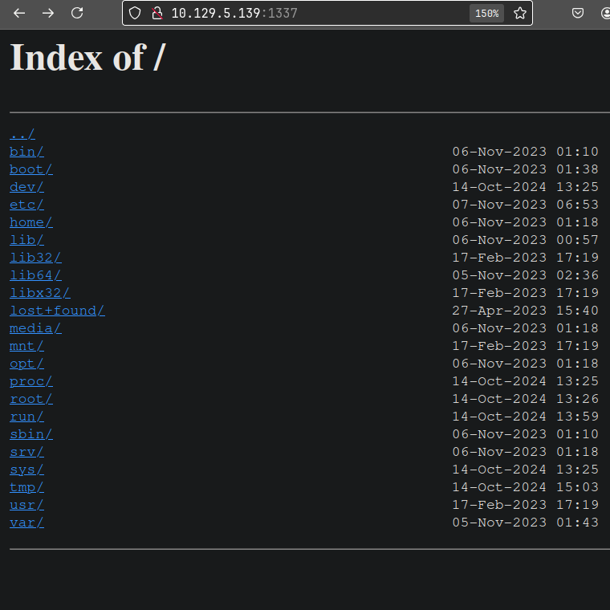
Can see root directory...

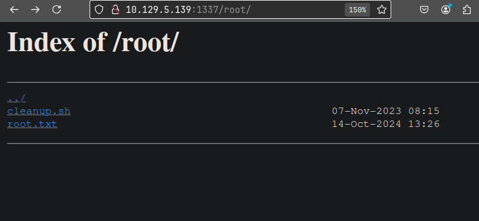
Can also look for .ssh in /root directory and then put you generated key in authorized file in .ssh. So that ssh as root user can become possible...

If we can access everything a root user is accessing so we can see /etc/shadow for the hash of root user and crack it for priv. esc...