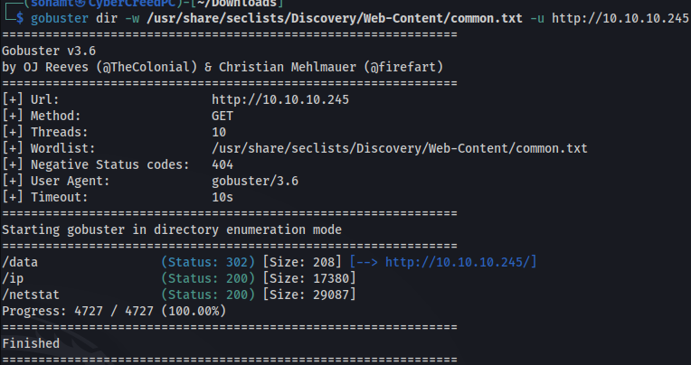

**ip of the machine:- 10.10.10.245**

machine is on!!!

only three ports are open.

a security dashboard is hosted on the web server.

directory fuzzing showed a directory and rest seems like commands to me.

a security dashboard with only one interesting option "data" and one possible username "nathan".

in security snapshot tab it is giving us pcap file for analysis purpose let's try downloading it and analyse it.

Found nearly nothing!!!

But in url it was written like /data/10 where 10.pcap is the file we downloaded so let's start changing it and see whether we can get some more pcap files to analyse or not.

on writing 4 we got a file named 4.pcap

Found nothing interesting..... Just normal HTTP traffic.

What if we change 4 to either -1,0 or 1 maybe it can give a file containing something interesting. This type of vulnerability is known as IDOR (Indirect Object Reference).

we can download on 0....

Now in the pcap file found some FTP traffic and followed the stream and found some creds.

was able to login with creds. and found some files. Let's get them and analyse them.

got user flag..

it seems like a root shell to escalated privileges.

i used password spraying (same creds. being used at multiple platforms or accessing of sources) as nathan used same creds. for ssh as well.

There was no point of running linpeas and analyzing the attack surface for more ways to escalate privileges as a script is already present so just ran it and thus did vertical privilege escalation.

got root flag.................