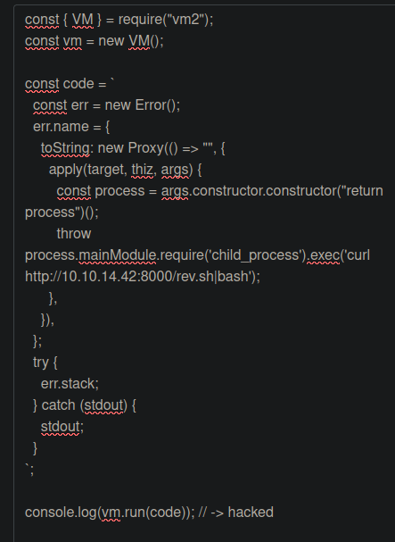
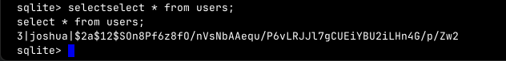

**ip of the machine :- 10.129.1.170**

machine is on!!!

Found 3 open ports...

There are two http servers running...

Added domain with ip in the /etc/hosts file...

Node js code testing website...

A library named "vm2" on node js is mentioned which is worth noting in about us page...

As usual which i have already explored...

Port 3000 is also running the same website....

Every subdomain redirecting to the original website which means no use of subdomain enumeration...

Got a lot of security which means that this library of nodejs is actually vulnerable...

Got some example code in the first blog...

Ok!!! So PoC code is working, let's try to add rev. shell in it...

First created a rev. shell file...

So wrote the rev. shell payload...

Got it!!!

Saw a directory in user's home directory reverse shelld as...

Found nothing in .pm2 directory...

found another user...

Got a file in /var/www/contact named tickets.db and searched and got to know that it can be opened through sqlite.

So typed sqlite3 randomly and it showed open a file...

So just went to list mode in sqlite3 and tried selecting values from users table as it is mostly the default one in most of the databases.

So randomly ran john with the hash to see which type of hash is it...

Got the password "spongebob1".

Logged in as another user and got the flag...

User joshua can run only one script as root user...

So saw the script's code and it requires root user's password for the database...

Also tried to inject a bash payload but failed...

Then saw this code snippet and though maybe a cron job might be running in the background in order to backup the database...

Got root password from the pspy shell as the code for was running in the background...

Got root flag...