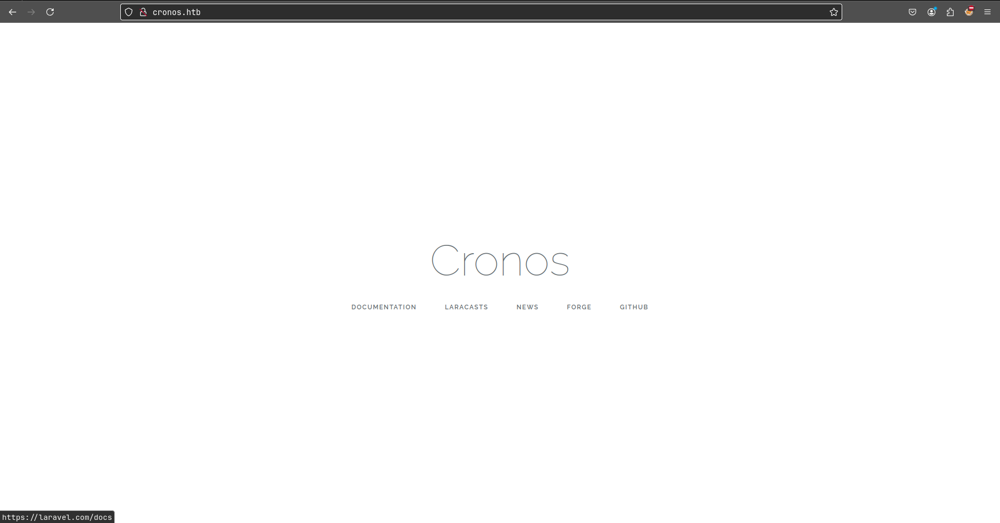
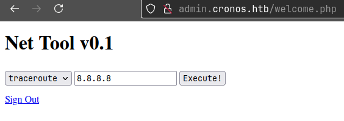
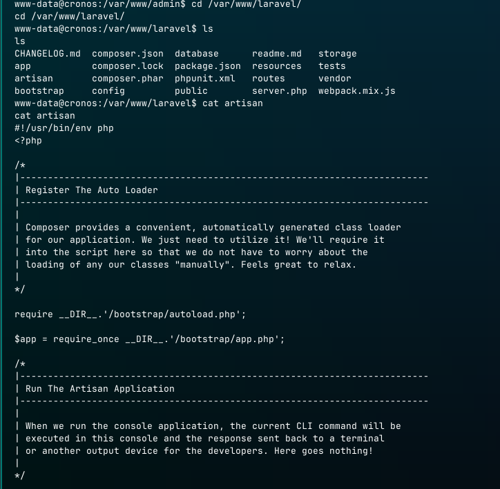

**ip of the machine :- 10.129.227.211**

machine is on!!!

Found some open ports!!!

Let's add domain with ip in /etc/hosts file.

Huh!!! Just a normal web page....

Found some directories but didn't find anything in them.

Wooh!!! Found a sub domain!!!

Found a custom login page, let's try the most basic stuff SQL injection!!!

Added the payload...

got it!!!

So, I really have no idea what this tool does so captured the request in burp suite and sent it to the repeater to see what can we do.

Let's try for the command injection.

command injection is possible!!! Let's try to get rce then...

It also worked this way....

Added the reverse shell payload which is URL encoded...

Got it!!!

Went to home directory and found a user there and got user flag...

So will be running pspy to see all the background processes and cron jobs to see if we can exploit anything or not, because no SUID, GUID or writable files found as such.

So saw a php file running in background as a cron job with permissions of root user probably.

Saw yeah it's a php file.

Saw downloaded the php rev. shell by pentest monkey and changed ip and port.

Downloaded the rev. shell on the victim machine.

Sp replaced the cron job file with my php rev. shell file while remaining the name of the file as "artisan" only. Now wait for the cron job to run...

Privileges Escalated!!!

Got root flag...