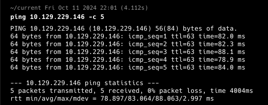
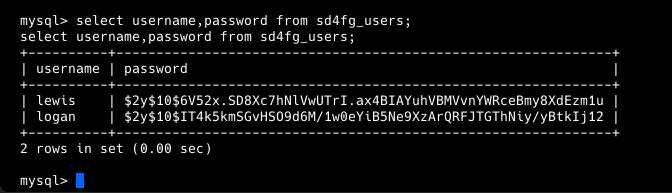
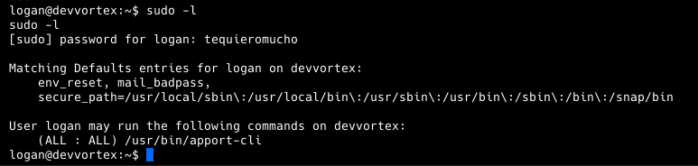

**ip of the machine :- 10.129.229.146**

machine is on!!!

As usual two ports...

added ip with domain in /etc/hosts file and started exploring the website manually and didn't find anything on manual enumeration.

Just the usual directories....

Let's do subdomain enumeration...

Used gobuster and found one subdomain. Let's visit it!!!

So it opened another website and again manual enumeration was useless over here and let's do directory fuzzing then.

got a lot of listings.....

Found joomla running in /administrator.... let's try finding default creds...

Default creds. didn't work but found this vulnerability, let's test the system for it...

Used curl and got a lot of text in bottom...

So, here got a possible username "lewis" and email of lewis.

so used above curl command and then found "lewis" password.

Found the password....

Logged in as user "lewis"....

So in system > site templates found some configuration files, and we can edit them and also found a possible user "logan", so will be changing error.php.

So in error.php added pentest monkey reverse shell..

after saving do this to initiate reverse shell through error.php file.

Got rev. shell..

so in /var/www/dev.devvortex.htb found database creds and database where other user creds. can be found. Let's try mysql now....

it worked....

In joomla database found some tables with name "user" in it...

found "logan" users creds.... Let's crack it!!!

So will be using hashcat to crack the password.....

Cracked!!! got it!!!

Logged in as user "logan".

Got our first flag in home directory of the user.

So user "logan" can only run one command with root privileges..... and it is "apport-cli". Let's search how to escalate privileges using this command.

So came across this blog on medium and will be following it!!!

First click "1"

then "2" and wait...

then "V" and when colon ":" comes type "!/bin/bash" to successfully escalate privileges...

Got last flag in /root directory.....