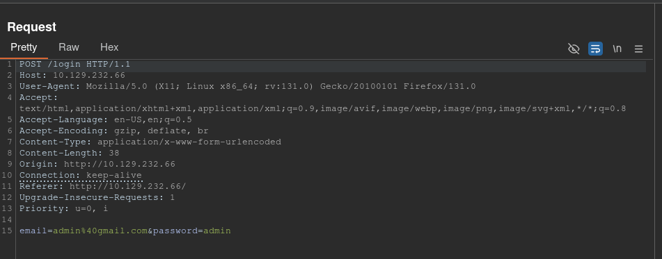

**ip of the machine :- 10.129.232.66**

machine is on!!!

Got only one open port and that is also running a web server.

Did an aggressive scan on the port and found out to be a python server.

So, it's like a gaming website with domain mentioned in the footer of the web page. So, let's add domain with ip in /etc/hosts file.

Tried to do web directory fuzzing but failed as it said all the directories in the word list exists which is not possible.

Subdomain enumeration also failed, there are no subdomains as such...

Found a sign in page.....

Just added some dummy creds. "admin@gmail.com:admin" and will capture the request using burp.

Got the request in the repeater. So i know that if any login, signup or forgot password page is present, try for SQL injection as it will communicate directly to the database in that case. So, will be trying for SQL injection.

So normal payload didn't work, so went for boolean based SQL Injection and added a basic payload to make the query "TRUE".

Response showed login success. So, now will be saving request in a file with .req extension and will be using sqlmap in order to get credentials from the database.

Removed the payload and got the request.

Now sqlmap will try all possible payloads.

time-based blind payload for sql injection!!!

Let's check for all the databases present on the server.

Got two databases. information_schema is obvious, it would be there. So, will be going for database named "main".

So now will be dumping all the tables and their entries in main database.

Ended the sqlmap scan as we got the table names blog, blog_comments and user. SQLMap takes a lot of time and it was printing blog table so ended it and will be viewing the contents of "user" table only.

Fetching columns and entries for database "main" and table "user".

Got admin email id and password hash.

got the password, let's login as administrator now.

logged in as admin now.

After clicking on the settings page it tries to redirect to another subdomain, let's add this sub domain to /etc/hosts as well.

Trying creds. of admin with same pass.

Logged in!!!

Let's search for any possible vulnerabilities in Flask Volt dashboard.

In search result i saw something called SSTI.

Server side template injection. It is basically injecting malicious payload in the template which rendered at server side by the application and is common in python web framework flask which is running. Let's try for SSTI then.

SSTI is usually different for different languages running on the back end, so when i typed SSTI flask it was prompting Jinja2 on hacktricks, so search "jinja2 flask" to see there relation and found out that flask uses jinja2 as the web template engine.

Got the blog at hacktricks, so will be trying the tricks in this.

So got some ways to detect SSTI, so we can try adding  the payload  to see if it evaluates the arithmetic expression or not.

So in settings tab, found that we can enter our full name, while birthday we have to choose and it checks for phone number, so we can only inject payload to full name only.

So added the payload and after clicking "save all", it evaluated the expression thus, confirming SSTI.

So, search for "SSTI to RCE" and found a blog on medium which gave a payload that we can add.

So added the payload to see the directory listing of the root directory and got it.

So added this payload and it didn't work for the reverse shell...

So added this payload and got rev shell. So i base64'd rev. shell payload and then decoding it and piping into bash.

Wait root directly?? Not possible...

So went to home directory, found a user, entered user's home directory and got the user flag.

Went to /root directory and there was no root flag...

So went to the /backend were i was reverse shell'd and found a Dockerfile. OK! Point to be noted.

So, saw all the listings of the / directory and found a .dockerenv file.

Oh!!! So we are in a container.

But can see /home/augustus directory of the user how?? So, used mount command and came to know that it is mounted from the system to the container in here, which means changes in it will also affect the user's home directory that is in the system as well. Hmmm!!!! looks interesting...

Saw this blog on freecodecamp.org and then saw this
Why do the container has 172.19.0.2 ip address? Who has 172.19.0.1? maybe the main system... We can find this out by running a port scan on 172.19.0.1, if it shows some open ports then it will be confirmed else, will go for any other way.

nmap is not present in the docker container. Let's search for a one liner port scanning script in bash.

Found it!!! Let's optimize the script according to the need and run it.

Port 22 of 172.19.0.1 is open.

used the same password to login as the user.

Logged in as the user.

So it means if add a bash shell in the user's directory, change it's permissions after going inside the container and then execute it after doing ssh as the user again will give me a root shell.

copied binary of bash in user's home directory.

Saw the binary in the container.

Changed the user and group of the binary and also gave rwx permissions to all three with SUID in the CONTAINER.

ssh'd again in the host system from the container and found out the permissions of bash binary is root:root with SUID.

So ran it with interactive and privilege mode and got root.

got root flag...