**ip of the machine :- 10.129.1.248**

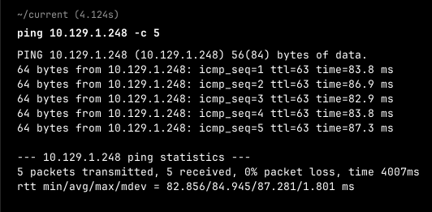
machine is on!!!

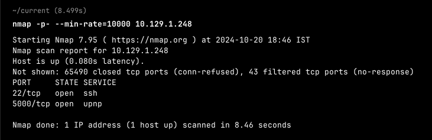
Got two open ports!!!

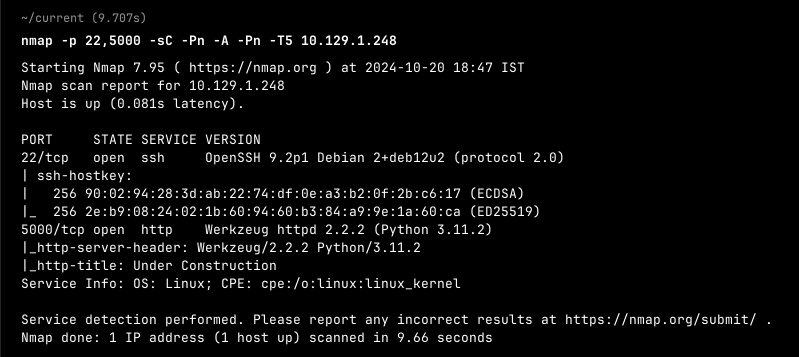
Got versions of both the ports...

**changed the ip :- 10.129.49.229**

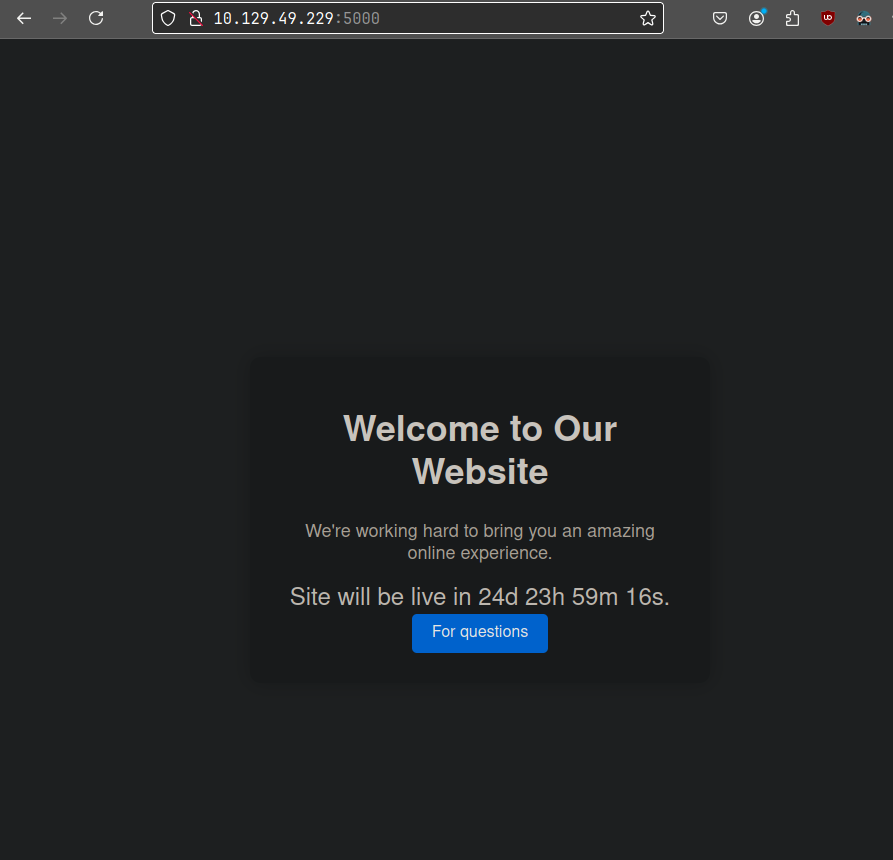
only one options. Let's click on it and explore it...

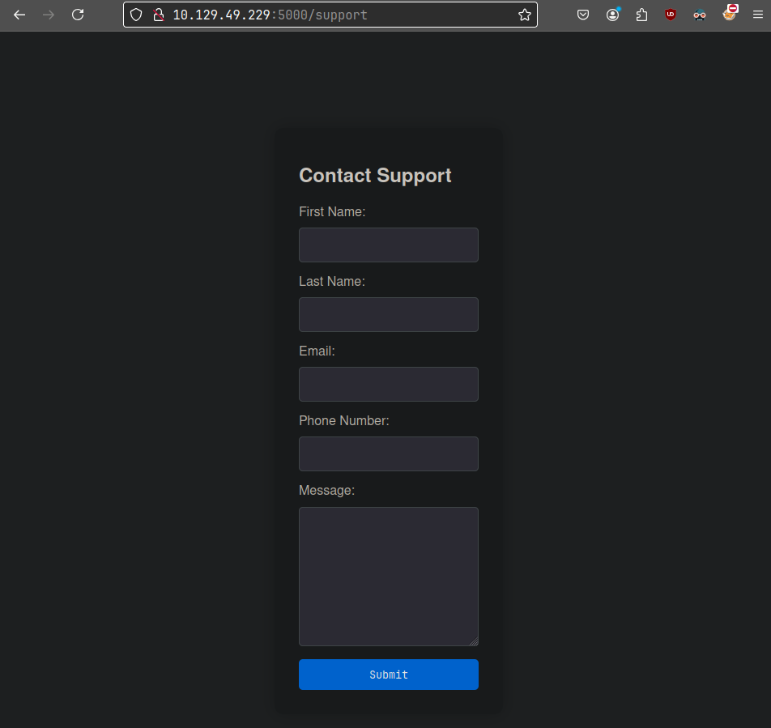
Got a form, let's try adding some random stuff...
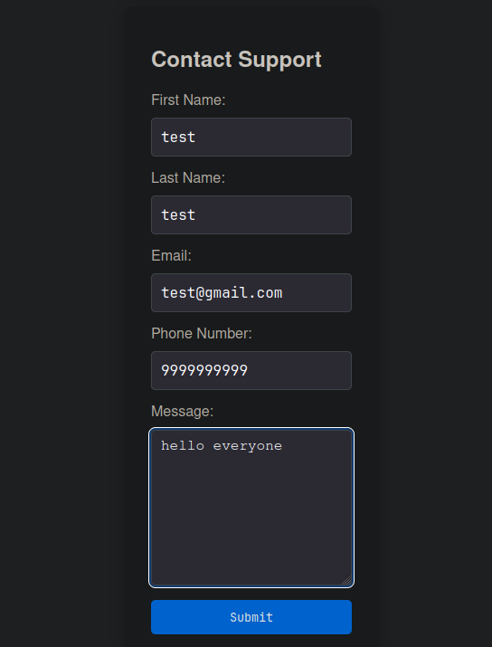Nothing Happened...

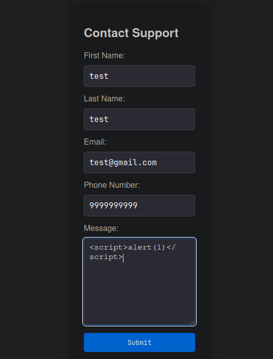
Added some random xss payload to check for xss.

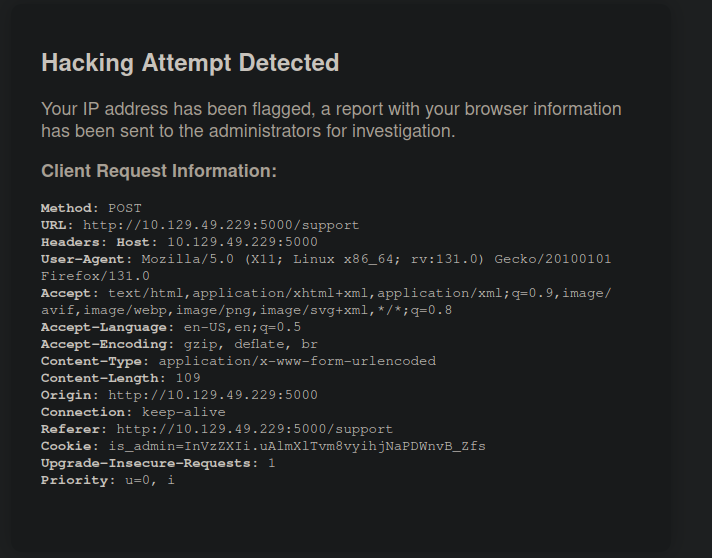
It detected a hacking attempt but gave headers which is unusual...

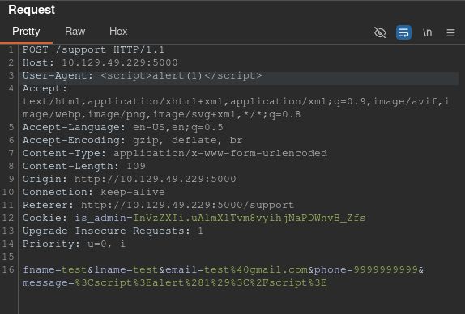So added xss payload in User-agent to see if web application is vulnerable to xss because it blocked a hacking attempt. So though of doing it in User-agent header.

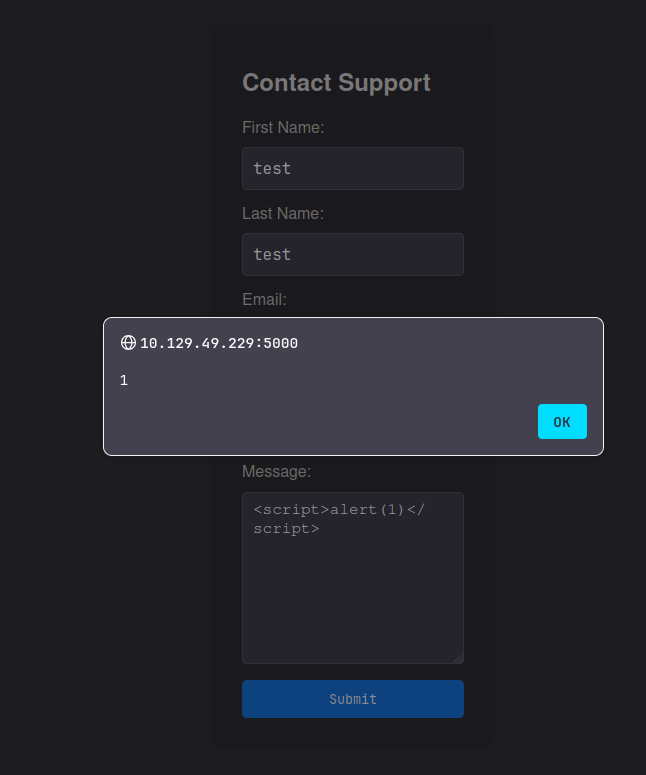
Stored XSS confirmed.

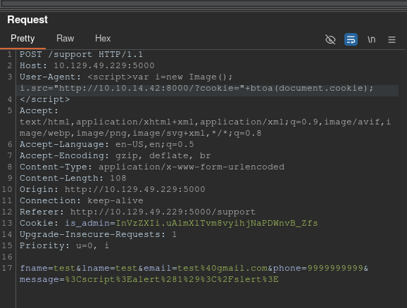
Added a payload to get a cookie...
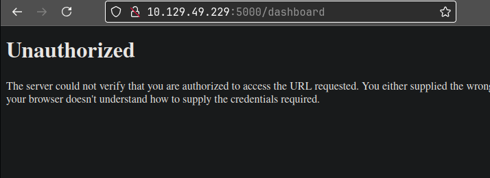
Because got an unauthorized page, so maybe there will be someone to access it...

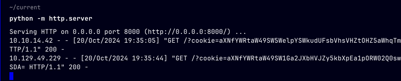
So after adding the payload "" got two cookies out of which one is ours, and one is admin's....

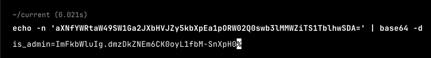
Got admin's cookie.

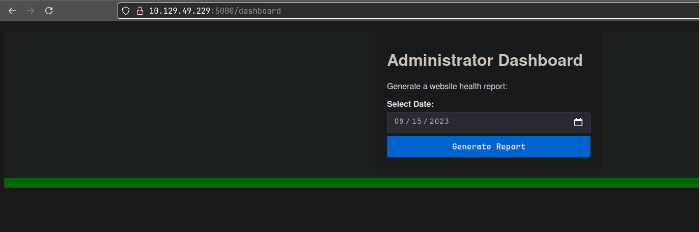
So after adding the cookie got this in /dashboard web page...

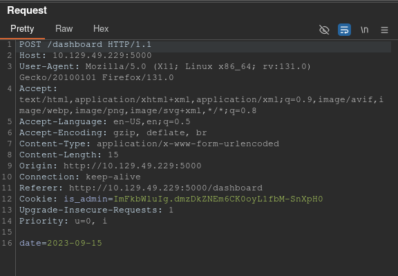
Captured the request after clicking on the generate report button and saw date parameter being passed...

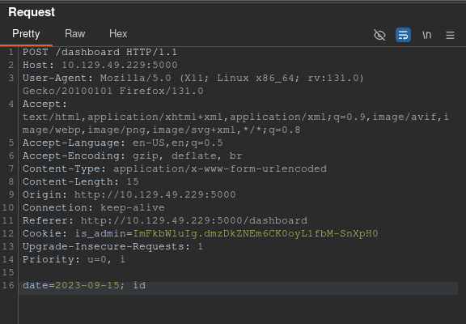
So added "; id" to see if command injection is not and got a response...

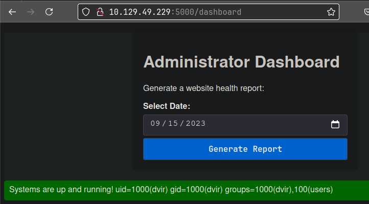
Well it is possible...

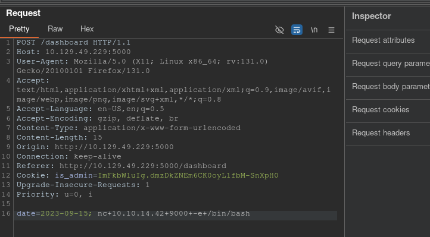
Added the payload for revshell...

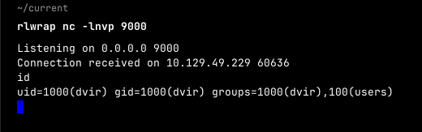
Got rev shell by adding the payload...

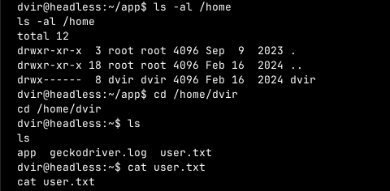
Found the user flag in user's home directory logged in as.

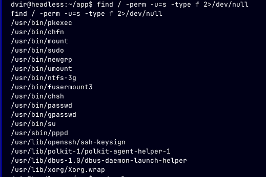
Didn't find any unusual SUID files...

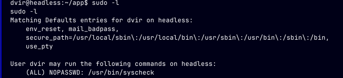
So saw that user can only run syscheck binary.

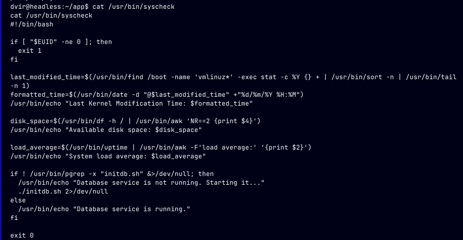
Saw the src. code of syscheck which is performing some system checks.....

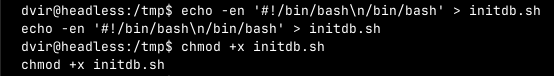
So in the src. code, it is interacting with a file in the same directory so created it in temp with bash shell and made it executable.

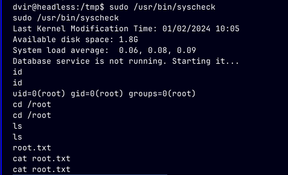
Executed syscheck as root and got root flag...