**ip of the machine :- 10.10.11.37**

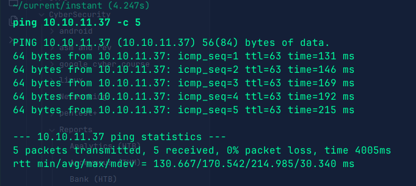
machine is on!!!

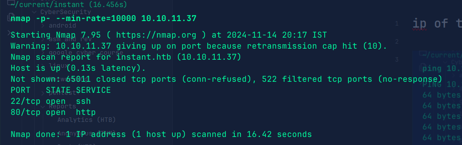
Got two open ports!!! 

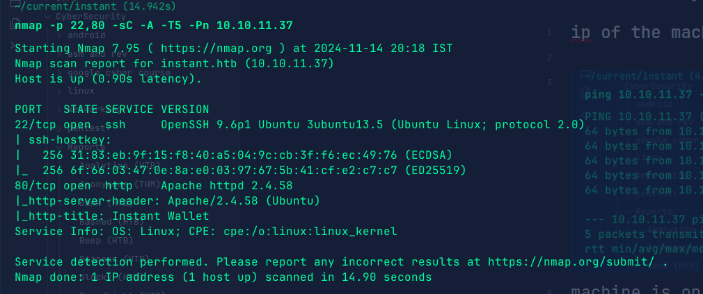
Performed an aggressive scan on the open ports and got versions of the services.

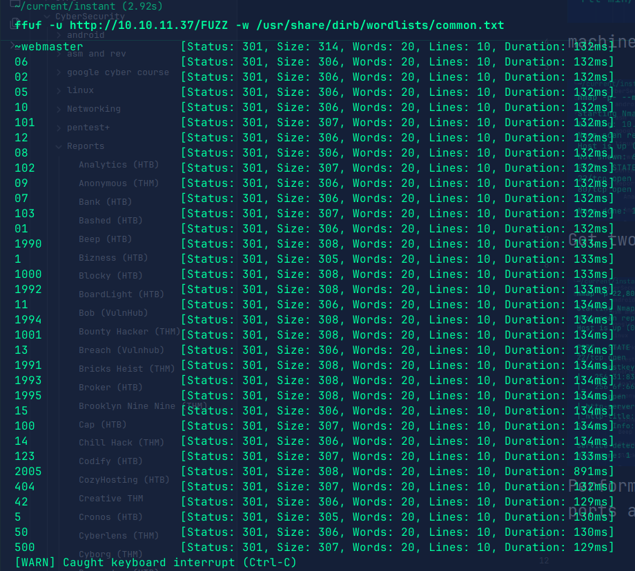
No directories as such. Let's open the web application and enumerate manually.

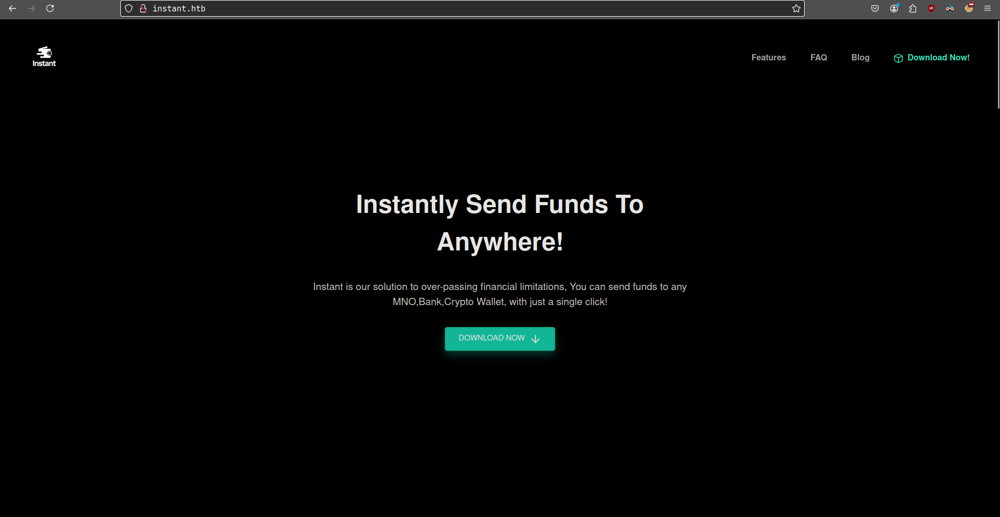
Found a download, let's see what are we downloading.

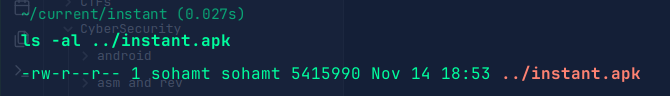
It's a .apk file. Let's decompile it and see what we can find.

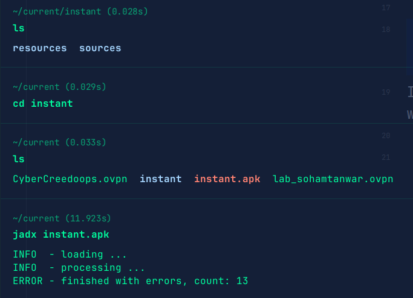
Used jadx to decompile the application.

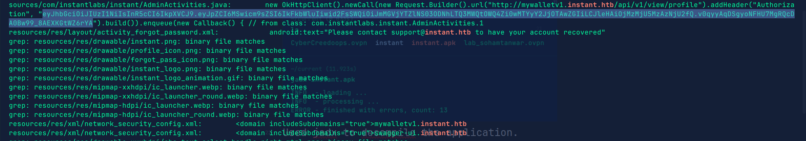
Used "grep" command to view in the file for the domain "instant.htb" and found two sub domains and an api key which is used for authorization on a specific sub domain.

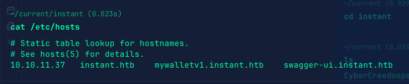
Added domains in /etc/hosts file.

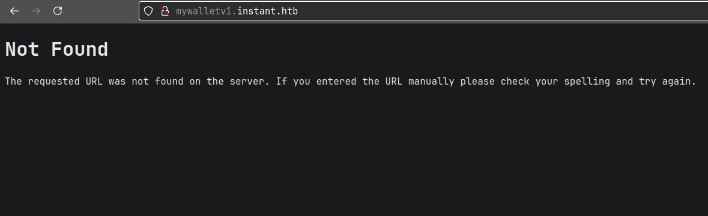
1 showed 404.

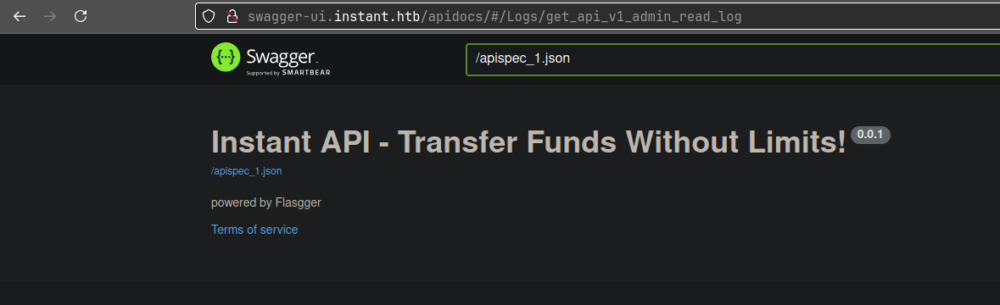
Other was for the api one. Basically we can view api endpoints and see what to get from those endpoints and stuff.

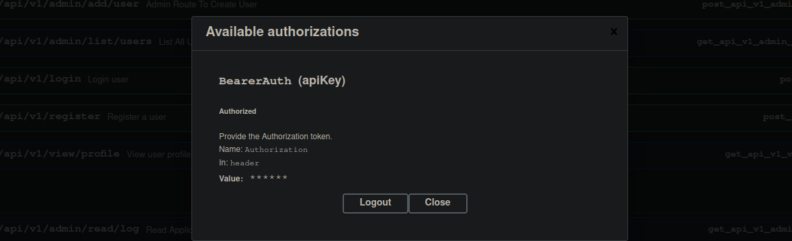
We have to authorize with our api key to see the endpoints and did that.

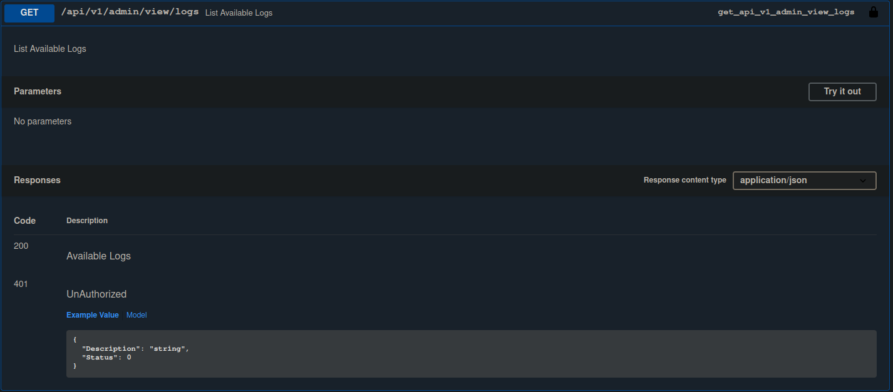
So, on one api endpoint we can view application logs of the admin.

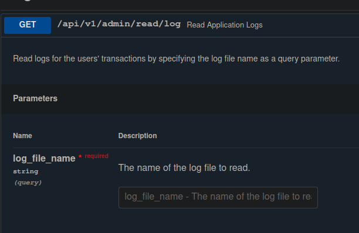
SO, found this api endpoint where we have to query with the file name and we can view it.

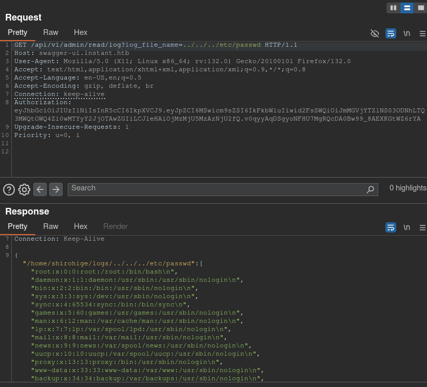
So, used burpsuite to test whether we can exploit api endpoint and was able to view /etc/passwd.

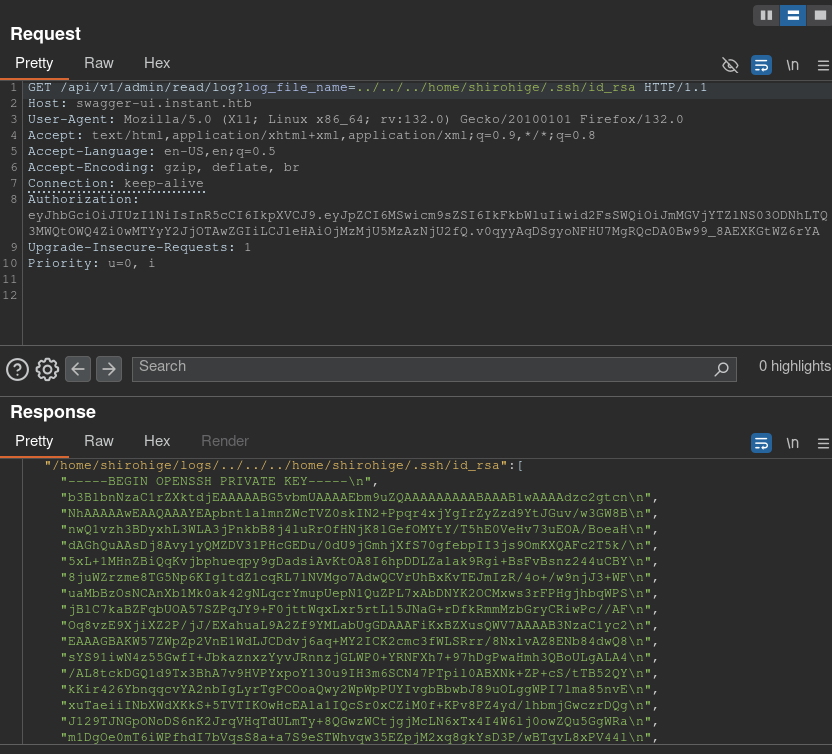
So, found a user and attempted to view it's ssh private key and got it.

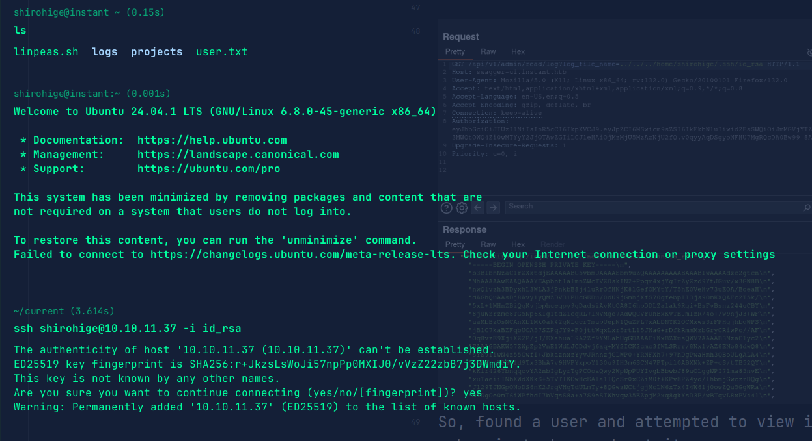
Logged in through ssh and got user flag.

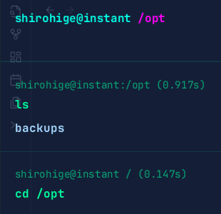
in /opt directory found a backups directory.

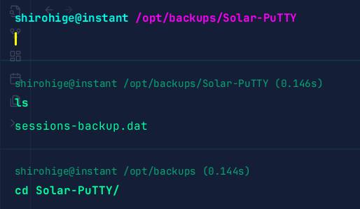
Found a .dat file.

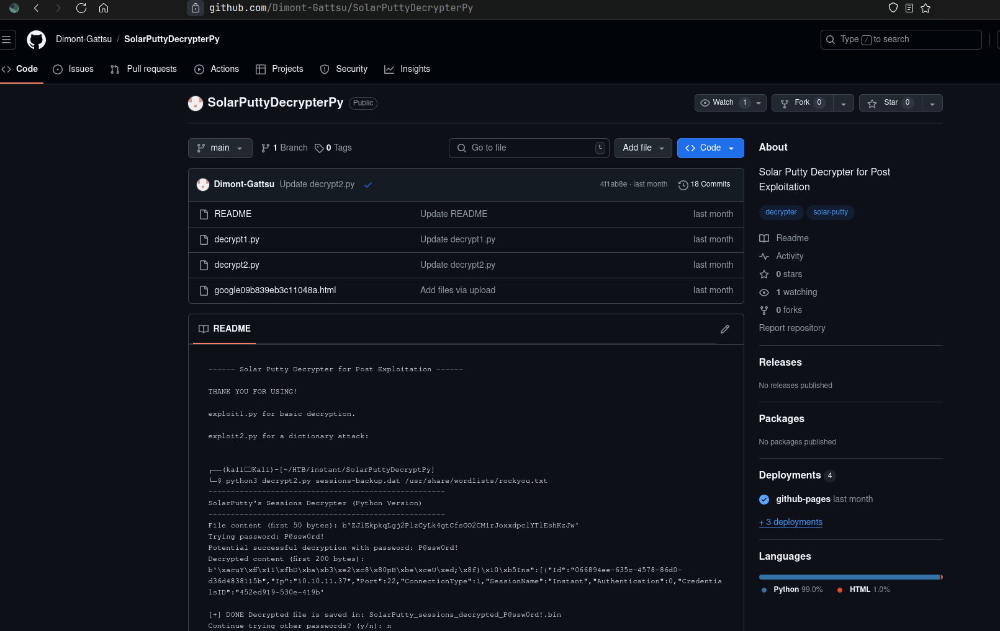
So, found this tool on github and let's try it.

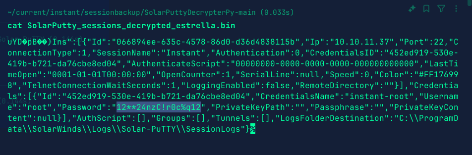
So, used the tool and found the password of the root user.

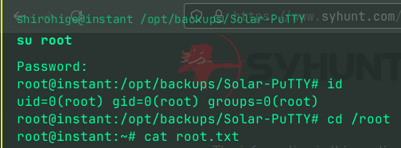
Got root flag.