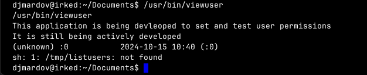

**ip of the machine :- 10.129.2.249**

machine is on!!!

Found some open ports out of which a lot are unknown so let's see what we can find about it in the aggressive scan.

So got versions, and started looking for any available exploits but didn't find any for ssh and http server...

Went to the website and it gave a hint "IRC". Now what the hell does that mean??

So IRC is a protocol used in 1988 for real time messaging. Wait is it really running on any port!!!

So some ports are running IRC protocol.... Let's find some possible exploits for IRC protocol.

So did another nmap scan for all the ports and found unrealIRCd as the open source one running the IRC server.

Don't know about the version of UNrealIRC so have to brute force / hit and trial with this exploit as it was the first when i wrote exploits for UnrealIRC.

So basically exploit had some reverse shell payload so -payload python means used reverse shell payload of python to get reverse shell.

Got one as a user...

Got another user in home directory...

Found user.txt in user's home directory but cannot view it...

In user djmardov's home directory found a .backup file...

Does "steg" means steganography and we have actually got the password of an image containing something hidden.

Let's download this image as it is the only image i've found.

Was write got a file by the name pass.txt.

Let's use it to login as another user....

Finally logged in as another user...

sudo command not found!!!

Looked for SUID files and found one strange one by the name "/usr/bin/viewuser".

Ran the file and it said a specific file in /tmp directory not found...

it is an executable/binary, that i know.

So here's an approach for priv esc.
Now i will create a file with the name listusers in /tmp directory which will contain a shell.

So first created a file and entered a shell in it and gave executable permissions, so when /usr/bin/listusers got executed, it also executes the /tmp/listusers file which contains a shell and it ran as root maybe that's why it gave a shell as root user.

Got the last/root flag...