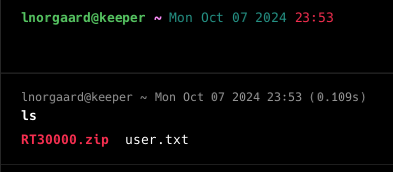

**ip of the machine :- 10.129.114.185**

machine is on!!!

only two ports are open!!!

did aggressive scan and found versions of the services running on the ports...

we have to add tickets.keeper.htb in our /etc/hosts file.

login page of request tracker is open!!!

let's try these default creds.

i am in!!!

in /admin/users found a possible username "lnorgaard"...

Found a username and password let's try logging in using ssh with above username and password.

logged in as user with ssh...

found 1st flag and a zip...

after extracting the zip file found two files. Let's see what these files are...

So .dmp is a memory dump file and that to a keepass dump file. Let's see if we can find a tool to parse .dmp file for master password for .kdbx file opening...

came across this tool on github.com. Let's try this tool...

ran the tool and it gave some gibberish stuff, i don't know so searched it!!!

Let's try this as the password...

we need a password to open .kdbx file.

So added this as the password...

Wooh!!! got into the password database...

in network section found "root".

Had a password and Putty private key for ssh.

Added this key in a file as password was not working, so will be using this to ssh into the server as root.

added private key in ssh authentication session in putty.

add ip and then connect...

logged in as root and got our last flag...