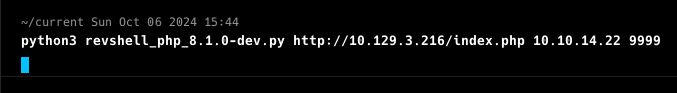
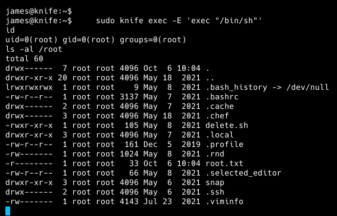

**ip of the machine :- 10.129.3.216**

machine is on!!!

only two ports are open!!!

Got versions of services running on both the ports...

found an index.php file through directory fuzzing not else... Let's see it...

just the same as the default one when we add ip addr. simply.

Then i analysed the response headers and found PHP version 8.1...

found this exploit of version 8.1 of php, let try it!!!

ran the exploit!!!

got rev shell as a user...

simply went to home directory of the user and found a flag over there...

by doing "sudo -l" found that user "james" can only run one binary as root user.

Got the command on GTFObins, let's try it!!!

entered the payload and escalated privileges vertically and got root flag.