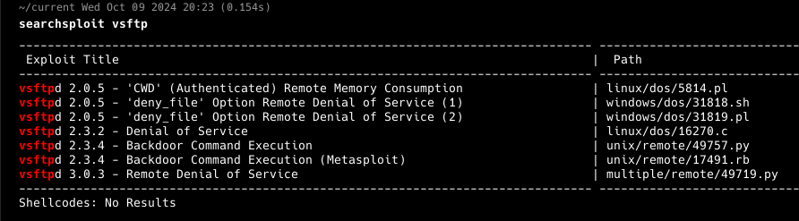
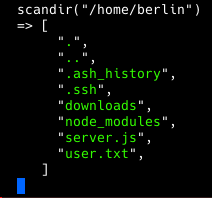
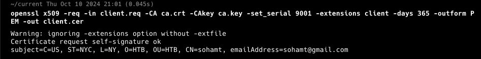
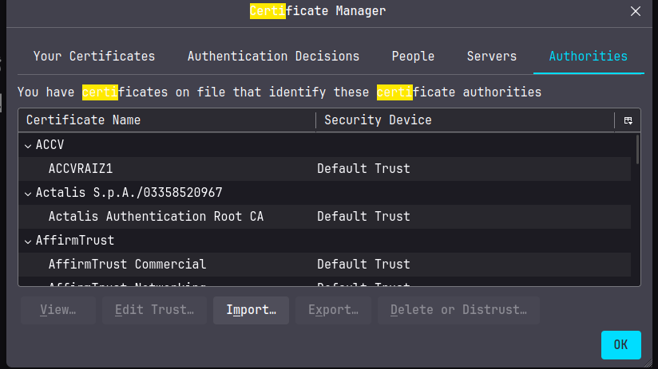

**ip of the machine :- 10.129.69.102**

machine is on!!!

got some open ports...

Got versions by nmap aggressive scan...

cannot login to ftp using default creds. let's see if this version of ftp has some vulnerabilities or not...

So the version running is 2.3.4 and contains backdoor command execution vulnerability and the exploit is on Metasploit...

got the exploit, let's set options and run it.

oops, it connected but then gave an error. But it was trying to connect on port 6200 which didn't come in the scan, that's unusual. It was connected to the backdoor but there was no shell...

Let's do a versioning scan on port 6200.

The scan gave a lot of php stuff and the name of a shel "psy" running 7.2.10 version of php, wait does that mean it is running php shell. let's search for "psy shell php".

So it is a developer runtime for php and an interactive debugger in php. Let's try to connect to it using nc...

we connected to the php shell...

help command gave us a lot of commands we can use...

Will be using this function to see more about the php running in the shell...

So after the above function got this which means we are logged in as user "dali" and the server running is in user's home directory.

cannot execute functions like "exec" for safety reasons probably.

then came across this function...

let's use it...

wooh!!! we can see directories at least...

Got some users..... in /home directory. Our php shell is running as user "dali" so checking "dali" user's home directory should be priority.

Got some directories and files.

we can also see .ssh directory although don't feel relevant in this case. Rest files and directories were of no use in dali's home directory.

in user "berlin" home directory found user.txt, our first flag, let's try to read it...

will be using this functions to read the contents of the file and display it.

Permission Denied!!! But at least we were able to find the function to get and display the contents of the file.

Found a "ca.key" file in user "nairobi" home directory, let's see if we can view it or not.

Got a CA private key.

saved it in a file name ca.key.

In rest user's home directories didn't find anything interesting...

Let's see website now...

So this the website running with HTTP.

This is the website running with HTTPS and it says that we require client certificate to actually access the website.

Now this means we need a client certificate and signed ca certificate for an ssl (HTTPS) communication with the website.
Let's do it using openssl then...

So "genrsa" means generating a client key in rsa format which will 4096 bit in size.

So this command will create a signing request using the client key generated.

Download the website certificate from the https site of the website and renamed it ca.crt and self signed the certificate request and got the client certificate.

converted the certificate into p12 format so that we can add it into the browser for ssl.

Now let's add the generate CA and client certificate into our browser...

So import client.p12 in "Your certificates" section.

in Authorities section add "ca.crt" of the certification authority.

after adding the certificates this will come....

In this image we can see two things, first the name of these files are in base64 probably and second the url as "path" query parameter which means there is a chance for LFI.

Was write file names are in base64....

so changed the value of the path query parameter to ".." and it showed directories... Let's try to grab private ssh key to get more hold of the web server.

cannot click on id_rsa.... But file names are encoded in base64 and i noticed that when any video or something is being downloaded whether from "SEASON-1" or "SEASON-2" it is from a directory named file...

so encoded the path of private key in base64 and then it automatically downloaded the private key.

Let's try to login through ssh now...

So now tried to login through ssh with various possible users in the system and professor was right...

didn't find anything worth it in user's home directory apart from some .js files.

Let's run pspy and linpeas for further enumeration.

Found a cron job running node and a .js file in home directory of the professor... Let's see what is it....

memcached.js was not readable for professor but found this command in memcached.ini file.

So changed the name to ini.bak and it will not change the permissions but the inode mapping.

created a .sh file in /tmp directory in above payload to get reverse shell...

created another memcached.ini file in the home directory and when the cron job will run it will run the payload in memcached.ini file as root as it is a cron job and it will execute the shell script that we created in the /tmp directory and then the payload in it will give us a reverse shell as the root user.

got it!!!

So was confused with ini and node js and there relation so searched it and learned that .ini file consists of the configurations with key value pairs, so here memcached.ini was the configuration file for the memcached.js which has the command for the cron job for memcached.js so we were able to know what was happening with the memcached.js even though we were not able to access it.

So, got user flag in the home directory of the user named "berlin".

Got the root flag as well.