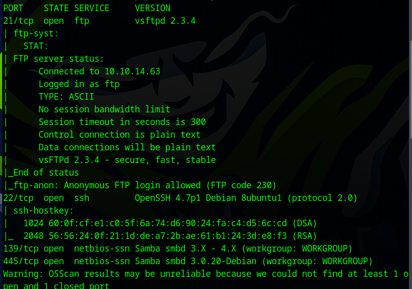

https://app.hackthebox.com/machines/Lame

**ip address :- 10.10.10.3**

First we did a ping scan also known as "ping sweep" to see whether the host is up or not.

Now we did an all scan (-A) to get the os information, version info and traceroute information. "-Pn" was used because we know host is up so there is no need of pinging the host and directly start scanning, and '-T5' for speed and min rate to send 10000 packets minimum to speed up the scanning process.

So, we can see Samba is running of Port 139 and 445 and FTP running on port 21 with version vsftpd 2.3.4. The scope of exploitation in this case is in FTP port and Samba ports.

So, first will start by exploiting FTP.

I searched for vsftpd 2.3.4 which is a backdoor command execution exploit on msf. 

Also tried to use it but failed because we don't have a password to create a backdoor session.

So now we only have one option. We have to start exploiting SMB on port 139. 
We need user and root flag which means we need a shell to get those flags.
So, Let's explore what possible vulnerabilities this version of SMB has and what possible exploits we can find to get a shell to execute OS commands.

So searching CVEs on cve.mitre.org and found this vulnerability which allows remote execution in server. 
Let's see if metasploit has any module to execute the task.

So after a lot of searches i was able to find the exploit because you cannot get it directly by typing "samba" or "smb" in search and not even "samba remote", we have to be a bit specific.

After setting all the options click exploit.

We got reverse shell prompt.......

We used this python one liner to get an interactive prompt and we can see we are already logged in as root.

so here we got one flag of the user.

here is the root flag.