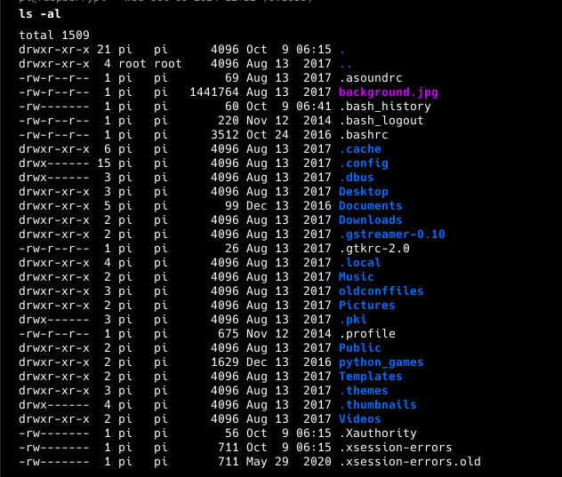

**ip of the machine :- 10.129.214.193**

machine is on!!!

Wooh!!! A lot of ports!!!

Let's see port 80 first...

got nothing... maybe index file don't have any html code i guess, let's do directory fuzzing then....

Found only two dirs. first one looks a lot interesting though.

Found an open admin console.

found a login page...

found pi default creds. but are for raspberry pi.... Then searched raspberry-pi vs pi-Hole.

So pi-Hole is basically raspberry pi but for docker.

So using default credentials was able to login to the server using ssh.

No user.txt but we can see the .bash_history file this time... Let's see it then...

user pi ran "sudo su"... well does that mean our user "pi" is the root user only.

was right abt it...

privileges escalated vertically.

got first flag in "Desktop" directory of the user "pi".

root flag is not there, usb stick...

Did lsblk to see all block devices and found usbstick...
/media/usbstick.

What the hell!!! deleted files of the usb stick...

So tried to get to the mount point and found that it is not a directory which means a file...

it's some kind of binary file, so let's do strings then.....

Got our last flag!!!