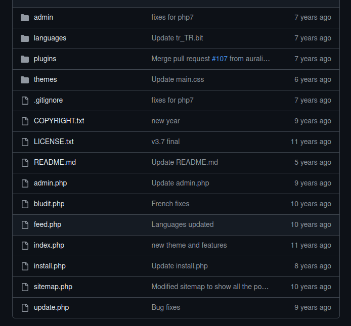
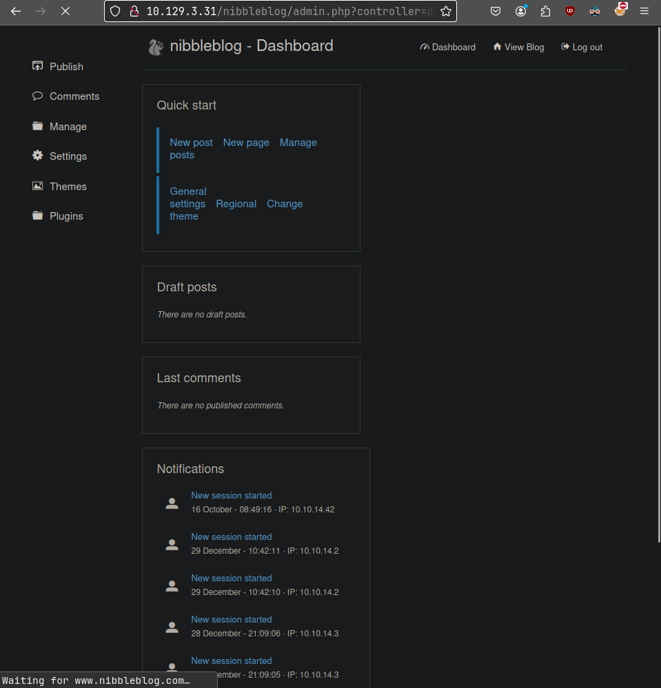

**ip of the machine :- 10.129.3.31**

machine is on!!!

Found two open ports as usual.

got version of both the services running on the ports...

Added ip on the browser and got to see the web application with only hello world.

So after viewing the page found a directory, so let's view it.

Huh!!! Powered by nibbleblog, but what is nibbleblog...

So it is an easy, fast and free CMS blog management kinda thing which is no longer maintained...

It's src. code has a lot of php files which is a point to be noted...

On directory fuzzing with ffuf found some .php files and directories.

found a login page.....

So logged in with creds.... (admin:nibbles), got an idea of username as admin from some searches and nibbles as password is what i randomly guessed!!! Just pure manual brute force...

Found only one exploit only.....

So ran the exploit with a payload as php reverse shell by pentest monkey.

got rev shell....

Got first flag!!! But also got a file personal.zip.

A file in directories!!!

A script but can be run as the logged in user only.

We can only run the script as root user and we can also rwx as normal user which is easy priv. esc.

So added the '/bin/sh' in monitor.sh and ran the script as sudo and got the root shell...

Got root/final flag...