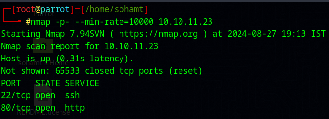
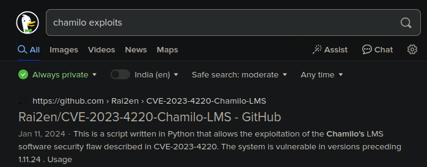
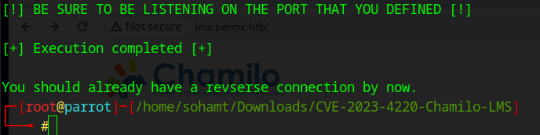

**ip of the machine :- 10.10.11.23**

machine is on!!!

got two open ports.

did an aggressive scan and found nothing useful.

After entering the ip address on the browser, it is redirecting on permx.htb. So will add them in the /etc/hosts file.

After adding ip-domain combination, website will open.

Did directory fuzzing using gobuster and found some.

Did subdomain enumeration using gobuster. Redirected the output in a file because there are many sub domains giving 302 status codes.

It had 5000 subdomains so grepped using source code 200 and found one.

found .css and .js files in all the directories, in /lib found them.

/css, /js and other directories gave some files of source code but not anything important so will be visiting the subdomain found using gobuster.

added lms.permx.htb in /etc/hosts file with the ip address of the machine and then we opened above web page.

in forgot password after entering admin as username, it prompted contact David Miller. So maybe David Miller is the admin.

So i didn't know about the creds so, tried to learn more about the this lms as we known that David Miller is the name of admin but it is not his username so we cannot do brute forcing, so tried to find some exploits related to chamilo lms and actually found one.

So this CVE in chamilo LMS can help us to get a revshell without actually logging in so i followed the steps in repo to find what to do.

first the repo said to do a scan to see whether the directory where we want to add our reverse shell can be accessed or not and it seems we can.

in repo they have also given a path so let's go and see at this directory.

able to access it!!!

Now to get a reverse shell it was written to execute this command and listen at nc ofc!!

after executing the command it will ask for ip and port and file names. Let file names to be default simply press enter, and added my ip and port on which to listen.

Let's see our nc listner now.

got the reverse shell!!!

in home directory found only one user.

in /opt found a script.

saw the contents of the script and it seems that the script is used to assign permissions to the files and directories.

Didn't find anything unusual in cron jobs.

found some SUID files. Didn't find anything to escalate privileges horizontally through SUID files.

/etc/passwd, users having bash as default shell.

also ran pspy but didn't find anything useful.

So after manually searching for a while, in /var/www/camilo/app/config/ found a file named configuration.php which looked interesting and had literally information about the tables in database, there name, auth, cookies etc and that to in one big file. Seemed pretty sus!!! to me.

And in the file configuration.php then found this interesting block of code.

in mysql server!!!! yay!!!

found two passwords in user table of chamilo database. Let's crack them!!!!

Password cracking was taking time so used database password for the user mtz and was able to login.

user can run only one file as root which we discovered in /opt.

created a symlink with /etc/passwd with pass in home directory of the user.

Then we can add a dummy username with root privileges in pass file and then we will get root shell and then further root flag...........