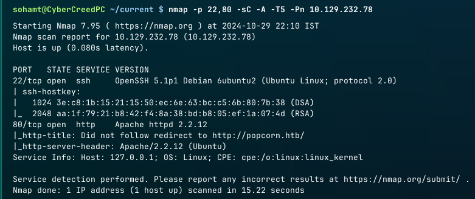
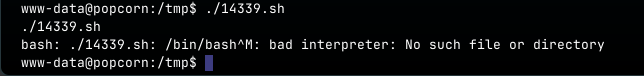
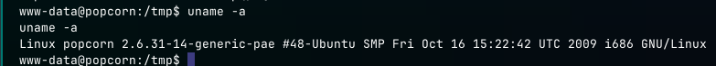

**ip of the machine :- 10.129.232.78**

machine is on!!!

Got two open ports!!!

Let's add ip and domain in /etc/hosts file.

Let's see the website now!!!

Found nothing as such...

Found some really cool directories to look into.

/test directory show configuration for all the web pages on the web application which looks interesting...

/torrent contains a torrent service hosting.

It asks us to login whenever i try to go anywhere in /torrent and the service that is running is from 2007 which means it may have some vulnerabilities and exploits along with some default creds. Let's check it out...

So found a file upload vulnerability exploit with some steps to follow and further get a rev. shell. Let's understand it...

Let's do a common php file scan to learn more about the php files in /torrent/ directory.

Oh!!! Found a lot of php files including the upload ones, as we know it is vulnerable to file upload vulnerability...

So every page is showing this blank stuff, I think so we have to login first but it doesn't has any default creds. Let's dig more to find any other exploit.

So after clicking on upload, it is redirecting us to the login page every time so will try to bypass the redirection. So yeah it didn't work as well...

So logged in as the user "test". There was a signup page, so i made an account with user named test and now i can access upload page to exploit file upload vulnerability.

So downloaded pentest monkey reverse shell.

Added all the required stuff, let's upload.

Of course it wasn't, it was a .php file. While uploading let's capture the request and try to rename it.

Let's change it to .torrent after .php.

Again it didn't work, let's see the exploit that we found on exploit-db again.

So renamed my file in the system and now let's try to upload it again.

Let's try to capture the request again to see whether it will upload or not.

Previously, it was detecting that we uploaded a .php file, now we are uploading a .torrent file, so there seems no problem now.

Still failed...

Now this time renamed the file with a png extension along with php.

Now after capturing the request changing application/php content-type to image/png.

Still not a valid torrent file. Is it even accepting the torrent file or not.

In upload directory saw .png files which means it is accepting .png files.

Maybe it's not the place to upload the revshell as it needs a .torrent file, so let's the one available on the website.

So uploading a kali linux .torrent file that was on the web application itself, because upload directory only has the screenshot of the torrents and not the .torrent files.

Let's get ourselves new torrent file.

So downloaded bittorrent file of parrot.

Now it asks us to add the screenshot let's add reverse shell here with .png.php extension.

Let's add our screenshot... I mean rev. shell...

changed the content type of the screenshot.

Wooh!!! Uploaded...

Got it in the upload directory.

Just click on the rev. shell and got it!!!

Found one user in the home directory and found the user flag...

Found database creds. in /var/www/torrent/config.php file.

in the mysql database with the creds.

In, torrenthoster database, found a table by the name users and got the admin password hash.

Hashcat was not able to crack the hash and not even crackstation.

Didn't even find any .ssh directory or private key in order to login as the user.

After finding everywhere and trying numerous things, went to user's directory again and noticed that we can see only one directory .cache. So viewed it and found a file with an unknown name.

Oh!!! it is the message displayed to the user, every time they login through ssh.

Then found this on exploit-db.

ubuntu only!!!

Let's try this exploit then!!!

Got the file in the compromised system. Let's run it...

bash is showing the error. Some google search revealed that it can run in sh.

So, the exploit is not running...

Let's search for any kernel exploits.

So ran a kernel exploit!!!

The above one which comes under dirty cow vulnerability.

So this exploit created a new user with a password displayed in /etc/passwd file and it's home directory will be /root.

So when the exploit is run, it asks for a password which i set "toor" in this case and got root privileges.

Got root flag...