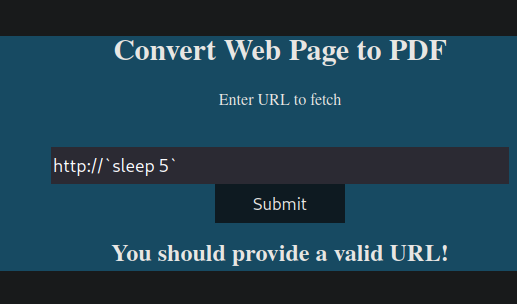

**ip of the machine :- 10.129.228.98**

machine is on!!!

Only two ports are open!!!

It seems we have to add precious.htb in our /etc/hosts file.

oops!!! let's see what is it...

So directories and sub-domains found in ffuf scan...

So didn't know much what web page to pdf was doing, so did a more verbose scan for port http, and found another software running with nginx.

So tried to analyse the site in burp suite and saw the runtime..... in response headers indicating that the applications backend is probably running in ruby.

Some kind of url filtering which need to be bypassed.

So "%20" means "+" which is replaced by space and then it is reloaded after 5 seconds so this means this payload is actually working and by the way using back ticks so that can write payload with spaces inside.

Let's try to add a reverse shell...

So instead of sleep in back ticks add this reverse shell payload so ruby compiler will execute it and you will get reverse shell.

Ta-Da got it!!!

So found creds. of another user "henry" in .bundle folder of user "ruby".

Got our first flag.....

So user "henry" can run a script in /opt directory as root user...

Let's view the script.

Well didn't understand much, but i think so it is comparing the dependencies in these script to dependencies.yml file.

So it says no depecdencies.yml file exist but in sample directory in /opt a sample is given, so here's an approach let's make our own dependencies.yml file with a reverse shell and when the script is run we will get a reverse shell as root. Although this approach didn't work for me.

Saw version of ruby for any exploits, version of ruby running is 2.7.4.

So wrote "ruby version and local priv esc", a blog came which is insecure deserialisation.

So, here it is, we have to write this in dependencies.yml in same directory and then run the script as sudo and it will not check for the type of data being passed in yml file or basically validity of the data and privileges will be escalated.

in place of "id" in git_set, add /bin/sh and it will give a root shell and then go and get root flag in /root directory.