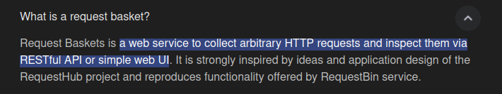
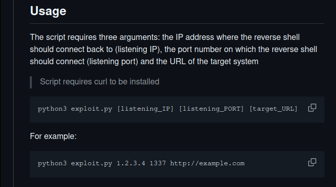
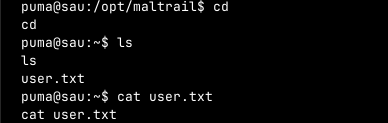

**ip of the machine :- 10.129.229.26**

machine is on!!!

Got 4 open ports but found only two open ports, let's scan them further...

So port 55555 is running HTTP server. Let's view it...

Website is running Request Baskets version 1.2.1. Let's see what is it....

So it is a web service to collect HTTP request and analyse it. Hmm... interesting...

So searched for exploit and every website showed SSRF (server side request forgery).
So it is vulnerable to SSRF, let's view any article and try to exploit it...

Got an exploit, let's run it then...

So exploit didn't work, i don't know why so went to a blog to find how to actually exploit it.

Got this from a blog and summarizing it, so basically we can create baskets and then request are received in those baskets, but we can also forward those baskets to another server which can also be the server of an attacker at localhost. So actually get the requests coming in the basket.....

So used this exploit...

Ran the exploit...

SSRF confirmed by forwarding request...

Now let's further exploit it for reverse shell in the server....

So tried forward URL on my device and it worked, so tried adding 127.0.0.1 and checked proxy response if the bucket is used as like proxy or somethin....

Did curl on the basket after changing configuration and found another site running behind.

Now opened the basket with provided url and found this....
It is running maltrail v0.53 so let's exploit it.

Found an exploit...

Got a usage example as well, let's use it...

So exploit failed, and then i noticed it redirected to login page...

So in configuration settings added /login and then ran the exploit...

Now it ran...

Got a reverse shell...

rev. shelld as the user only...

Got user flag...

Woah!! ran sudo -l and saw what the user can do as root...

So executed the command as sudo...

When systemctl command was ran it opened it with command less, which is for viewing the file so added !/bin/sh to invoke a shell there, as the command was running as root so got a shell as the user root.

Got root flag as well...