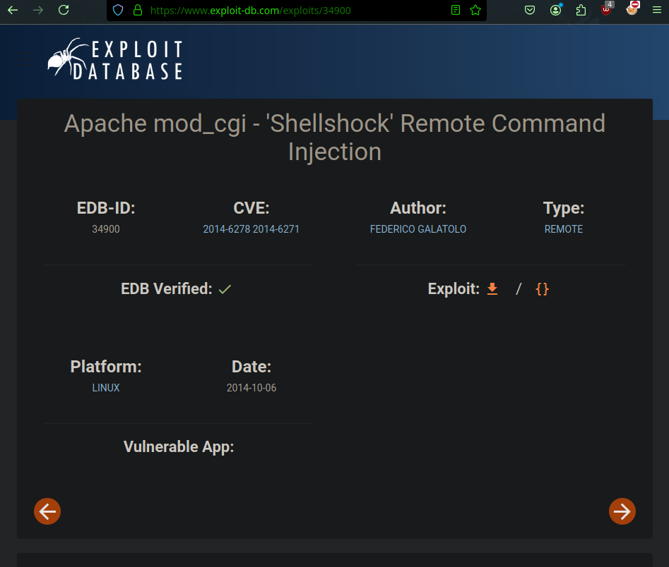
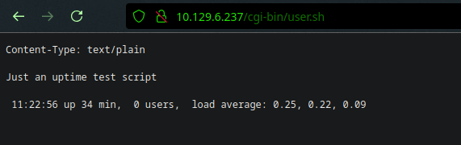
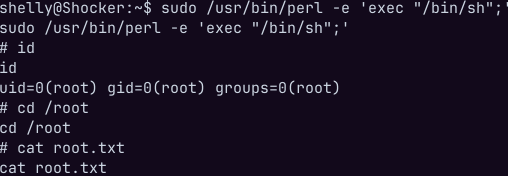

**ip of the machine :- 10.129.6.237**

machine is on!!!

Only two ports are open!!!

So port 80 is running http as usual and port 2222 is running ssh.

Found some directories, All are 403 except one which is the default one "index.html". But still out of all "cgi-bin" seems different... Let's search something about it

So i came across this exploit for cgi-bin...

So exploit-db exploit was not working even after fixing errors in the exploit, so searched for new exploit with the CVE and found one.

Again this exploit not working some how so learned about the CVE more and then it said that there should be a script whether .sh, .cgi or .ps1 in cgi-bin directory which can be then further exploited by adding payload through exploits to get the rev shell, so thought of doing directory fuzzing again in /cgi-bin/ to see whether we can find any script to exploit or not.

So used dirbuster for recursive directory fuzzing and found user.sh with 200 status code, let's see it...

Just an uptime test script, now let's use exploit because now we know the correct path that it is not /cgi-bin/ but /cgi-bin/user.sh.

So using a metasploit module for this and set options.

After setting options enter "exploit" and a meterpreter session will be opened.

Type shell and then above python script to get an actual shell instead of using meterpreter shell.

So went to /home diectory and found one user "shelly" over there and got our first flag.

I just realized that i had shell as user "shelly" only, so did "sudo -l" and saw that user can run /usr/bin/perl as root user.

So will be using this command from GTFObins in order to escalate privileges.

Escalated privileges and got the last flag.