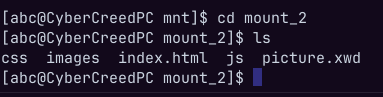
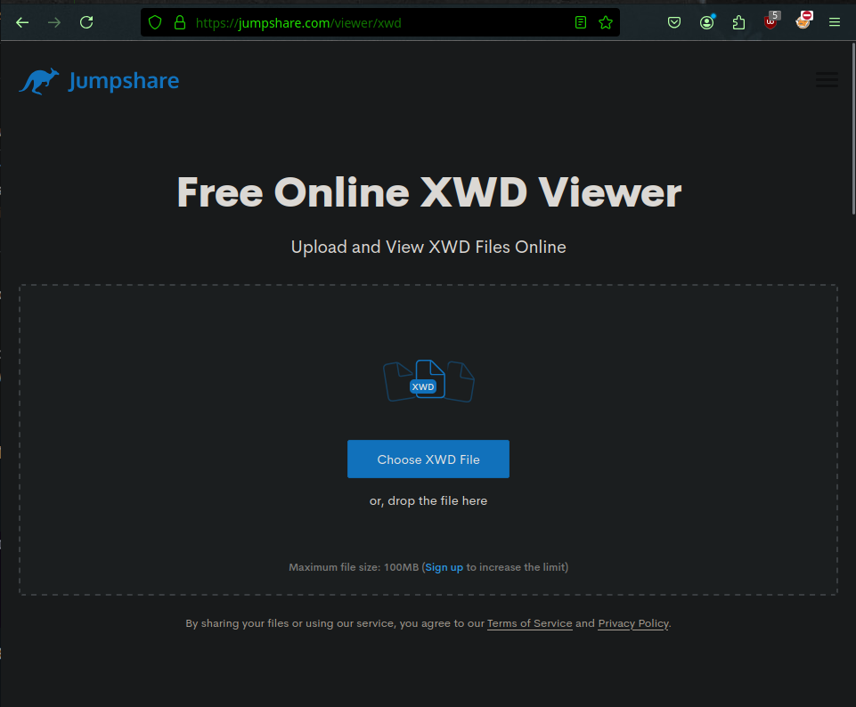
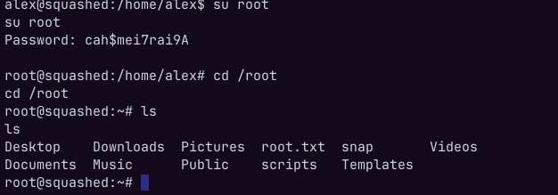

**ip of the machine :- 10.129.228.109**

machine is on!!!

found some open ports... but found some unknown ones which seems unusual.

Aggressive scans revealed some versions but only ssh, http and nfs are of use or worth.

Found a website but didn't find anything worthwhile.....

Found some directories and then visited each of them and can only see there files but nothing interesting in those files. But the only good thing is we can see them that's all.

Now let's start with NFS (Network File System) which is networking protocol which defines how files are stored and retrieved.

But there is something about network file system it contains certain directories/shares which we actually mount in our system and can actually access the files in those directories, so let's see what possible directory names and shares we can mount... For this will be using a nmap script...

So these are the directories/shares we can mount. Name of the script is "nfs-showmount" and can be found by a simple search.

So created directories in my /mnt directory to mount the file system.

So used "mount" command, "-t" stands for type which is nfs in this case. So mounted both in my system /mnt directory.

So this is home directory of user "ross".

Found a .kdbx (which is a keepass file) in the home directory of the user but it also requires a master password to reveal the creds. which we don't have it....

So for now ross user home directory does not require more enumeration so will be going to /var/www/html which is the src. code of the website running on the web server.

wooh!!! permission denied so did "ls -al" to see permissions of the directory...

So, mount_2 or src. code of the website can only be accessed by a user with uid (user id) 2017 and group name "http". So let's create one shall we???

So this is one of the weakness of nfs shares when mounted in a system, we can create even user and group with custom uid and gid in which share is mounted and access files and directories which are not allowed to access upto certain extent.

So we made a user by the name "abc" with uid set to 2017 and adding abc in it's secondary group http.

Now we are in mount_2 or source code of the website directory...

The user we have created also have permissions to add, alter and delete files from the directories...

So here is an approach :- let's try to upload reverse shell in the images directory specifically php reverse shell by pentestmonkey and then will go the images directory and then try to invoke the reverse shell.....

Added it in the images directory...

Started our nc listner.

We can see revshell.php, simple click on it and you will get reverse shell.

got it as user "alex".

Got first in user "alex" home directory.

Now after enumerating different files and directories for a long time, saw a file named ".Xauthority" and wondered what is it.....
So came to know that this file stored credentials for the authentication of the user for X sessions like (X11) and also contains the data of user done in a particular session just like session cookie in websites, well a bit similar to that but not exactly the same.

this file is in the form of binaries so cannot read it, let's make it's base64.

Created one. Let's go back to attacker's machine.

Added it in a file and then set an env. variable to set a session and we can see session is started as user "ross".

So now will be using xwd command to actually capture the window of the session.

So used xwd command and then redirected the output to an .xwd file.

So used nfs to share file with my system...

Went to an online xwd file viewer...

After uploading .xwd file on the website we can see password of the root user.

Logged in as root user and got our last flag.

At last to unmount the file shares or shared partitions use "umount" command and to delete the user which we created "userdel".