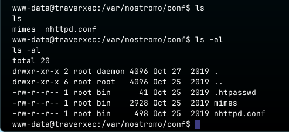
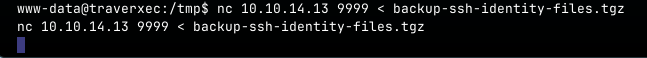
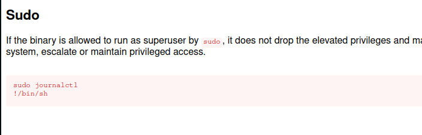

**ip of the machine :- 10.129.231.58**

machine is on!!!

Got two open ports!!!

Got version of the services running on the respective open ports...

Website looks fine and doesn't has any link or something and as well as directory fuzzing is not even working...

Then searched the web server running on http with it's version as it seemed different and got an exploit, so will be using metasploit for this one!!!

So after setting all the options, i ran the exploit and it worked, session created.

There is one user's home directory but cannot access it.

So went to /var directory where there are all the files and directories for the web application running on the web server.

got some interesting file in conf directory. Let's see view them...

maybe we should look in htdocs directory after seeing all the files here...

Oh!!! password hash for user david, we were looking for...

cracked it!!!

Now that's strange!!! It didn't work!!! Let's go to htdocs directory which was in conf file for more information...

Nah!!! got nothing interesting, just the src. code of the website...

So, found just a password and that is also not working, let's try to find some more stuff.....

I overlooked the .conf file, it contains a directory.

i cannot cd into /home/david but can into /home/david/public_www as it is a public directory and have permissions to read and access it...

here, got another directory and found a .tgz file which looks interesting, so let's get it back into my system...

So first started a nc listner with output redirecting to a file we want to recieve from the sender.

Then send it to the reciver with ip and port specified and file we want to send.

file recieved.

Extraction revealed a lot of files...

Got a private ssh key in order to login as user david...

It is asking for the passphrase, let's try entering the password we got previously.

OK!!! So it is the wrong password!!!

Let's find the passphrase using ssh2john.

created the hash of the private key...

found it!!!

Got user flag...

OK!!! cannot see what user david can run...

But also found a bin directory in user david's home directory, let's see what is it.

A script only david can rwx and no other can.

saw the last line of the script and found out that user david can run journalctl as root user, so let's modify the script and exploit it in order to escalate privileges vertically.

Got the payload in order to get shell as root user, let's see how to use it!!!

Just ran the script, and found nothing to inject the payload. So now, let's edit the script then.

Cannot edit the script using any text editor!!!

So let's use the command directly.....

So directly ran the command and it invoked less to show info. but as the root user. Let's add the payload then...

added payload and escalated privileges...

Found the root flag...