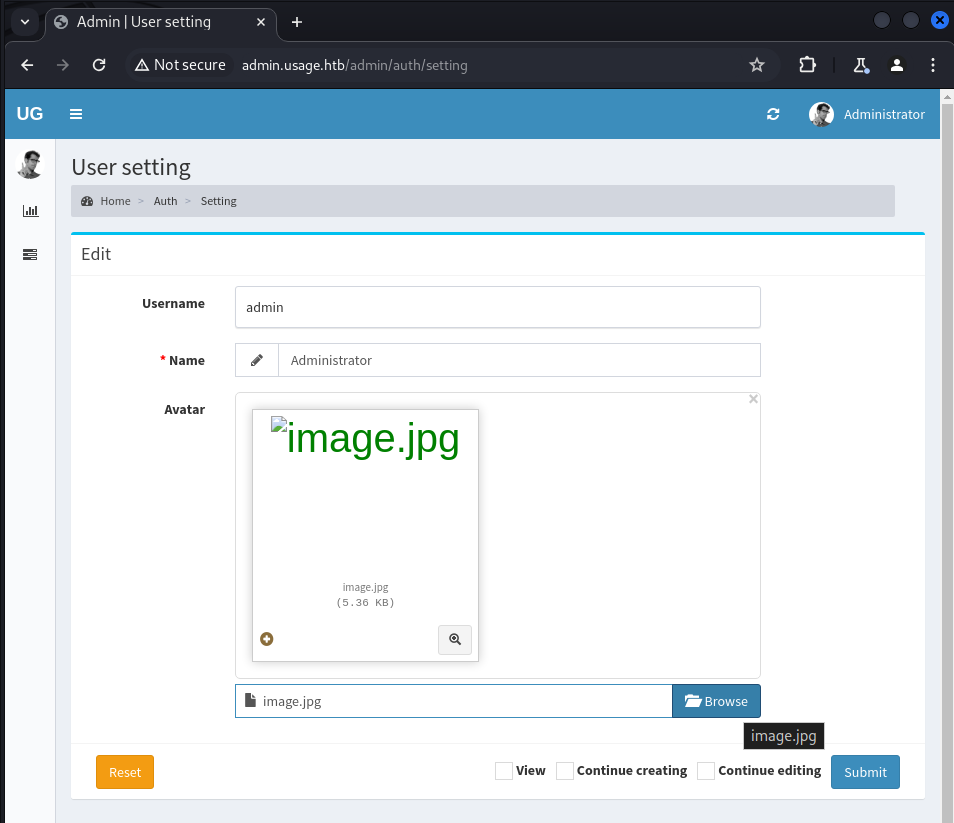

**ip of the machine :- 10.10.11.18**

machine is on!!!

got some open ports!!!!

result for all the services and there respective versions running on the machine.

found a sub domain through sub domain enumeration of gobuster.

found some directories through gobuster directory fuzzing.

we can register as a user so registered a demo user.

after logging in found this and nothing interesting.

nothing else was working as such so went to forgot-password web page to see if we can find something or not.

Here, tried to attempt some SQL Injection and found that it is vulnerable to sql injection so will be using "sqlmap" further.

capture forgot password request from burp and save it to a file.

-r :- file with the captured post request.
-p :- for the parameter which is vulnerable to sql injection
--batch :- no input from the user and using automated ones
-dbs :- want all the databases present
--level :- level of test perform where 1 is default and if it is confirmed that sql injection can be performed than higher level should be preferred.

only got three available databases. Will be looking at tables and content of usage_blog database.

also looked at the possible tables and found "admin_users".
-D :- for database 
-T :- for the table
--dump :- to get the records from a specific table in a specific database mentioned

got admin password hash.

it's a bcrypt type hash and cracked it using hashcat and password is "whatever1"

hooray!!! was able to login as admin.

Then searched for possible CVEs for laravel admin and found one which can help for remote code execution by uploading a php reverse shell.

We have to go to admin settings and then change the profile photo.

it was not uploading .php file so uploaded .jpg file which contained the php reverse shell of pentestmonkey.

Now while submitting, capture the request in burp and then add .jpg extension to it and then click "forward"

now we have to use nc and find a link to get a reverse shell.

got reverse shell.

got 1st flag in user's home directory.

also found another user as well.

got private ssh key of the user "dash" and logged in through ssh.

os info. can be used for kernel exploit later if req.

some services by name .monit something are running what are they??

saw contents of .monitrc because thought it would be like a config file like .bashrc or .zshrc so viewed it first and got some stuff.
This is password of the user "dash" who is our admin. But password is showing incorrect for user dash. Maybe password is for the another user. 

was write it is for xander.

xander can only run one command.

it was a binary so did strings to see what is going on and saw these lines.
So in /var/www/html directory a zip.

ran the binary and chose first option to create a backup and it created it in the /var/backups directory.

Now for vertical priv esc. create id_rsa file and create a soft link with private ssh key of the root user. Because when we choose option 1 while running the program it will create a zip and which will contain all the contents even the private key. Create "@id_rsa" so that when creating a zip after selecting the option it will display private ssh key of the root user on screen only and we don not have to unzip the project backup and manually look at it.

it gave us private key.

Now add this private key in a file with 600 permission and then login through ssh as root user.

got root flag......