**ip of the machine :- 10.129.231.125**

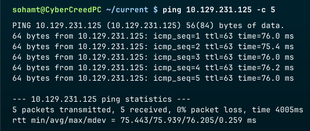
machine is on!!!

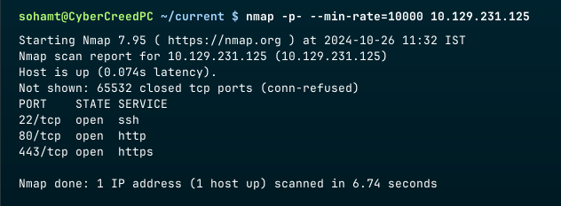
Got usual ports open!!!

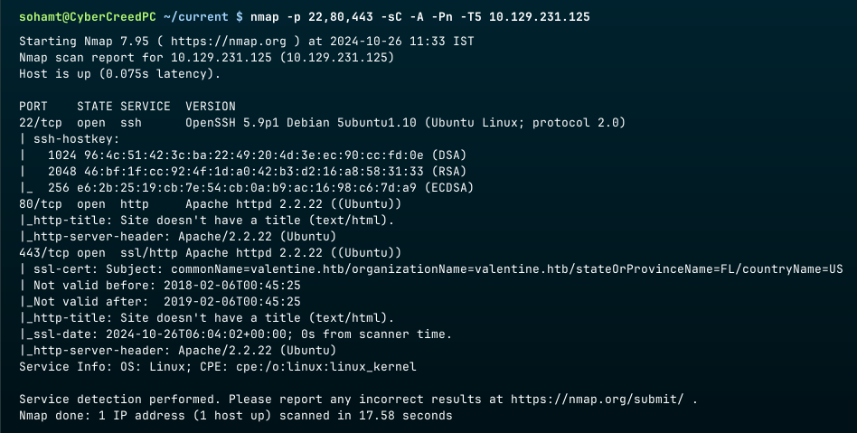
aggressive nmap scan revealed version of the services running on above found open ports.

http and https was hosting the same stuff...

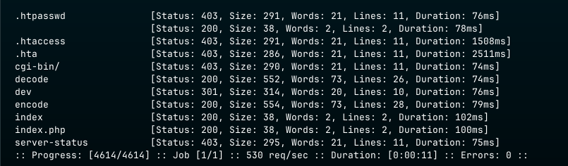
got some directories using ffuf...

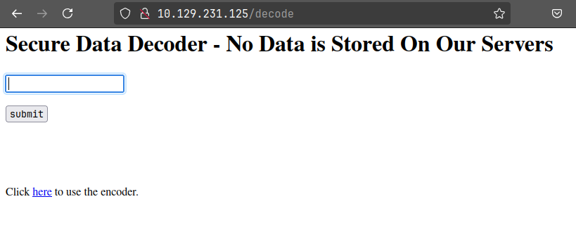
got a decoding web page....

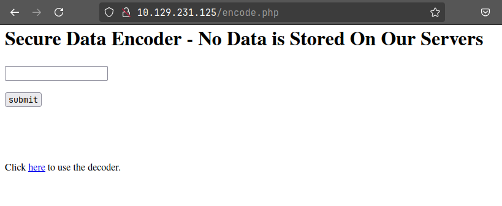
also got an encoding web page....

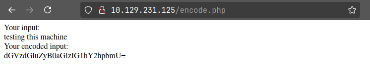
Looks like base64 encoder to me.... Although captured this request...

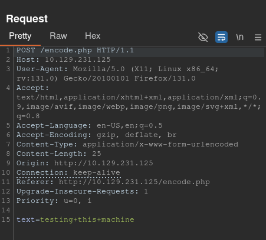
It is passing text as the parameter in data of the POST request, so let's try for command injection.

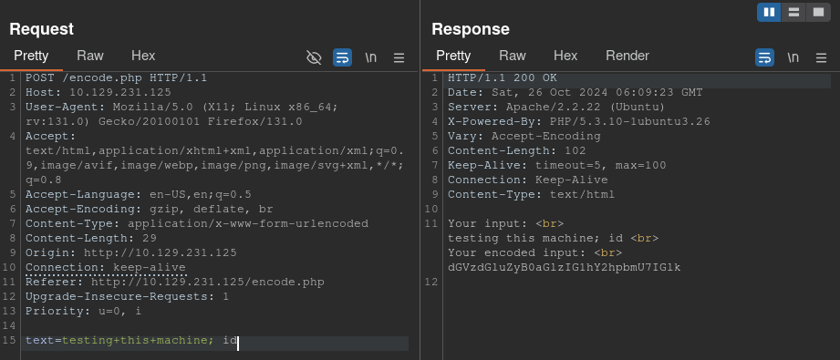
didn't work in any case and same with the decoding web page...

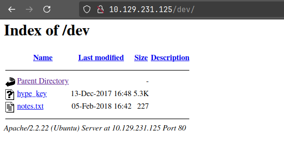
in dev directory got some interesting stuff...

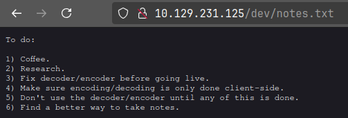
Saw notes.txt file first and just a normal to do list...

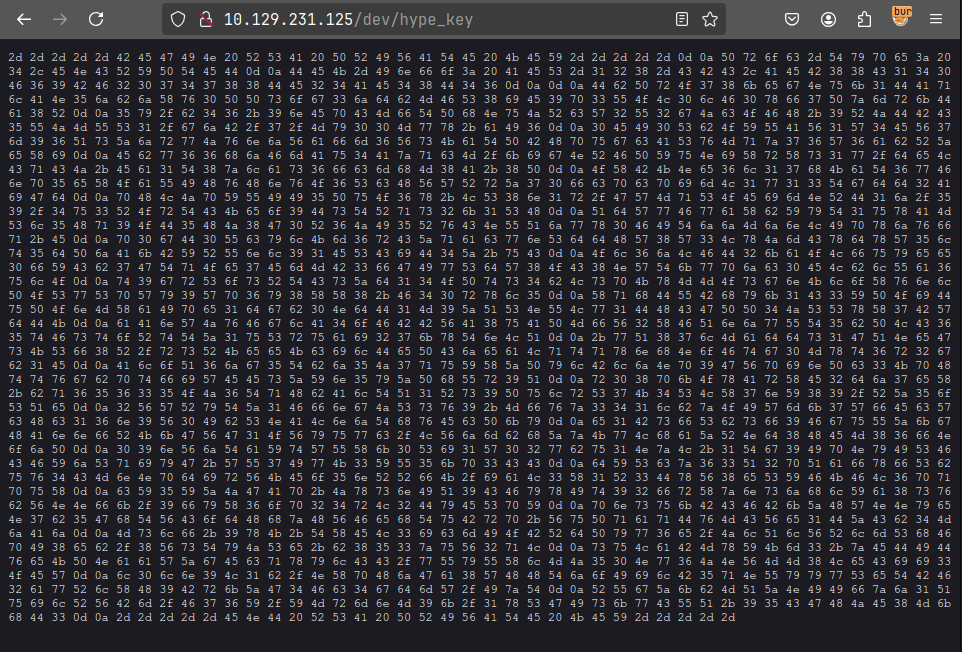
saw hype_key file and seems like hex to me...

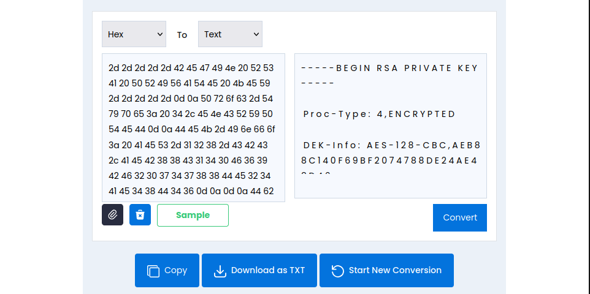
seems like an ssh private key!!!

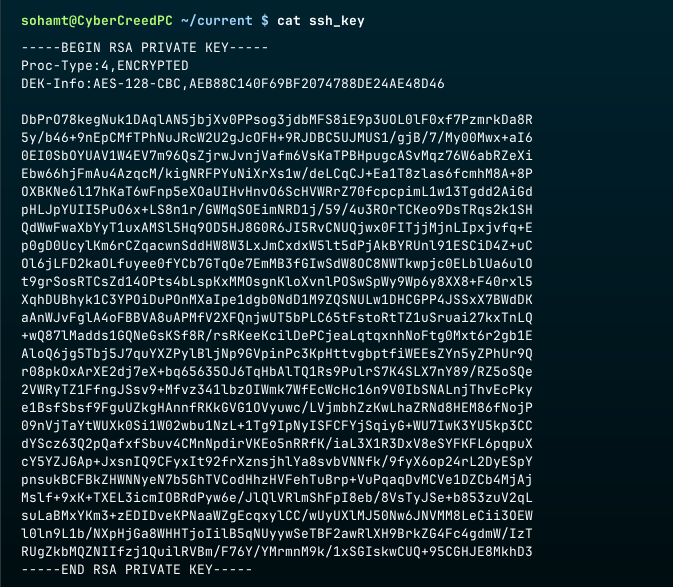
got a private ssh key!!!

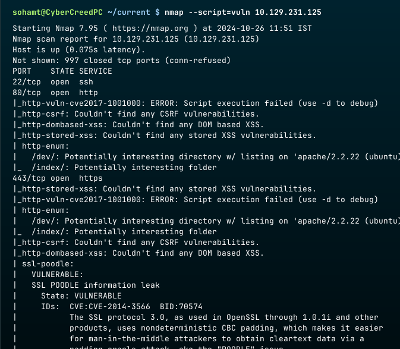
So after looking on different web pages and directories and also looking if the web server running is vulnerable or not but still didn't find anything and then ran the "vuln" script by nmap...

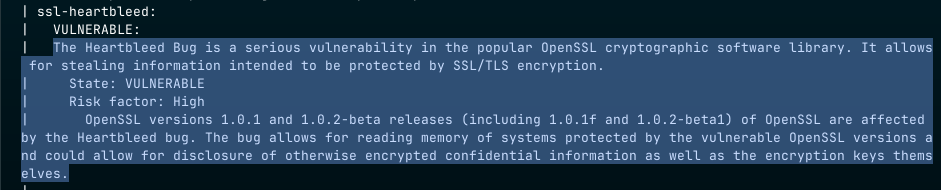
Found the web application to be vulnerable with "Heartbleed" bug which is an error in openssl cryptographic library which can leak the info. which is supposed to be protected by SSL/TLS enryption...

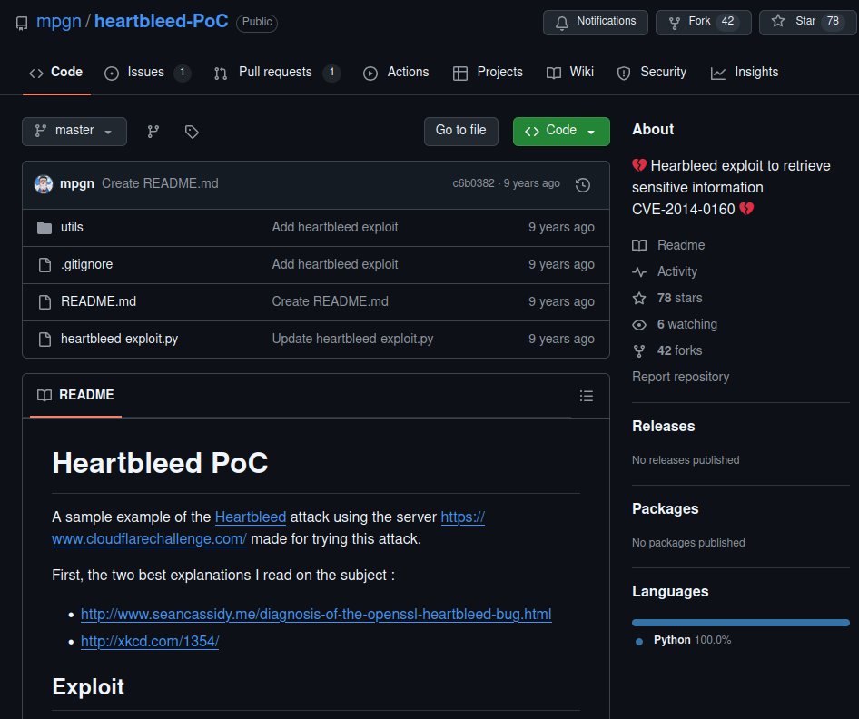
So searched for any possible exploits and found one, let's try it!!!

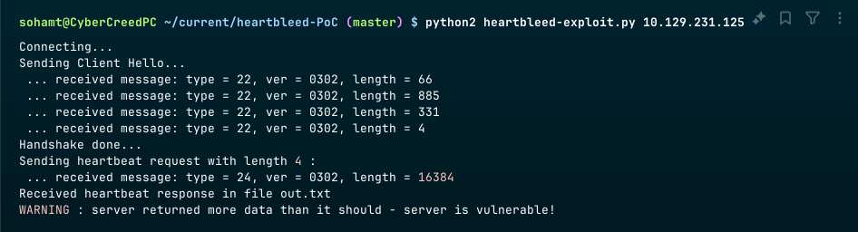
Run the exploit with python2 as it will not work with python3. 

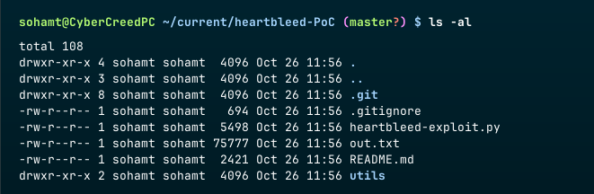
After running the exploit the leaked info. from the web server will be in the out.txt file.

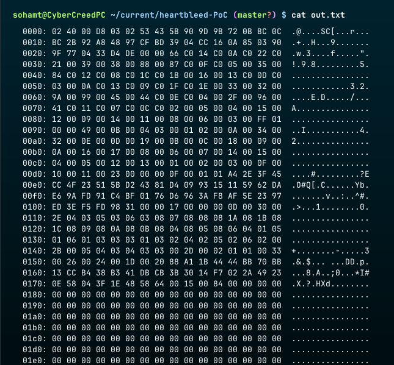
It's a hexdump, to reverse it to get the original data whose hexdump it is, will be using xxd...

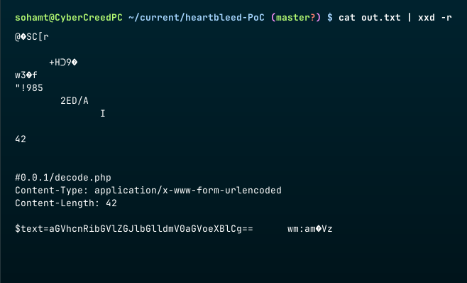
Got an unusual base64 string!!! Let's decode it...

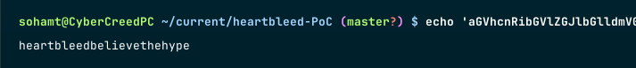
Seems like some random text...

So after no such vulnerabilities and stuff thought of login through ssh.

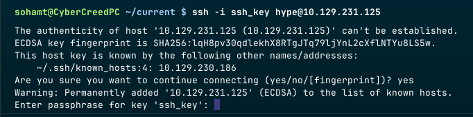
Though of username as hype as the file name was hype and the random string that was base64 also had "hype", so tried is as the username and it worked. So, now will be adding password as the random string now...

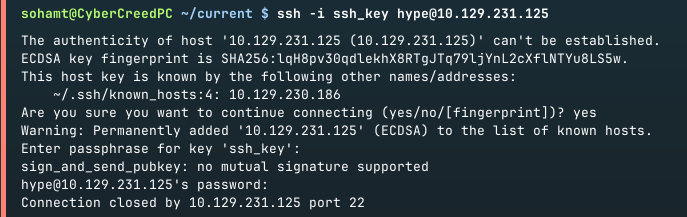
got a no mutual signature supported error...

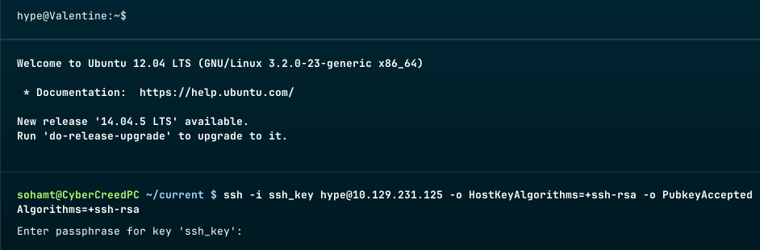
After spending a lot of time figuring out the error added some more options and flags and it fixed the error because current ssh commands actually don't support rsa private keys by default so had to add more options and commands...

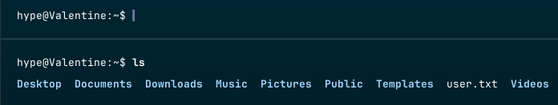
got first flag...

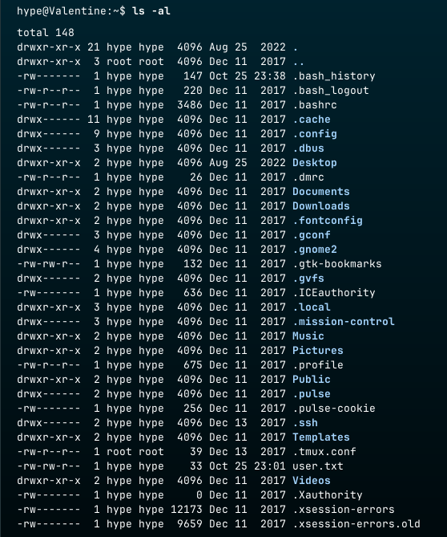
we can see .bash_history file of the user...

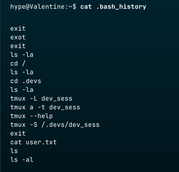
Hmmm some tmux commands and sudo -l didn't work as password of the user is not known and also found a .tmux_conf file in user's home directory, this means that user currently logged in as might be running a tmux session.

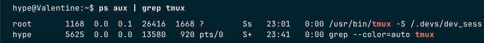
yup!!!

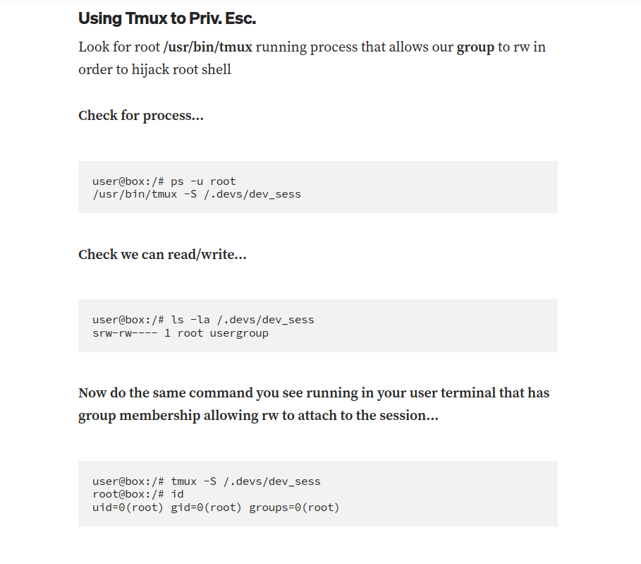
got this random blog on tmux session hijacking on medium with some commands of tmux. So, I tried the command to open the session running.

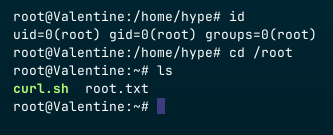
So after running the command, i noticed the tmux session was running as root user and got the root flag...