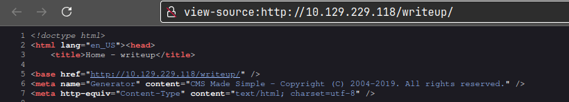

**ip of the machine :- 10.129.229.118** 

Machine is on!!!

Got two open ports!!!

Got versions to all the open ports and also got one disallowed entry from robots.txt.

Saw just a normal web page.

Again in /writeup just a normal web page.

In src. code, found that it is made in CMS Made Simple.

Found one exploit with associated CVE.

Ran the exploit and got some hashes let's crack them.

Cracked the password using hashcat.

Logged in as the user through ssh and got user flag.

When sshd as the user, root user runs /usr/bin/env with sh and also specifies init directories.

As the user is in the staff group and directories in /usr/local can be write by the users in the /usr/local directory.

So made a one line and added it in a file in /usr/local/bin, so when logged in again through ssh it will give /bin/bash SUID permissions.

It gave it SUID permissions and got root flag.