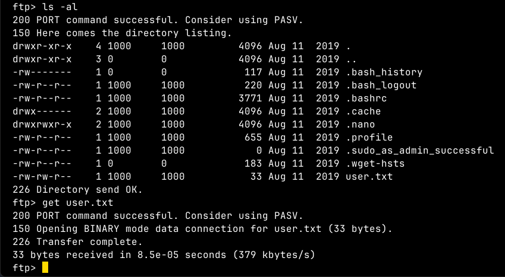

**ip of the machine :- 10.10.63.53**

machine is on!!!

Got some open ports, bit no http.

So, did an aggressive scan and found that whole root directory is accessible through ftp.

Logged in through anonymous login.

Found a user in /home directory.

Got user flag into the system.

So, found this directory in root directory.

Got two files in them. Let's get them and then see what to do with them.

So, after a quick search found out that private.asc is a private key use for decryption on encrypted .gpg file.

It asks for passphrase while importing the private key. Let's see how to crack this.

So, using gpg2john to create hash of the private key.

So, cracked the passphrase using john.

It worked. Let's decrypt our file.

So,again it prompted for passphrase but it was same as before and got password hash for the user and root. 

So, used hashcat to see the type first which is md5. Let's crack it now. So, it didn't work.

So, this time added password hash of root user in the hash file and then cracked it and it got cracked.

Now, was able to login as root with the password.

Got the root flag.