**ip of the machine :- 10.10.228.203**

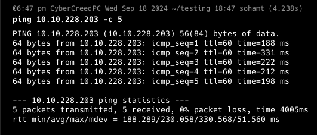
machine is on!!!

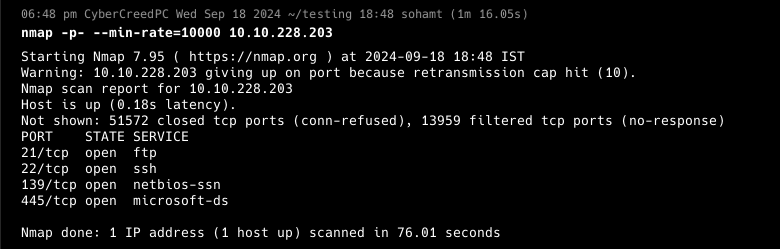
ftp, ssh and smb is running on default ports...

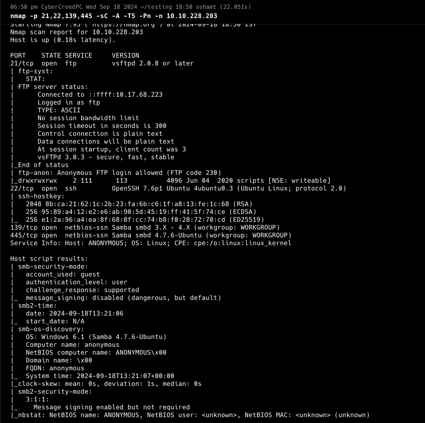
ftp anonymous login is allowed...

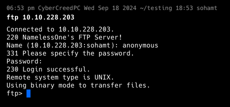
anonymous login successful...

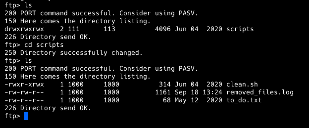
found a directory with some files, let's get them...

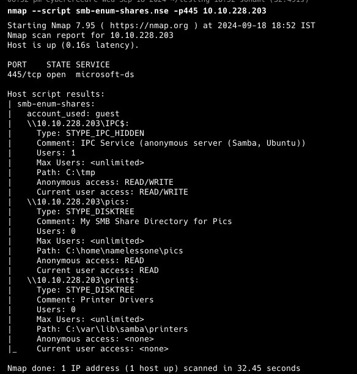
So used nmap smb-enum-shares script to get all the shares on the server.

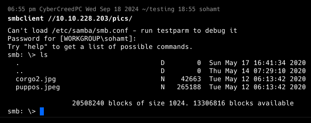
logged into pics shares and found some pictures, let's get them...

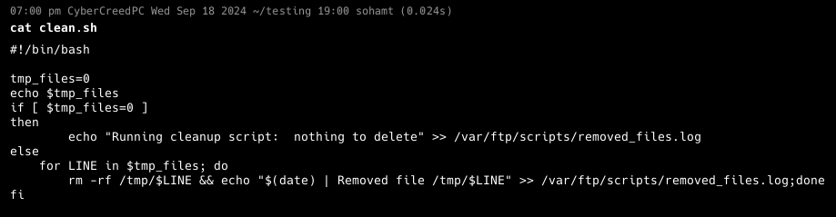
I think so clean.sh script is designed to delete every thing in the /tmp directory.

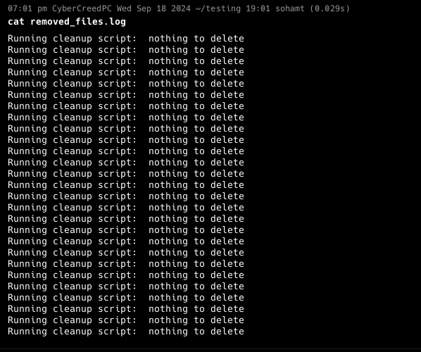
nothing to delete means no current files in /tmp.

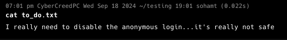
well!!! have already exploited anonymous login.

No file is of use. Except that we have anonymous login to ftp. Let's add a revshell over there and see what we can do....

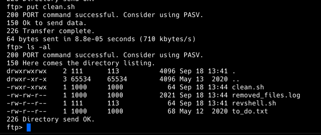
So added revshell in clean.sh file and then uploaded it on ftp server directory where it got updated and as other we have read, write and execute all three permissions.

So start a nc listener on any port and wait a while to receive a connection as clean.sh is probably a cron job.
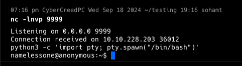
So got a reverse shell connection..... as username "namelessone".

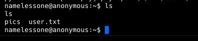
got first flag...

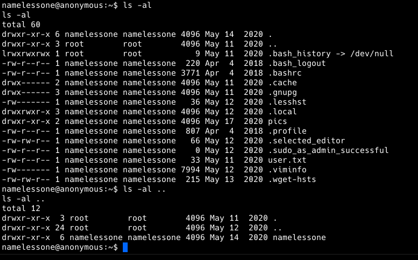
there is only one user and didn't find any interesting files and directories. Let's do "sudo -l" to see what privileges does this user has.

Sudo -l is asking for a password which we don't have and didn't find any as such. Let's check for SUID files now.

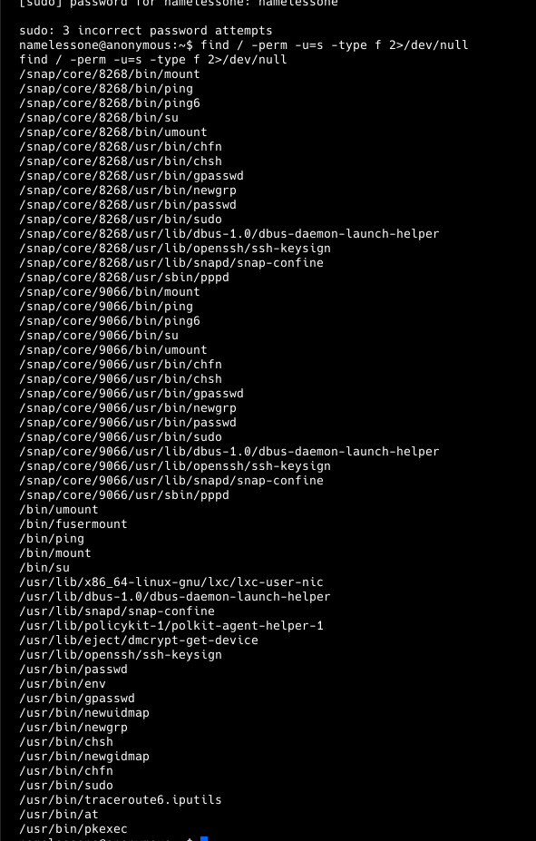
got some binaries, let's go to GTFObins.

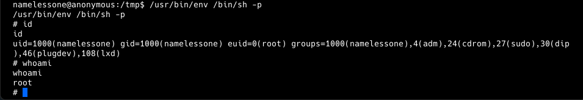
Saw on GTFObins and found that env command can be used to escalate privileges. Basically /bin/sh was in env variables, so called /bin/sh in /usr/bin/env in privileged mode to get root/pwned shell.

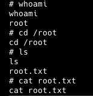
got final root flag.....