**ip address of the machine :- 10.10.109.99**

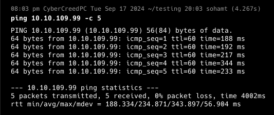
machine is on!!!

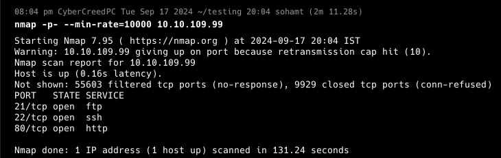
found some open ports!!!

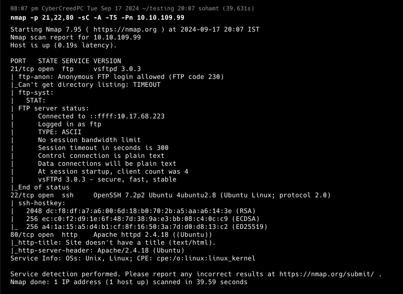
anonymous login allowed using ftp.

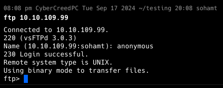
logged in as anonymous.

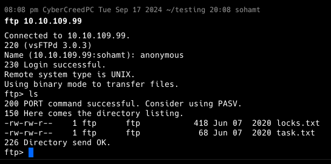
got two text files.

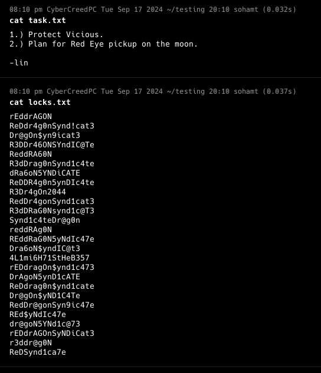
Found some possible passwords and a username "lin".

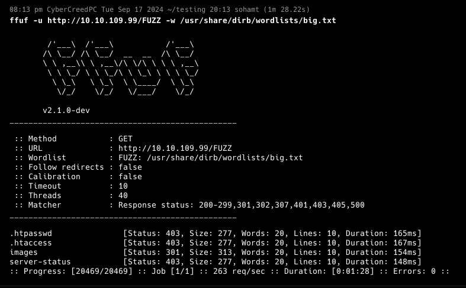
didn't find anything.....

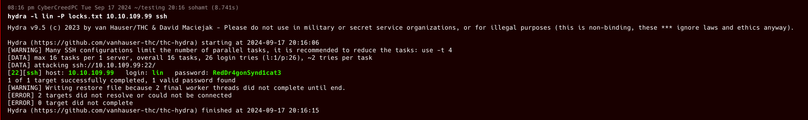
Didn't know what to do as there was no login or cms or something for rev shell so brute forced ssh and found the password. "RedDr4gonSynd1cat3"

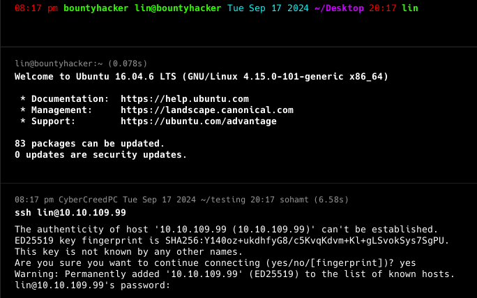
logged in as user with the password.

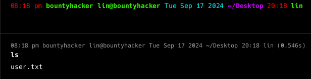
got first flag....

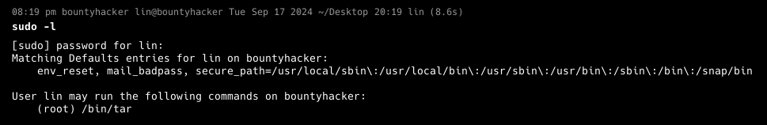
user "lin" can only run tar as root.

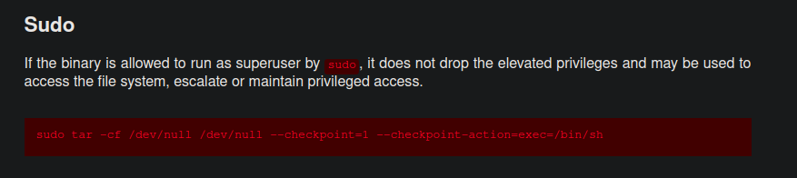
will be using this command from GTFObins.

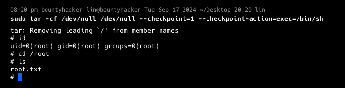
got root/pwned shell as well as the root/last flag.