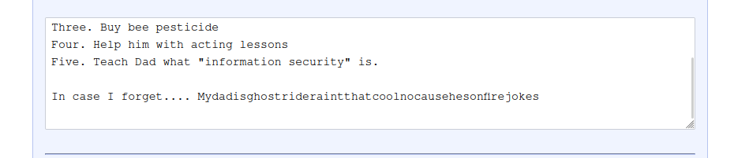
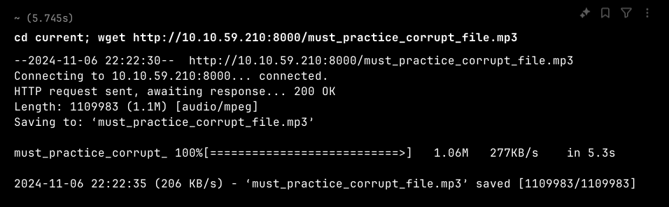

**ip of the machine :- 10.10.59.210**

Got three open ports...

Did an aggressive scan on the ports and found out that anonymous login is allowed on ftp.

Found a file, let's get it.

Got it, let's view it!!!

Huh!!! what is it??

It was a base64 but still the text that we have got is strange!!!

So, didn't find any clue... Let's see the web application then...

Nicholas Cage themed web page and found nothing in the src. code. Let's do directory fuzzing then!!!

Found two interesting directories, scripts and contacts, let's view them.

Uh!!! Found some!!!

None of the scripts were useful, these are just random conversations between different users that doesn't even make any sense.

In contracts directory found something with nothing in it.

So after finding nothing in the directories, went to dcode and boxentriq cipher identifier and analyzer.

Both were suggesting that it is vignere cipher.

So vignere cipher decoder of dcode and boxentriq was not working because both of them were asking for the key and brute force was not working so searched and found a website.

Got some text.

Got a password.

So username is weston. Now let's login through ssh.

Logged is as the user weston.

Found nothing in weston's home directory but also found another user named "cage".

We don't have the permission to enter user "cage" home directory.

Did "sudo -l" to see if user "weston" can run anything as root or not and it can "/usr/bin/bees".

So no command/binary with name bees, so it is a custom binary/script. Let's see it.

Nothing as such...

We can run it, but we don't have any permissions to write to it. Let's find any other way because i think it is just given to maybe confuse us.

When i entered /opt directory because i found something, it ran a script, so maybe a cron job is also running which is also exploitable.

So, in the directory found a python script and it is fetching records from another file which is also hidden and then basically executing a system command or simply printing the quotes.

Found it, so it is fetching quotes from this file.

We can only read and execute the script but we cannot do priv. esc with it but if we are user "cage" we can do it...

So went to /var/www/html and found another directory which was not present duing directory fuzzing and it had a .mp3 file.

So got the file in my machine for further analysis and found nothing in the mp3 file.

So, after finding other stuff, though that if we cannot edit the script which is fetching from a file ".quotes" but if we can edit the .quotes file, or basically if we can add a reverse shell in the .quotes file from which it is fetching the quotes, we can become user "cage".

So, removed all the quotes and added the reverse shell payload and now let's wait for the cron job to run.

Let's see if the cron job is even running or not because after adding the payload, didn't get the reverse shell.

