**ip of the machine :- 10.10.6.101**

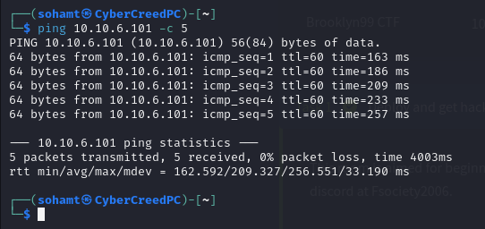
machine is on!!!

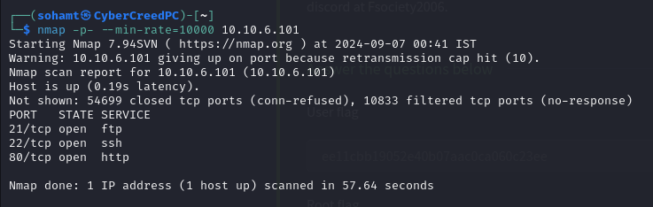
found some open ports.

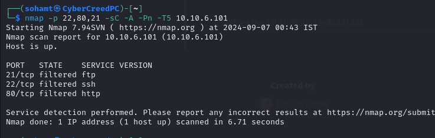
it showed that all are filtered....

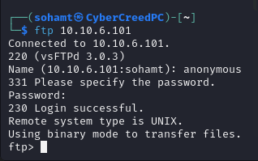
tried to login using ftp default creds. for anonymous login and it worked.

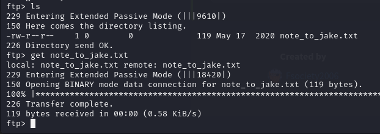
found a text file and downloaded it.

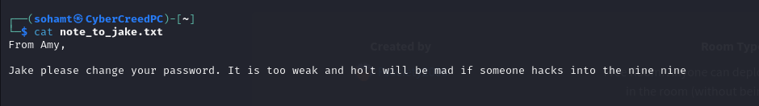
so jake is using a weak pass... Hmm!!!

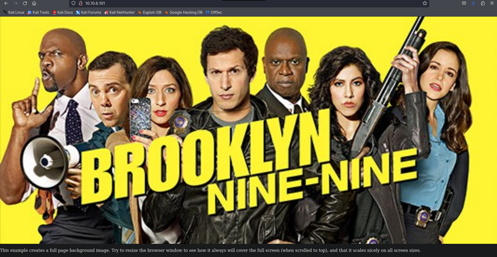
went to website to check the src code first.

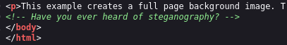
Found this line in src. code which means we have to use steganography.

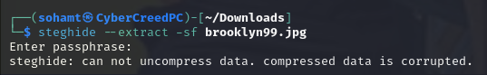
Don't have any passphrase.....Hmmm!!!!

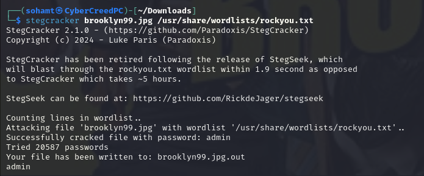
So there is a tool in repository of kali which is stegcracker which can brute force passphrase and can also extract the hidden files which is brooklyn99.jpg.out in this case.

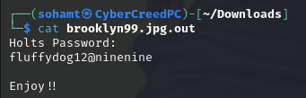
woo!!! found some creds.. probably for ssh.

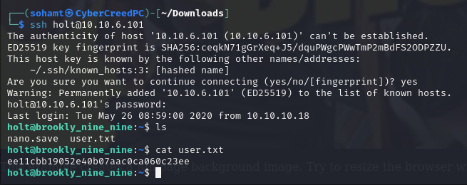
was able to login with id and password and got first flag.....

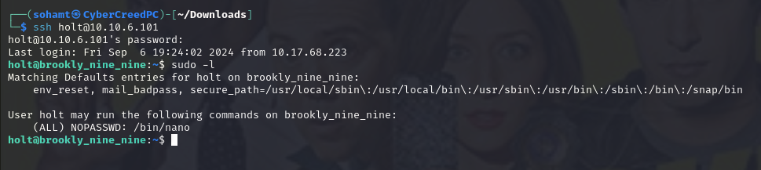
user can only run nano.... Let's go to GTFObins.

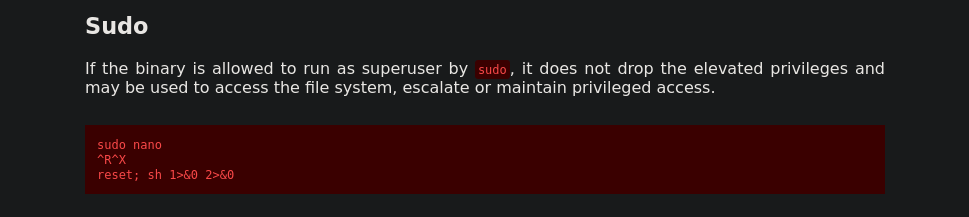
will be using this way to get the root and last flag further.

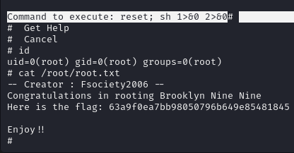
First type "sudo nano" then after entering nano text editor press "ctrl+r" and then "ctrl+x" to enter any command and ten add the payload and you will get the root shell and got the root flag.....