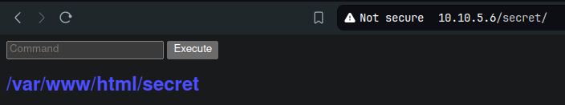
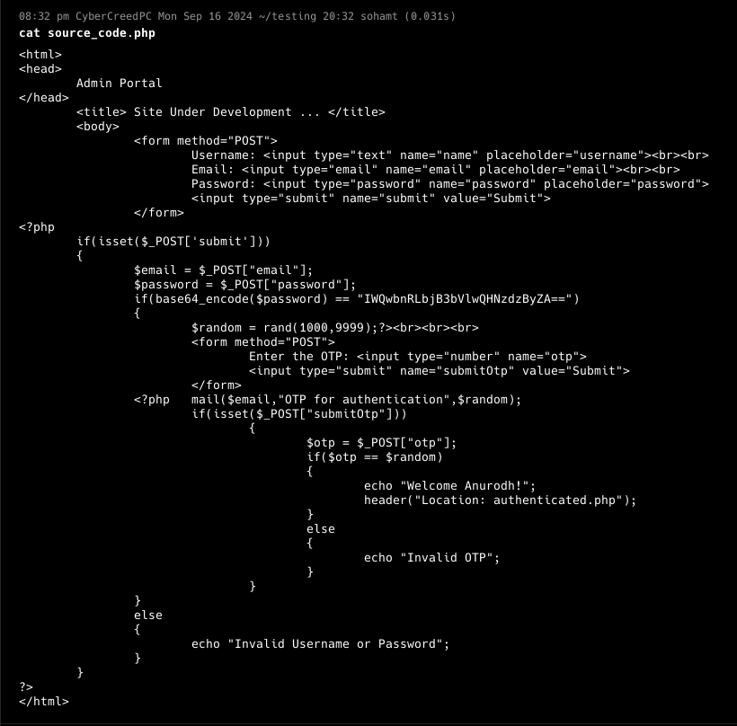
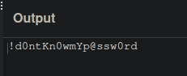

**ip of the machine :- 10.10.5.6**

machine is on!!!

got 3 open ports.

we can login to ftp server with username anonymous.

logged in using anonymous:anonymous.

Found a file "note.txt" and downloaded from the server.

Got two possible usernames "Anurodh" and "Apaar".

Let's do directory fuzzing using ffuf.

Got some usual directories but "secret" looks interesting though.

oops; what is it!!!

i typed "id" command and it showed this!!! which means it is like a web shell.

So after adding rev shell payload, it showed this and didn't get reverse shell. This means it is blocking some commands.

so right now id and find commands are working, ls,cat,cd, even bash not working.

pwd is also working.

So started a python server and tried to use commands like wget and curl to see if i can download something, and it worked. So let's think how to get rev shell now.

Added python rev shell but with a random back slash in python and it worked..... Although it was a random thought though. Because it was blocking every type of payload for rev shell, so did something different and by chance got the shell, because it won't filter it.

Got it....

So in /files/account.php file, a sql query is given and is executed and is from sql tables named "user".

hacker.php, "look in the dark and you will find your answer". I wonder what does this mean?

in mysql database. we can login as root and localhost and even password is given in index.php.

So, was write this gibberish was the password for mysql database as root.

Got some password hashes.

unable to crack of root, so will move another database, named webportal because in one of the .php file, we saw that it is being used for authentication in login form.

And it only has one table.

got both the user's password hashes.

got password of "Anurodh", "masterpassword".

Got password of "Apaar", "dontaskdonttell".

both the above users exist, let's do some password spraying to see if they are reusing password or not.

So both of them are not reusing the password.

But there is also one more user in the home directory. Let's try him!!!

Permission denied!!!

i can only read apaar's home directory.

Let's see how we can login as user "apaar".

images directory has two images, will be examining them because found no way as such for priv esc.

this is an image we downloaded, let's find for any hidden files.

So randomly used steghide and didn't enter any password simply "entered" and got backup.zip file.

created a hash of the zip file, because while extraction it asks for a passphrase.

"pass1word" is the passphrase.

unzipped and got a .php file.

found a password in the file.

So password was base64 and after decoding this is the real password. "!d0ntKn0wmYp@ssw0rd"

logged in as anurodh.

it can run .helpline.sh as "apaar".

same creds. used to login through ssh.

logged in as apaar through script because the message that we will enter will be executed. I came to know that by seeing the src. code of the script and found that if i enter /bin/bash in message then it will give me a shell as user "apaar".

got user flag...

saw that user anurodh can run docker and an image existed so mounted the root directory in /mnt in the image and ran sh command in the container to get root shell.

got last flag....