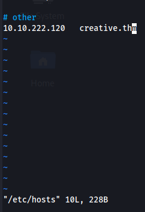

machine is on!!!

Had to add ip and domain name in the /etc/hosts file because it was redirecting over there.

only two ports open on nmap scan.

did a script scan and found nothing interesting.

found some directories to look for.

Didn't found anything in those directories so did subdomain enumeration and found one.

Also add this domain in /etc/hosts file.

Added creative.thm website to see what it gives and showed a normal website.

But when added my ip address with port running a web server it gave my directory listings this means we can do command injection with specified port to get some information.

After modifying the url data we are getting the output as "Dead".

In intruder brute forced the port to get some more information and in payload chose top 50 most common ports.

All ports gave same content length except port 80 (creative.thm website) and port 1337 which gave out all the directories of the server. 

port 1337 gave this.

/etc/passwd file revealed a username named "saad" with a home directory. Let's see if we can access it.

was able to access his home directory and gathered a private ssh key.

the ssh key is protected by a passphrase, so trying to crack it using john.

Found the passphrase.

Found 1st flag.

in .bash_history file of saad found his password.

did sudo -l to see what permissions do saad has. Now didn't find anything on GTFObins related to ping command for local priv esc. But from an article found that LD_PRELOAD is an env variable which is used for listing shared libraries with functions that override it and can be used for local privilege escalation.

in /tmp created a C file and added this code in it.

after compiling and setting exploit to be the value of the env variable. Used the env variable with the command user was able to use which is "ping" such that the exploit override it and gave us root privileges.

got the last/2nd flag........................