**machine ip :-> 10.10.223.107**

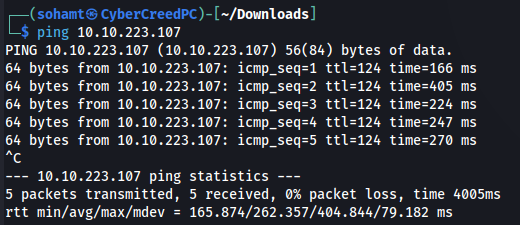
machine is on!!!!

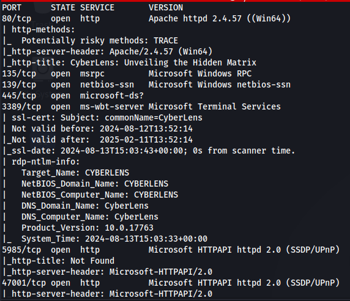
Did an nmap scan and found some results. According to the versioning scans i am assuming that it is running a windows server and SMB but also has a web server running.

NOTE:- Didn't find anything pleasing in the dir scan of gobuster.

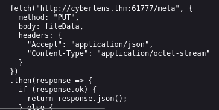
Found this js code in code snippet. It seems like the website is fetching some information from an unrecognized port which didn't come in port scanning and let's see it manually.

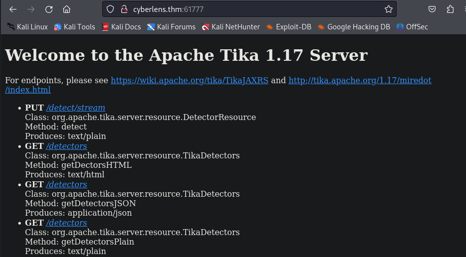
Apache Tika server is running. Let's see if we can find some exploits or not.

Didn't find anything pleasing on exploit-db but found a module in metasploit.

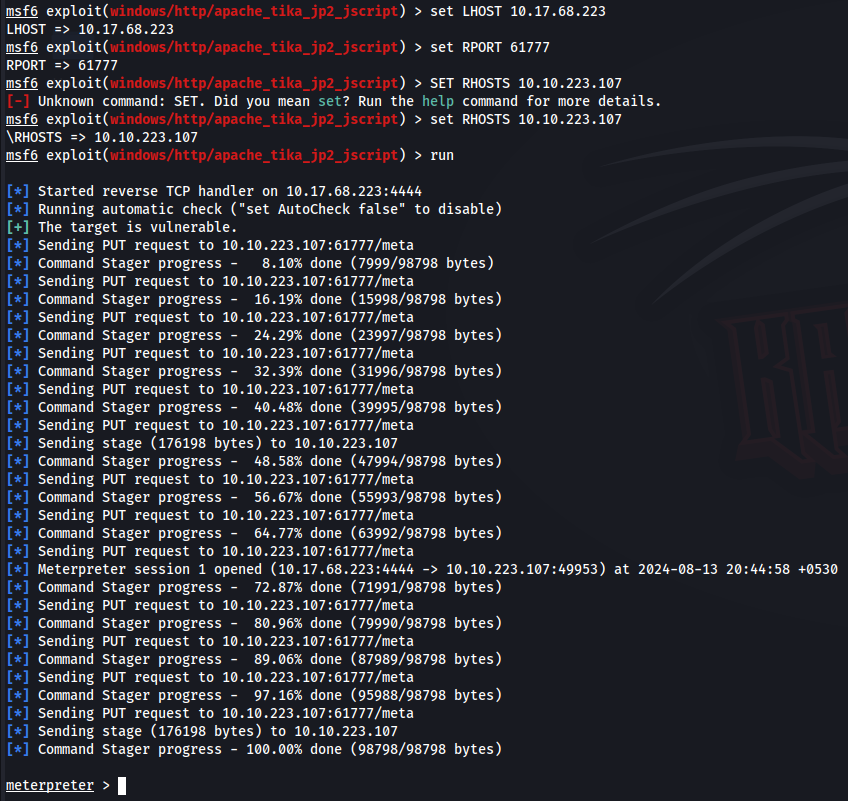
set all the options and we will get a meterpreter session.

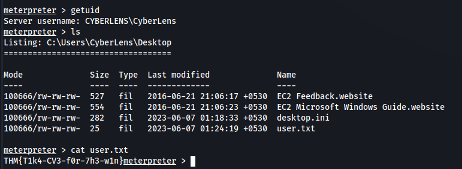
so first did "getuid" which is just like "id" command in linux to see username we are logged in as. Then got a file named user.txt so viewed the contents and got the first flag.

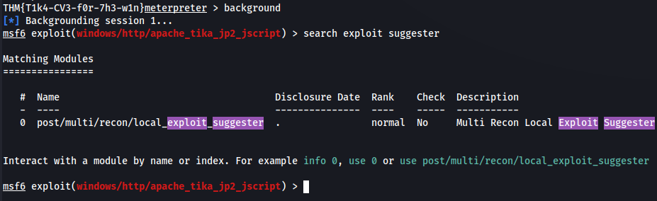
now background the session using "background" command and will be using a module named "exploit suggester" which will suggest the exploit we can use on the target machine depending upon the background session of meterpreter.

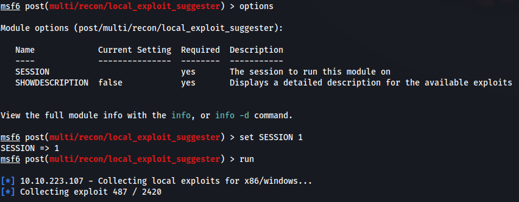

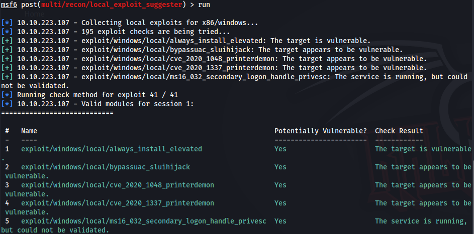
so this module suggested some solutions depending upon our target machine. Will be using first one which can be used to become admin.

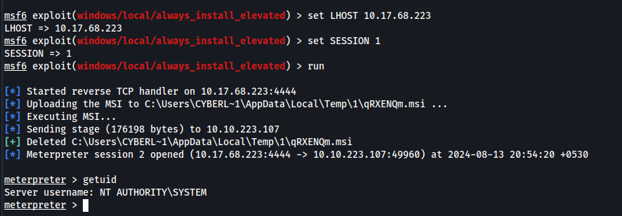
became admin now just need the last flag.

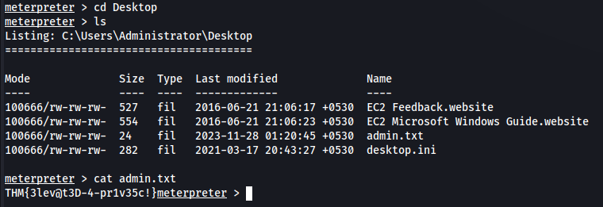
found admin flag in Desktop folder/Directory of Administrator.