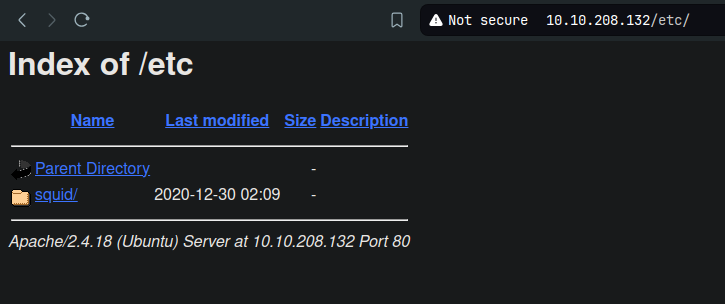

**ip of the machine :- 10.10.208.132**

machine is on!!!

only two ports are open.

Did an aggressive scan and got to know about the versioning of different services running on the ports.

found some directories, let's look them....

/admin, let's further look this directory.

in one option found an archive and downloaded it.

also found admin shoutbox in admins web page.

in /etc now...

got a passwd and a .conf file. Let's see the contents or download them.

got somethin'...

what does this conf file mean!!!! It seems like an auth config is connected to /etc/squid/passwd in order to authenticate. Let's try adding these credentials for ssh login.

was showing password incorrect so went to hashcat hash modes and added apr and saw that it is an apache apr1 md5apr1 hash so will crack it using hashcat now.

so the password is 'squidward'.

maybe this isn't password for ssh login then what then....

Extracted the .tar file and got some files and sub directories.

so there was a README file and got a link to a documentation.

So basically borg is used to create backups with encryption to even make backups secure.

in this first we have to mount our archive somewhere and then it asks for a passphrase, which is the one we got before.

we got a new directory and some new files.

whooo!!! so in encrypted archive backup, it is user alex full home directory.

in user's Documents directory found a file with some creds. Now let's try to login through ssh.

was able to login as user "alex" with provided creds.

got our first flag....

i saw that we can edit the file, so added bash binary/shell in the file and ran the file as sudo and got root/pwned shell, go get the last/root flag.