**ip of the machine :- 10.10.5.87**

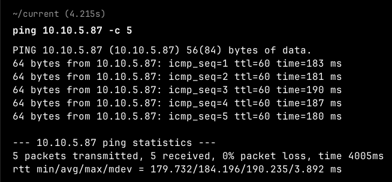
machine is on!!!

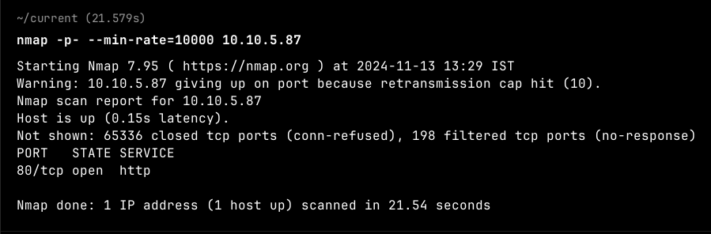
Only one open port!!!

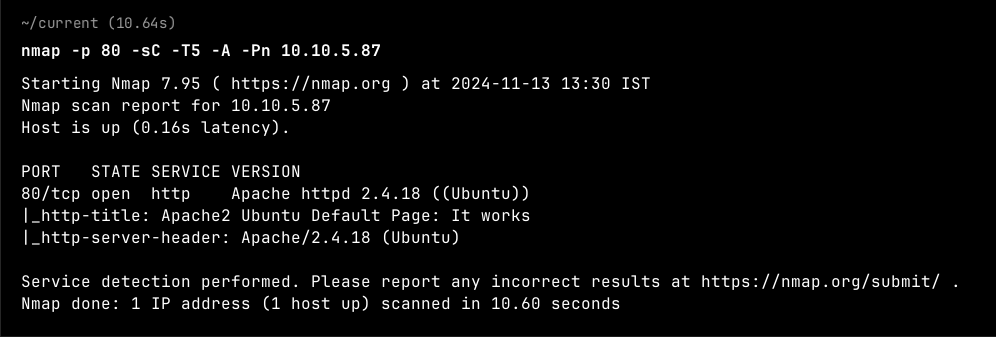
Now aggressive scan revealed the version of the server but is also indicating ubuntu's default page.

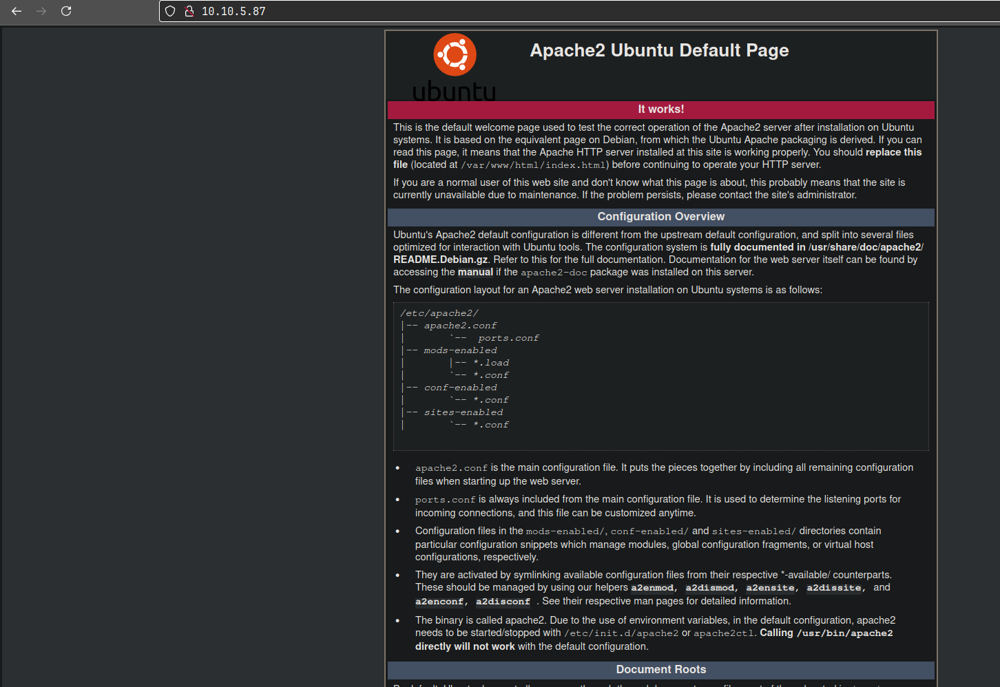
Yup!!! Let's see if this version of apache has any exploitable vulnerability in order to get initial access or not.

Nah!!! Didn't find any.

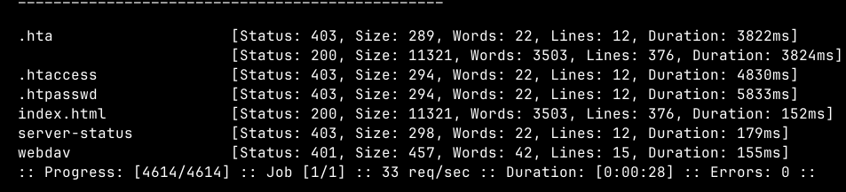
Found some directories during directory fuzzing. "webdav" looks interesting.

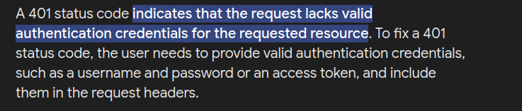
Didn't know about 401 status code so searched and found something interesting.

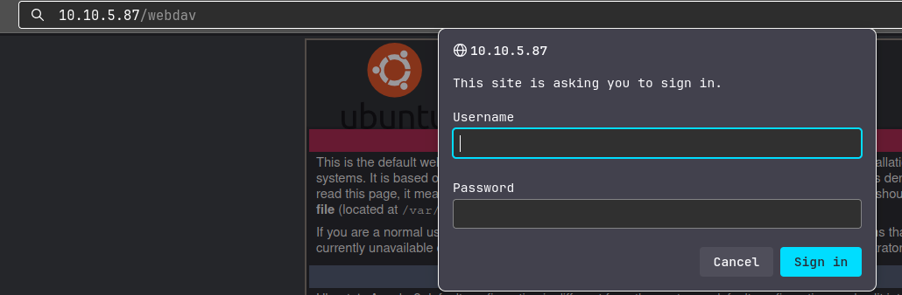
webdav directory asked for a username and password. Let's try some default ones like admin:admin, admin:password etc and nothing worked. Let's try to capture the request and brute force through hydra.

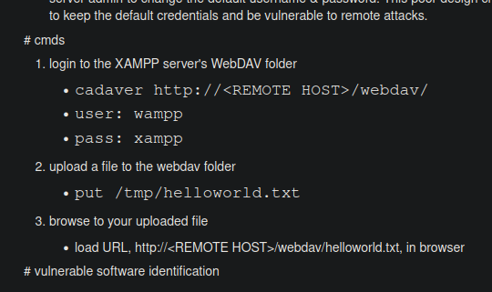
So, after some searches, found out that webdav is a kind of service and found some default creds. to try on.

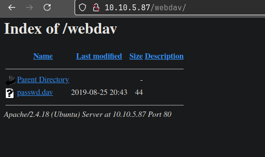
It worked and now we get a file.

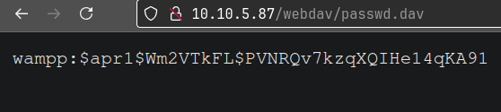
OK!!! So it's a hash. A password.

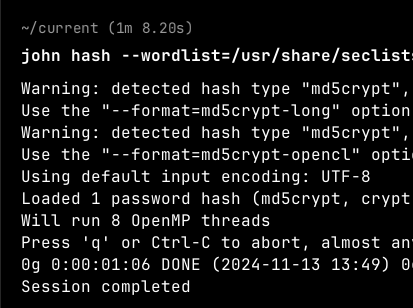
Unable to crack the hash. Let's try something else.

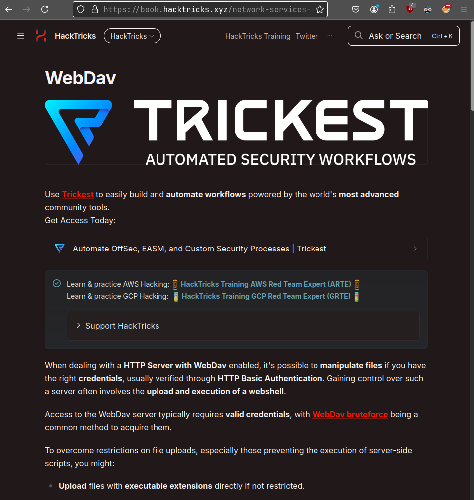
So, after searching about how to get rev shell to the server, i came along a blog on webdav on hacktricks. Let's follow this.

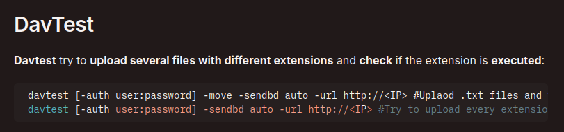
Let's try uploading several files of different extensions using davtest.

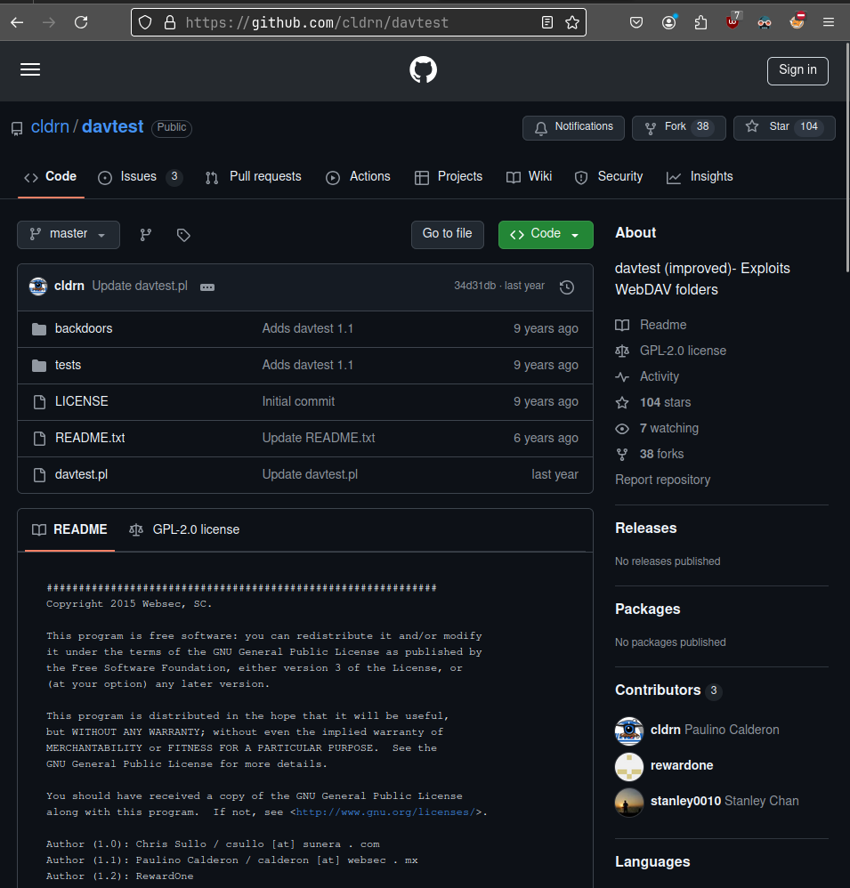
Davtest is not available anywhere, so i have to clone the repo. manually and then test.

So, was unable to resolve dependencies after cloning the repo.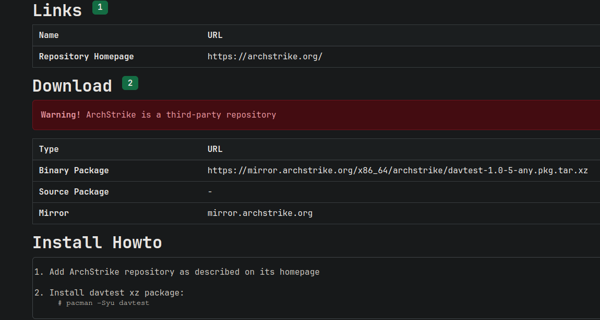
So, found it in arch strike repo. so will be downloading from here.

So, archstrike one also failed so tried from blackarch repo. and it worked.

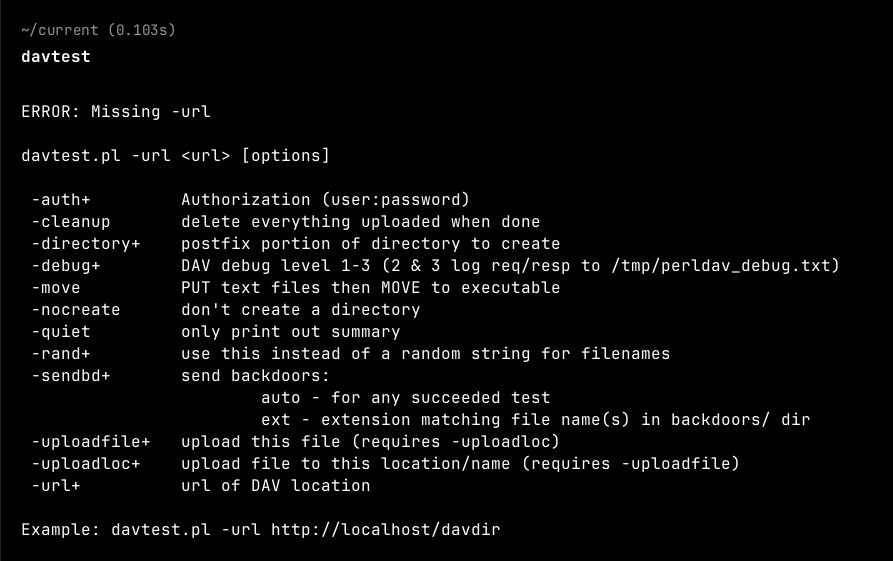
Let's try uploading pentestmonkey rev. shell payload.

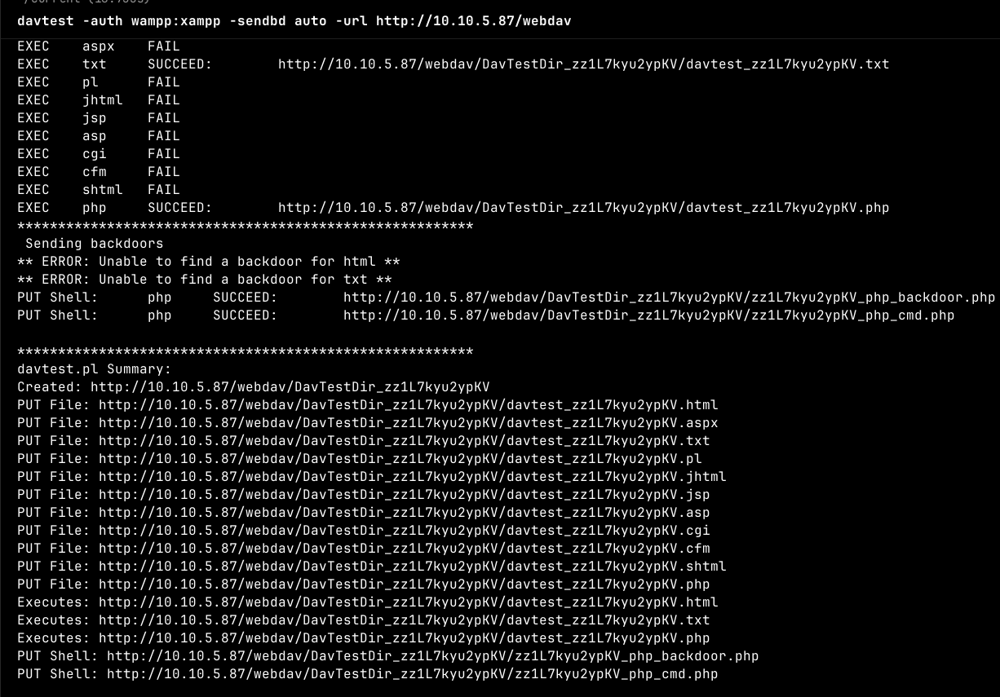
So, ran davtest to see if we can upload any file with particular extension to any directory and that file then can be viewed from the browser.

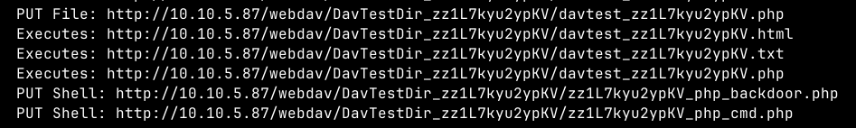
This means we can upload php reverse shell and get it.

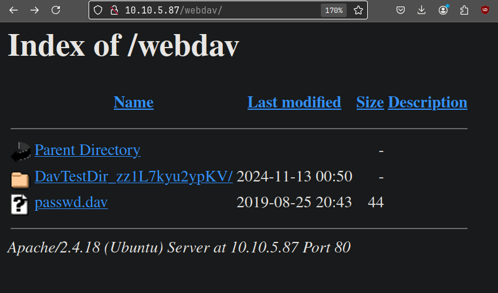
So, davtest uploads some custom files in a directory to see and evaluate and we can see that webdav directory has the directory of davtest and also some test files in it.

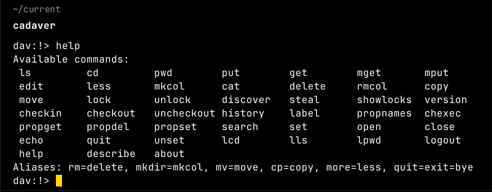
Then got to know about cadaver, which is a command line tool for webdav.

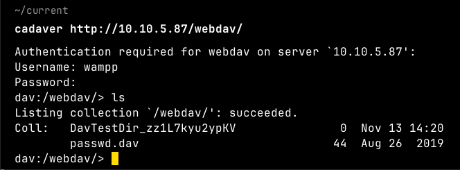
in webdav directory through command line.

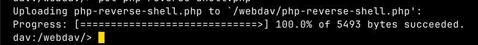
Uploaded my php revshell.

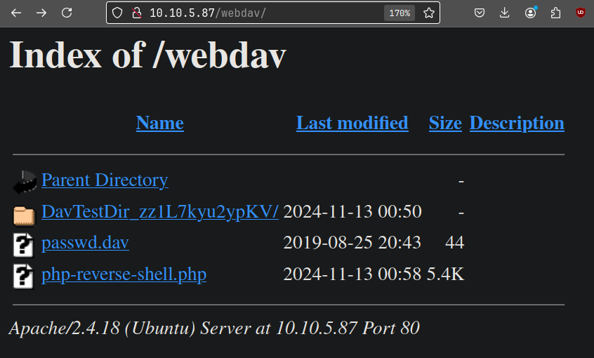
Let's initiate reverse shell.

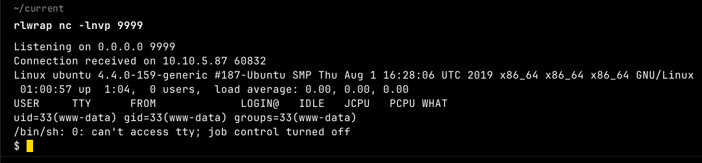
Got it!!!

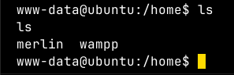
Found two users in /home directory.

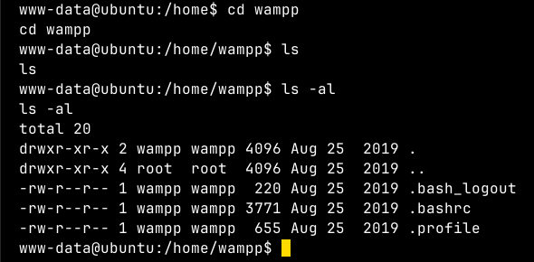
So, found nothing in "wampp" user's home directory.

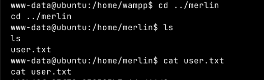
Found user flag in other user's home directory.

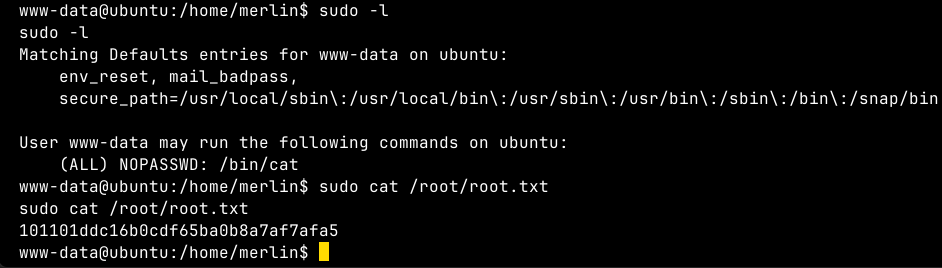
Did "sudo -l" and found that user we reverse shelld as can run "cat" command as sudo (with root privileges) so got the root flag directly.