**ip of the machine :- 10.10.176.228**

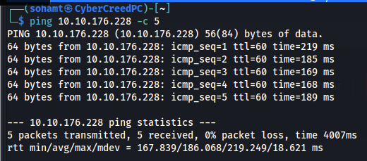
machine is on!!!

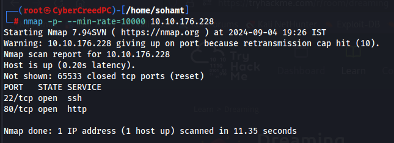
got some open ports. Let's go for aggressive scan and let's see what we can find.

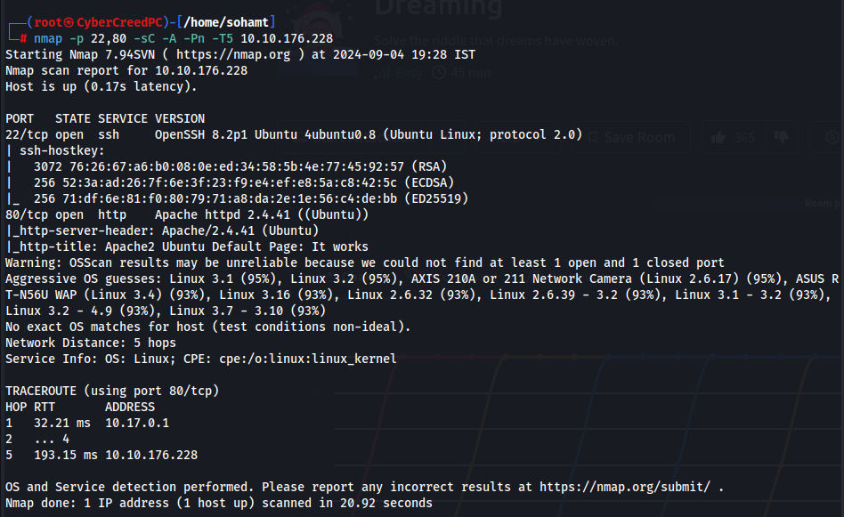
with aggressive scan got some info. We can see Ubuntu is running with apache web server.

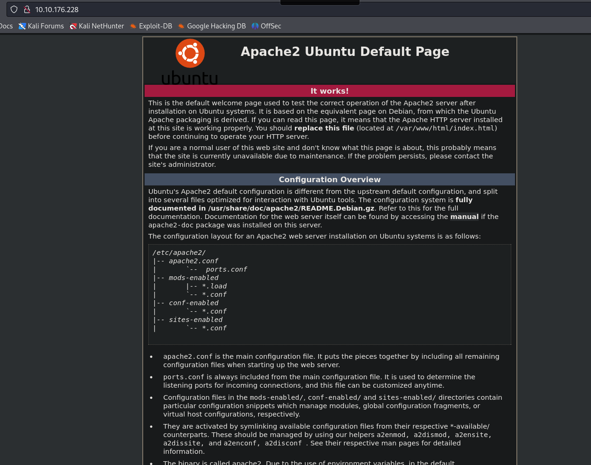
I visited the website with this ip and found this. Again nothing interesting.

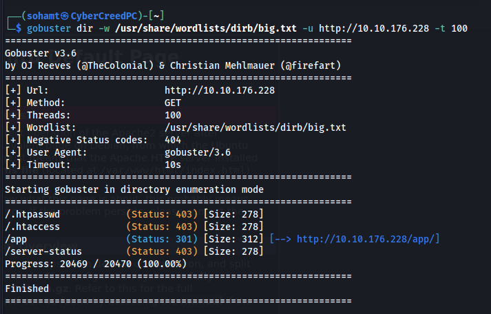
So thought of doing directory fuzzing as web server is what we have, and found /app directory.

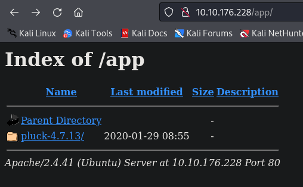
Before Doing Further directory fuzzing, went to /app and found pluck-4.7.13/.

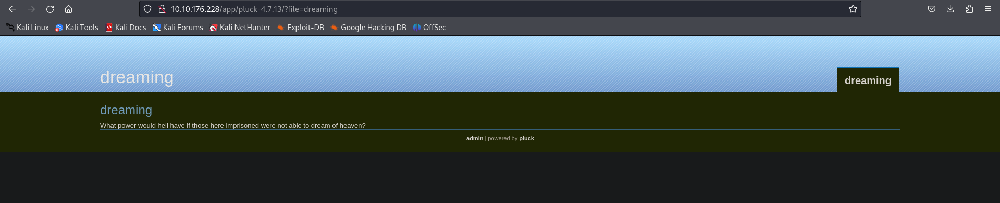
after clicking on pluck to see what is in the directory, was redirected to a page named "dreaming". But got a possible version of pluck "4.7.13".

So basically was confuse what pluck is so, went on to search for it.....
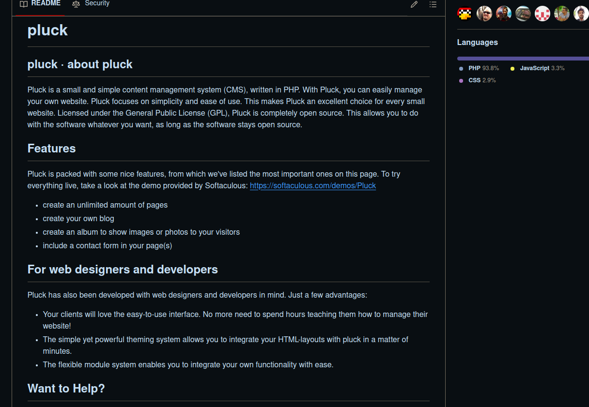
So it is a CMS in php. Huh!!!. Which means vulnerable i guess??

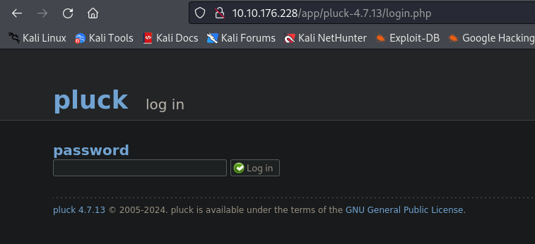
So there was a link to login as admin, so was redirected to at this page. Haven't found any password, so let's try the most obvious ones, "password", "admin" and if these two don't work then will brute force it.

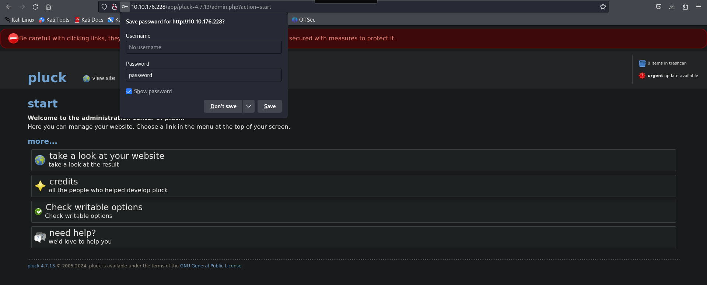
was able to login through "password" as the password.

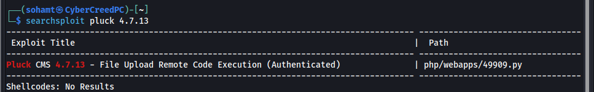
Yay!!! Found an exploit for gaining a revshell.

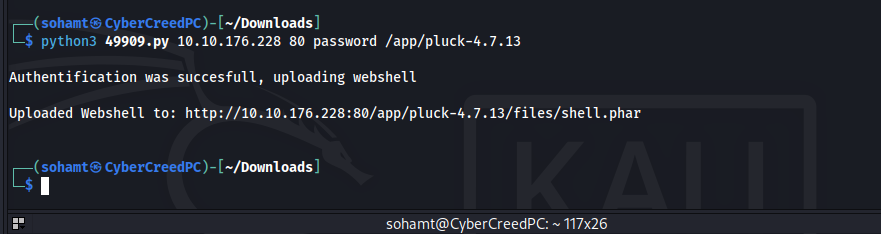
so ran the exploit and it seems to have worked.

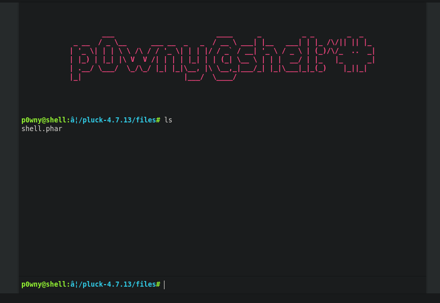
i saw the source code of the exploit and it gave us a web shell.

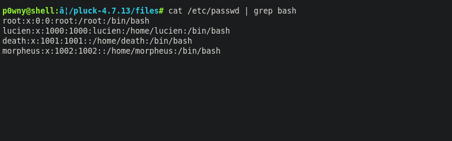
got three possible usernames.

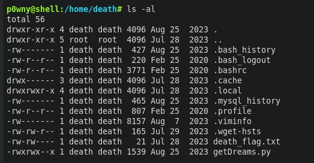
So went to home directory of user death first and found close to no permissions but can run a .py file. But unable to run this .py file. So went to /opt directory.

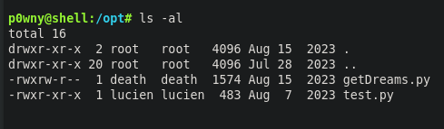
got atleast access to read the src code.

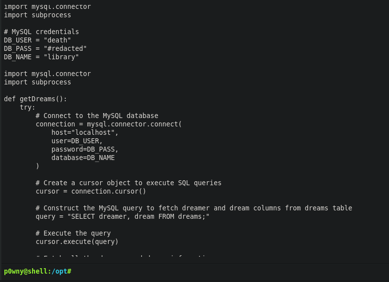
Seems like user death trying to access database but we cannot see the password.

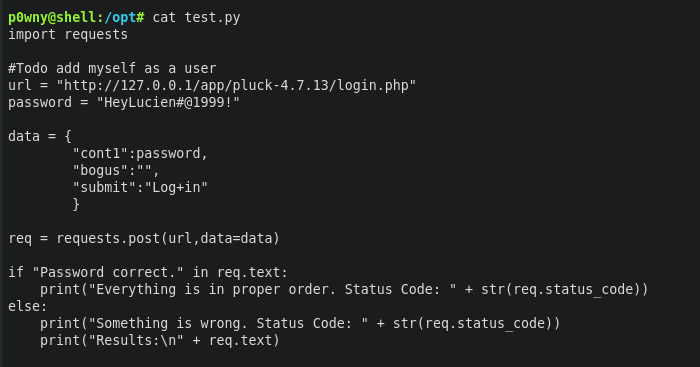
but in test.py found a possible password.

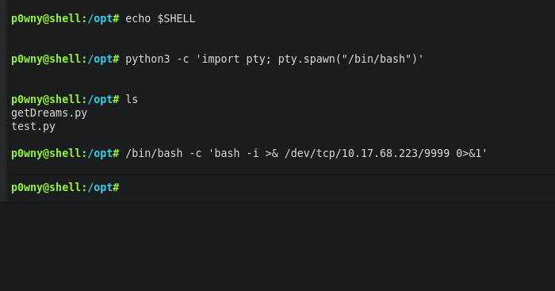
took a revshell from web shell because some things not working in web shell.

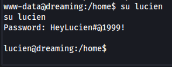
Was able to login as lucien because in the password that we got word "lucien" was mentioned.

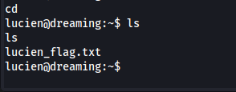
got one flag.

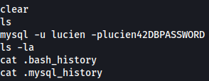
so .bash_history file was readable so went through it and found mysql creds for user lucien.

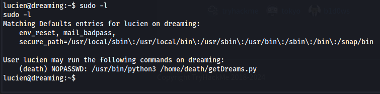
also saw what permissions lucien and saw that it can run the .py file that i saw in the home directory of death but can be run as user death.

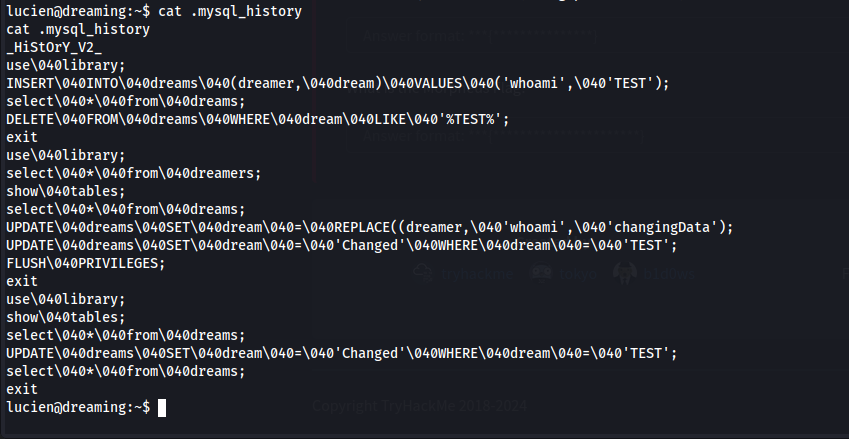
also saw .mysql_history which seems a bit obfuscated but after understanding it manually, i think some records are changed in library database and further dreams table.

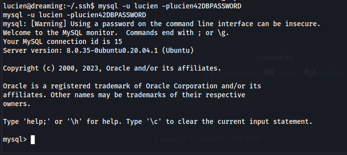
was able to login as user lucien in mysql server.

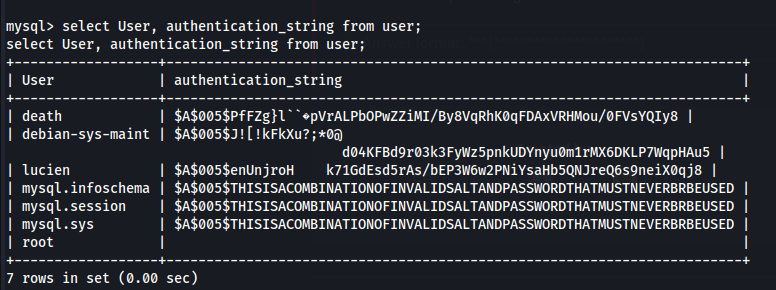
got password hash for death but was unable to crack it.

So saw the .py file again that user death can execute and there found a line where it is executing the query. It means if we add a shell in the table which will be executed as user "death" and we will get a bash shell running as user death.
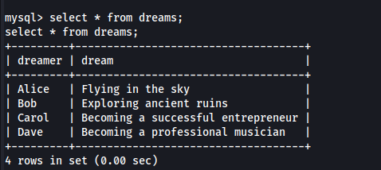
so it basically taking each query and executing it using the python program.

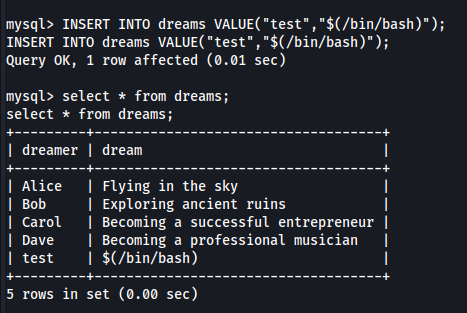
so tried to add a bash shell in it. As user lucien is allowed to run only that .py as user death, we will get a shell as user "death".

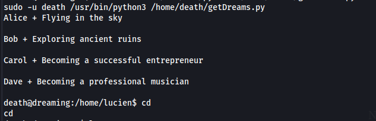
got the shell but cannot perform any operations, or basically no commands are working...

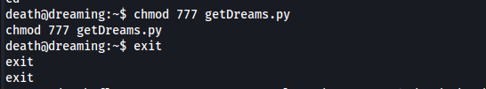
so chmod 777 to the script and then exited out of the shell which was not working.

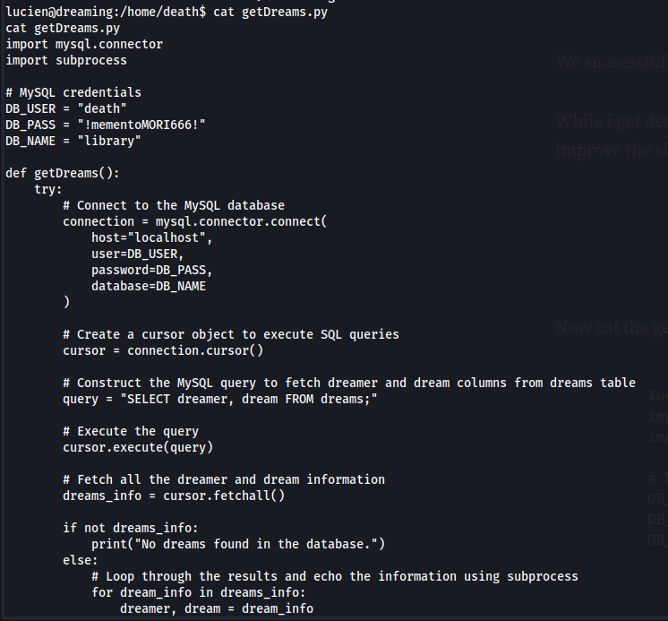
now we can see the contents and even the password.

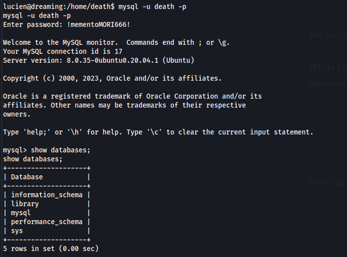
So was able to login as user death in mysql database but don't know what to do so i exitted out of the mysql.

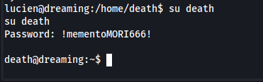
So did some password spraying whether user "death" is using the same password for his account and was right.

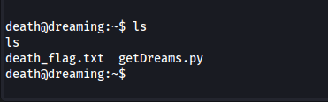
got second flag....

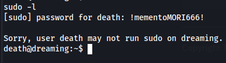
so user death cannot run nothing as another user or root.

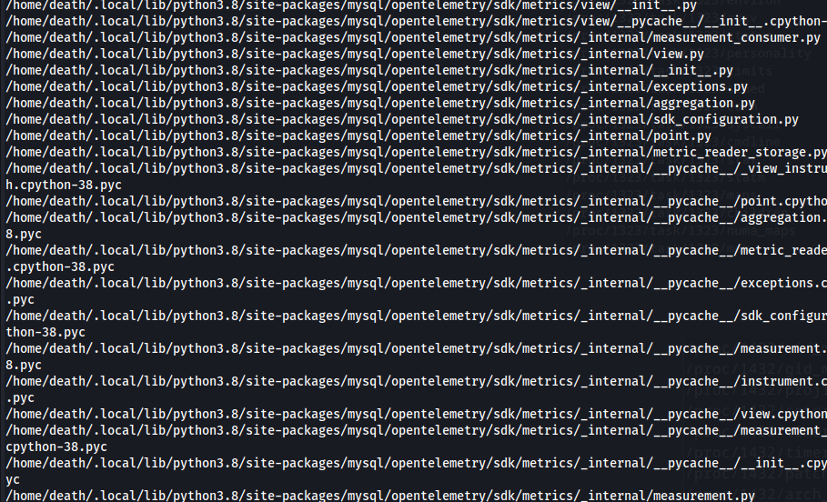
So tried to enter command "find / -group death -type f 2>/dev/null" and most of the results were from /.local/lib/python3.8, so will check that directory manually right now. But didn't find anything then i redirected the output of the command in a file and then found a file with suspicious name.

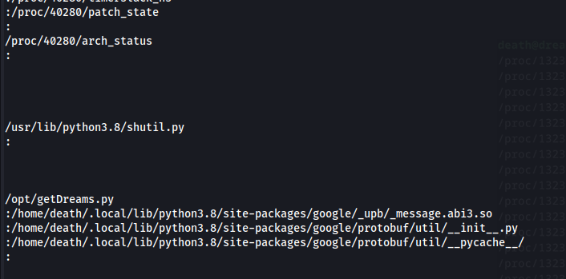
shutil.py!!!

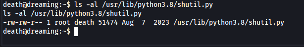
we can write in this file.

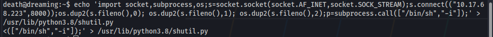
added a rev shell in the file.

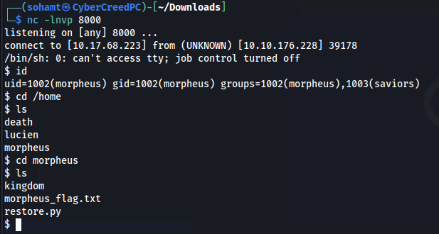
got the last flag....