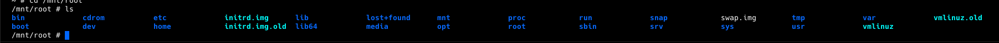

ip of the machine :- 10.10.167.136

machine is on!!!

Only two ports are open!!!

Did an aggressive scan for versioning...

home page of the website, let's go through the src. code to see what we can find...

Found a possible user "john".

Let's do directory fuzzing using ffuf.

Found some directories to look at!!!

robots.txt hinting towards /uploads/.

/secret contains a secret key.

it's a private key for ssh login.

in /uploads/ found some files let's view at them first and then will try to login through ssh using the private key.

dict.lst is a like a list of possible passwords.

it is like a message for hackers by "the mentor".

Just an image.

using private key is asking for a passphrase..

used ssh2john to create a hash and then further we got a dict.lst so used it for brute forcing and found the passphrase "letmein".

logged in as user "john"...

got our first flag.

So we are into lxd container.

We are allowed to run lxd so will be following this below blog.

So will be using this to escalate our privileges.

After following the above build steps, forward .tar.gz to the attacking machine.

importing image to lxc.

we can see the list of images.

So first we are initializing the container and allowing it to run with elevated privileges basically privileges of root then we are mounting the resources from host machine to /mnt/root of the image and then starting the container. After this we are executing a command /bin/sh on it which will give a shell for the image. This image in container is running with elevated privileges so executing a shell means getting a root/pwned shell.

And became root.

So, in /mnt/root, we have the root directory of the machine inside a mount point of the container.

So got root/last flag.....