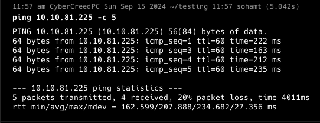
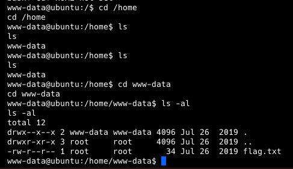

**ip of the machine :- 10.10.81.225**

machine is on!!!

oh!!! only one port is open.

so it is using fuel cms which is also based on PHP.

in src. code found the link to fuel cms on the web server with creds. hardcoded "admin:admin" in src. code itself.

we known creds. are admin:admin.

got in!!!

Let's search for any possible exploits.

Found this exploit, will try to use it.

ran the exploit!!!

got rev. shell.

So there was a user in the home directory, in which we found our first flag.

found some SUID binaries and libraries but was unable to escalate privileges with any of them.

in /var/www/html/fuel/application/config/database.php found creds. to access database.

into the database... But no luck.... Didn't find any way to escalate privileges. 

So i tried to do password spraying which is if root user using same password of the mysql server as his own as well and was right.

Got the last flag.....