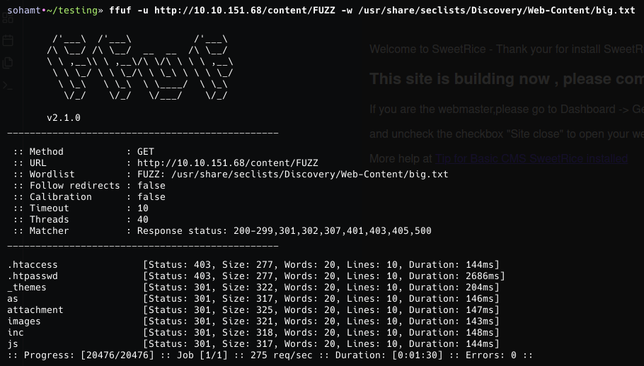

**ip of the machine :- 10.10.151.68**

machine is on!!!

got some open ports..

not very pleasing.. Let's enumerate web application using ffuf and manually afterwards.

only got one directory worth enumerating manually.

apache2 and that to in ubuntu huh!!!!

Got to know about SweetRice CMS. Let's look for any possible exploits. There were many exploits, but didn't know what to use so instead further did directory fuzzing in /content/ directory.

got some directories, let's look in them further.

found this in _themes directory.

images directory.

inc directory.

js directory.

found a login page.....

in /inc was able to download a file so went for it.

found a hash in the file.

cracked it. (Password123)

was able to login with creds. manager:Password123

also got it's version. Let's search for any exploits now.

found 5 exploits, but will be using 2nd one.

go to media center section and upload the php revshell but zip and then click on extract zip archive as it will extract and then execute it.

Now click on the file uploaded with the random name.

Got revshell.

So went to /home directory found a username and also got first flag.

Also got some creds. for mysql as well. Let's try them.

got it!!!

got password hash for rice....

password is same as mysql. 

What if rice user is the itguy user in home directory?? Let's try!!

nah!!! was wrong!!!

so there was another file known as backup.pl and when viewed it, it is indicating to a script known as copy.sh in /etc directory.

so as another user saw what permissions i have for this script and found that i have all permissions other so let's try to add a pwned/root shell and copy.sh can be run as root so now problem.

did sudo -l to see what permissions i have as others and saw that i can run only one command even as sudo with no password.

added "/bin/bash -ip" in it so whenever i run the privileged command it will run bash in privileged mode.

so after running the command as sudo, i got pwned/root shell and got root flag.