**ip of the machine :- 10.10.46.107**

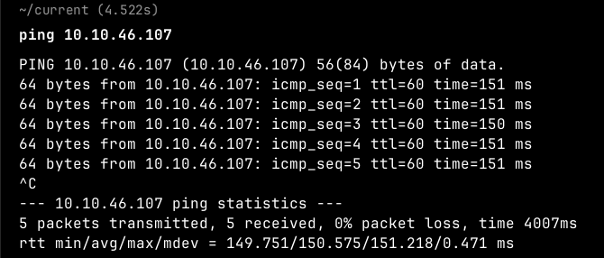
machine is on!!!

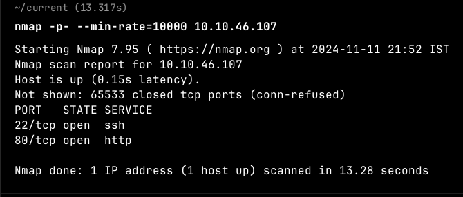
Got two open ports!!!

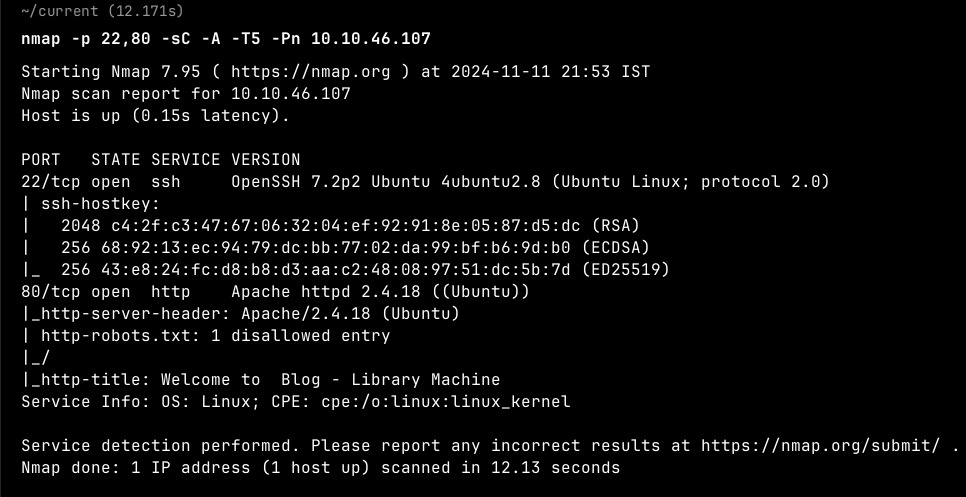
Found version of the services running and also one disallowed entry in robots.txt.

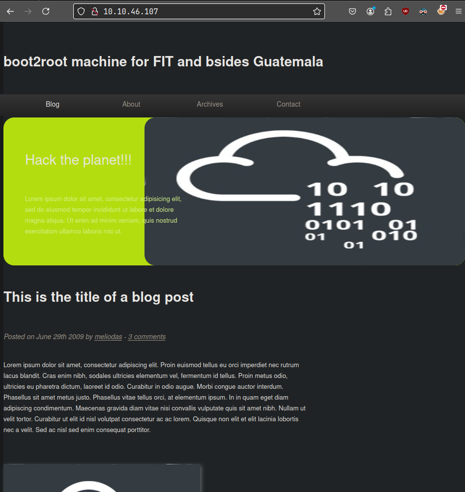
Just a normal website with no clickable links.

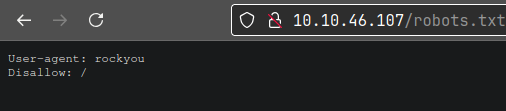
Rockyou!!! Hmm interesting!!!

Found a possible username "meliodas".

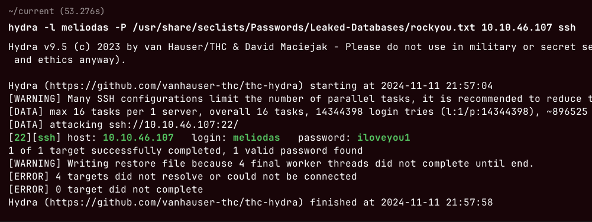
So, after getting a username, rockyou hint and only one service to brute force. Ran hydra and got the password for the user.

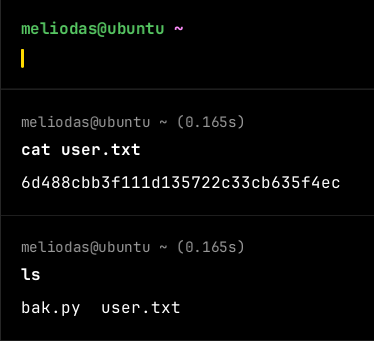
Logged in through ssh and got user flag. Also got a python file.

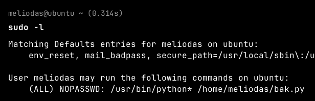
So, we can run the python file as root.

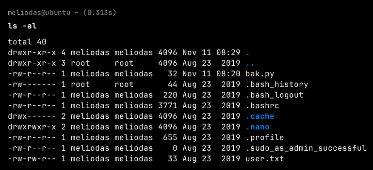
we also have permissions to edit the file.

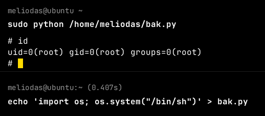
Added the shell payload in bak.py file and ran the file as root user and got the root access.

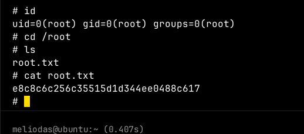
Got root flag...