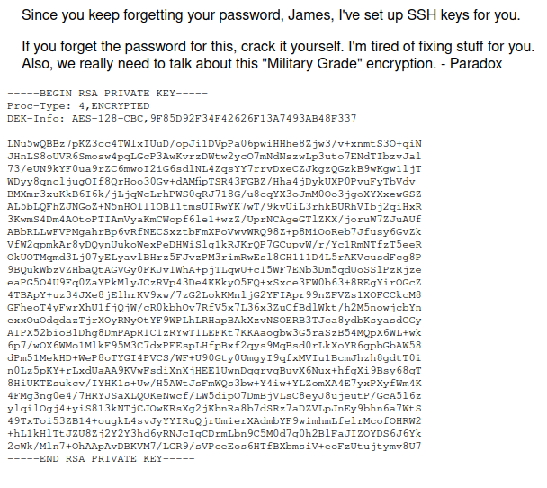

**ip of the machine :- 10.10.201.195**

machine is on!!!

got some filtered ports, maybe because of some kind of firewall on those ports.

So interesting ports are 22 and 80 only.

So let's go for directory fuzzing right now and then manual web enumeration.

got some directories.

in /aboutus web page got some possible usernames.

found administrator login page. So on this web page SQL injection didn't work and XSS didn't work.

in view page source found three scripts.

found the code. After entering some creds. they are validated at backend and when the response is sent like "Incorrect Credentials" then it will not login us in, but if credentials are right it will. So we have to manipulate the response.

So added a Session Token to bypass the login page. So it basically worked because, in src code it is saying that if we add wrong creds. it will say wrong pass and then we won't be able to login but what if we don't supply any and just set the Session Token to be statusOrCookie which will be assigned after logging in.

got a private ssh key of the user named "james".

it is asking for the passphrase. Let's find it using john.

found the passphrase.

logged in as james...

found the first flag as well as a todo list.

"cat todo.txt"

in /etc/crontab saw that a script is being downloaded and executed.

We can write to /etc/hosts file... So will start a web server on my system and create a file buildscript.sh and then it will contain another reverse shell and when it will be executed by root, it will get us root/pwned shell.

added revshell.

It will take some time to fetch the revshell but still it's fine.

got root/pwned shell.

got last flag...